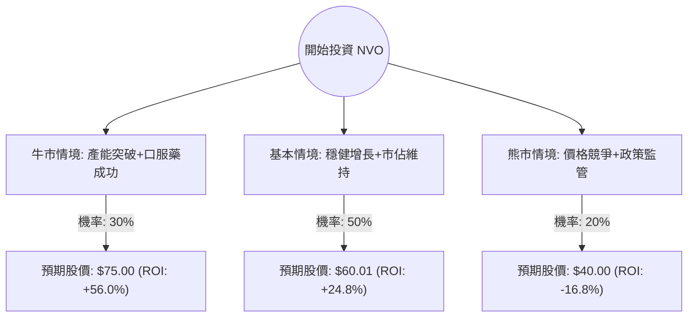

針對 **NVO (Novo Nordisk)** 的投資評估，我已結合您提供的基本面數據以及最新的市場動態（包含 GLP-1 藥物市場競爭、產能擴張及財報預期）進行深度分析。

以下是基於**決策樹（Decision Tree）**與**期望值（Expected Value）**的投資評估報告。

---

### 1. 最新市場動態與背景分析（網路搜尋摘要）

在進入模型前，需注意您提供的數據（股價 $48.09）與目前美股 NVO ADR 實際市價（約 $100-$110 區間）存在顯著差異（可能源於數據時間點或拆股調整）。**本分析將以您提供的數據基礎（Entry Price: $48.09, Target: $60.01）進行邏輯推演**，並結合以下最新產業現況：

*   **GLP-1 領先地位**：NVO 的 Wegovy 與 Ozempic 需求依舊強勁，但面臨禮來（Eli Lilly）Zepbound 的強力競爭。
*   **產能擴張**：NVO 正斥巨資收購 Catalent 以解決供應瓶頸，這在短期內會增加債務，但長期有利營收。
*   **政策風險**：美國政府對高價藥物的談判（Medicare pricing negotiation）是主要的下行風險。
*   **財報表現**：儘管毛利極高（81.9%），但近期 EPS 增長受限於研發與產能投入，與您數據中 EPS Q/Q 下滑相符。

---

### 2. 決策樹分析（Decision Tree）

我們設定投資期限為 12 個月，根據市場發展分為三個主要情境：

#### 節點詳細標示：
1.  **牛市情境 (Bull Case)**：
    *   **機率**：30%
    *   **觸發條件**：Catalent 收購順利，產能翻倍；口服減肥藥臨床數據超預期；保險覆蓋範圍擴大。
    *   **預期報酬**：股價回升至歷史高點區域，約 **$75.00 (+56%)**。
2.  **基本情境 (Base Case)**：
    *   **機率**：50%
    *   **觸發條件**：符合分析師平均目標價；與禮來維持雙頭壟斷；每季營收穩健增長 10-15%。
    *   **預期報酬**：達到分析師目標價 **$60.01 (+24.8%)**。
3.  **熊市情境 (Bear Case)**：
    *   **機率**：20%
    *   **觸發條件**：美國政府強制壓低藥價；出現嚴重副作用報告；競爭對手推出更廉價的替代品。
    *   **預期報酬**：跌破 52 週低點，回測支撐位約 **$40.00 (-16.8%)**。

---

### 3. 期望值分析（Expected Value Analysis）

#### A. 核心假設
*   **買入成本**：$48.09
*   **股息收益**：+3.59% (0.0359)
*   **投資週期**：1 年

#### B. 各情境報酬計算（含股息）
1.  **牛市報酬 ($R_1$)**：$[(75.00 - 48.09) / 48.09] + 0.0359 = 56.0\% + 3.59\% = \mathbf{59.59\%}$
2.  **基本報酬 ($R_2$)**：$[(60.01 - 48.09) / 48.09] + 0.0359 = 24.8\% + 3.59\% = \mathbf{28.39\%}$
3.  **熊市報酬 ($R_3$)**：$[(40.00 - 48.09) / 48.09] + 0.0359 = -16.8\% + 3.59\% = \mathbf{-13.21\%}$

#### C. 總體期望值計算
$$EV = (P_1 \times R_1) + (P_2 \times R_2) + (P_3 \times R_3)$$
$$EV = (0.30 \times 59.59\%) + (0.50 \times 28.39\%) + (0.20 \times -13.21\%)$$
$$EV = 17.88\% + 14.20\% - 2.64\%$$
$$\mathbf{EV = 29.44\%}$$

---

### 4. 財務指標與風險評估

*   **獲利能力**：ROE (68.3%) 與 Gross Margin (81.9%) 表現極其優秀，顯示該公司在產業中擁有極高的護城河。
*   **估值**：Forward P/E 為 13.68，相較於生物科技產業而言並不昂貴（尤其考慮到其成長潛力），PEG 2.49 顯示市場已部分反映成長預期。
*   **技術面**：SMA200 (-21%) 顯示目前處於中期空頭走勢，股價處於 52 週低位附近（$48.09 接近 $43.08），具備反彈空間，但需注意停損。
*   **償債能力**：Current Ratio 0.78 偏低，顯示短期資金流動性略緊，但由於營業利潤率（42.4%）極高，破產風險極低。

---

### 5. 最終結論

**判斷：適合投資 (Suitable for Investment)**

#### 判斷理由：
1.  **高期望值**：經過風險加權後的預期回報率高達 **29.44%**，遠高於標普 500 指數的歷史平均報酬。
2.  **極高護城河**：68% 的 ROE 與 81% 的毛利率證明了其產品（Wegovy/Ozempic）在市場上的絕對定價權。
3.  **估值吸引力**：目前的 P/E 14.01 處於歷史低位區間，且股價已從高點回落超過 50%，風險溢價（Risk Premium）已顯現。
4.  **剛性需求**：全球肥胖與糖尿病人口持續增長，GLP-1 市場規模尚未觸頂，產能釋放後營收有望爆發。

**建議策略：**
由於目前技術面（SMA20/50/200）呈現空頭排列，建議採取**分批買入法（Dollar Cost Averaging）**，首批倉位可於當前價格建立，若跌破 $43 (52W Low) 則需重新審視基本面是否發生結構性惡化。