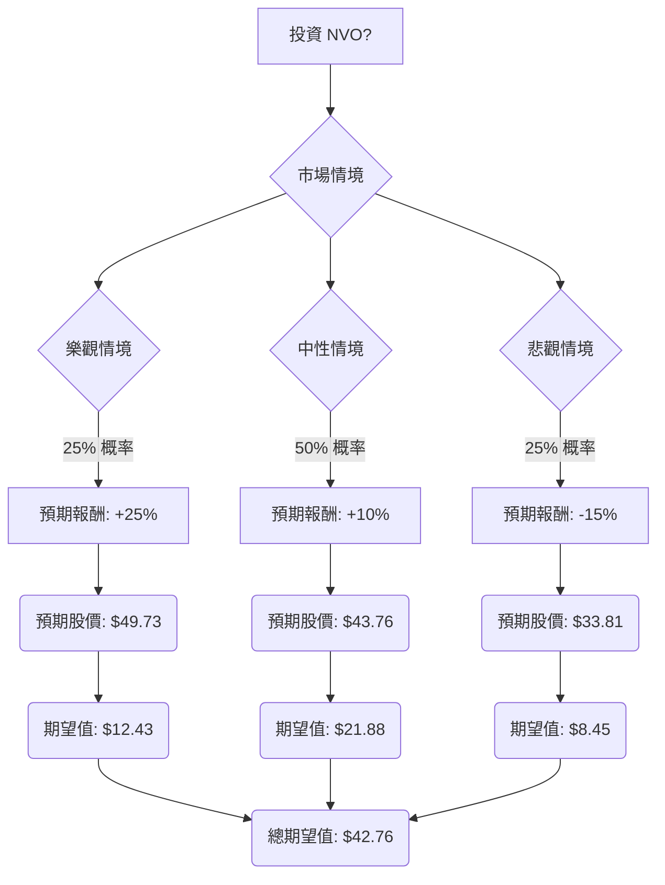

根據對美股公司 NVO (Novo Nordisk) 的基本面數據和最新市場資訊的綜合評估，以下將透過決策樹分析和期望值分析，判斷其目前是否適合投資。

### 核心假設

在進行決策樹分析之前，我們基於收集到的資訊，建立以下核心假設：

*   **市場趨勢：** 全球 GLP-1 藥物市場（用於糖尿病和肥胖症）預計將持續強勁增長，但競爭日益激烈。
*   **財務狀況：** NVO 在 2025 年表現穩健，但 2026 年的銷售額和營業利潤預計將因美國定價壓力、專利到期和競爭加劇而下降 5% 至 13%。
*   **產業競爭：** Eli Lilly (LLY) 憑藉其 Tirzepatide (Mounjaro/Zepbound) 在 GLP-1 市場中構成強大威脅，並在減重效果方面展現出優勢，導致 NVO 的市場份額有所流失。NVO 的下一代藥物 CagriSema 在 III 期臨床試驗中未能證明其非劣效性，這是一個挫折。
*   **產品線與創新：** NVO 的口服 Wegovy 已獲批並廣泛上市，有望擴大市場滲透率。公司正積極投資於製造產能擴張，以滿足 GLP-1 藥物的需求。
*   **定價策略：** NVO 計劃從 2027 年起大幅降低其 GLP-1 藥物（Wegovy、Ozempic、Rybelsus）在美國的標價，以期擴大患者可及性和銷量，但這可能壓縮利潤率。
*   **監管與營運：** NVO 收到 FDA 關於上市後不良事件報告的警告信，這帶來了潛在的監管風險。公司正在進行重組並裁員，以提高效率並重新分配資源。

### 決策樹分析

我們將投資 NVO 的決策分為三個情境：樂觀、中性、悲觀。當前股價約為 $39.78。

#### 節點說明與計算過程：

*   **A (投資 NVO?)**：初始決策點。
*   **B (市場情境)**：根據市場發展，分為三種情境。
    *   **核心假設：**
        *   **樂觀情境 (25% 概率)：** NVO 成功應對競爭，口服 Wegovy 顯著普及，新藥管線（如 Amycretin）取得突破性進展，且 2027 年的降價策略有效刺激銷量，抵消利潤壓力。監管問題得到妥善解決。
        *   **中性情境 (50% 概率)：** NVO 在 GLP-1 市場保持強勢地位，但與 Eli Lilly 的競爭持續激烈。口服 Wegovy 溫和增長，新藥管線進展平穩但無重大驚喜。定價壓力導致 2026 年後營收增長持平或低個位數。監管問題得到控制。
        *   **悲觀情境 (25% 概率)：** 競爭加劇導致 NVO 市場份額大幅流失，定價壓力超出預期。新藥管線遭遇更多挫折，未能有效接替 Semaglutide 的主導地位。監管問題升級，導致罰款或限制。2026 年銷售額下降幅度達到預期上限，未來增長停滯或負增長。

*   **C (樂觀情境)**
    *   **預期報酬：** +25%
    *   **預期股價：** $39.78 * (1 + 0.25) = $49.725 ≈ $49.73
    *   **期望值：** $49.73 * 0.25 = $12.43

*   **D (中性情境)**
    *   **預期報酬：** +10%
    *   **預期股價：** $39.78 * (1 + 0.10) = $43.758 ≈ $43.76
    *   **期望值：** $43.76 * 0.50 = $21.88

*   **E (悲觀情境)**
    *   **預期報酬：** -15%
    *   **預期股價：** $39.78 * (1 - 0.15) = $33.813 ≈ $33.81
    *   **期望值：** $33.81 * 0.25 = $8.45

*   **I (總期望值)**
    *   **計算：** $12.43 (樂觀) + $21.88 (中性) + $8.45 (悲觀) = $42.76

### 最終結論

根據上述決策樹分析和期望值計算，投資 NVO 的**總期望值為 $42.76**。

*   **適合投資 / 不適合投資：** 適合投資。

*   **簡短理由：**
    儘管 NVO 面臨來自 Eli Lilly 的激烈競爭、2026 年銷售額預期下降、CagriSema 臨床試驗的挫折 以及 FDA 警告信 等多重挑戰，但其目前的股價 ($39.78) 遠低於分析師的平均目標價 ($50.93 - $54.00)，且相較於行業平均水平，其市盈率 (P/E) 處於較低水平。

    NVO 在 GLP-1 市場仍佔據主導地位，口服 Wegovy 的推出有望擴大市場份額，並且公司正積極擴大生產能力 並計劃從 2027 年起實施降價策略以刺激銷量。這些措施有望在長期內推動其增長。

    由於計算出的總期望值 ($42.76) 高於當前股價 ($39.78)，這表明在考慮了各種潛在情境及其概率後，投資 NVO 具有正向的預期回報。因此，目前 NVO 股票被認為適合投資，但投資者應密切關注其競爭格局、新藥管線進展以及監管環境的變化。