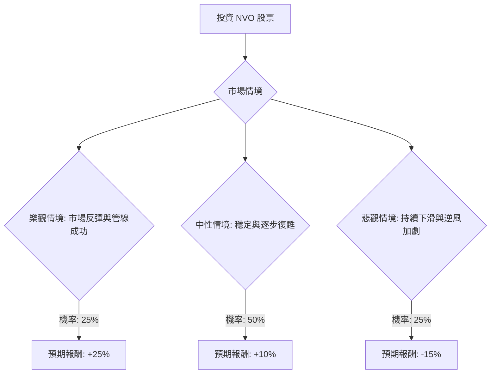

根據對美股公司 NVO (Novo Nordisk) 的基本面數據和最新市場資訊的綜合分析，以下是使用決策樹分析和期望值分析對其投資適宜性的評估。

### 核心假設

1.  **市場動態：** 減肥和糖尿病藥物（GLP-1 市場）將持續高速增長，但競爭將日益激烈，特別是來自 Eli Lilly (LLY) 的產品。美國市場的藥品定價壓力將在 2026 年和 2027 年持續存在。
2.  **NVO 產品表現：**
    *   **口服 Wegovy：** 預計將因其便利性和較低的價格而獲得可觀的銷量，但這將被較低的利潤率和對注射劑銷售的蠶食所抵消。
    *   **現有 GLP-1 藥物（Ozempic/Wegovy 注射劑）：** 將面臨來自競爭和政府定價協議的顯著定價壓力，並可能導致市場份額下降。
    *   **研發管線：** UBT251 和 Zenagamtide 等有前景的新藥，以及 Wegovy 在 MASH 新適應症的獲批，提供了長期增長潛力，但這些仍處於早期/中期階段，短期內無法完全抵消當前的逆風。
3.  **財務表現：** 根據公司自身預期，2026 年將是充滿挑戰的一年，銷售額和營業利潤預計將下降。 盈利能力將受到定價壓力和新產品研發/營銷費用增加的擠壓。
4.  **分析師情緒：** 目前分析師普遍給予「持有」評級，並下調了預期，反映出對短期前景的謹慎態度。 然而，肥胖市場的長期潛力使得部分分析師仍維持「買入」評級。

### 決策樹分析

**決策點：投資 NVO 股票**

**節點詳情與計算過程：**

*   **當前股價 (Close)：** $38.43
*   **分析師平均目標價：** $49.93
*   **用戶提供目標價：** $48.64

1.  **樂觀情境 (Optimistic Scenario: Market Rebound & Pipeline Success)**
    *   **情境描述：** 口服 Wegovy 獲得顯著市場份額，抵消定價壓力速度快於預期。 新管線藥物（如 UBT251、Zenagamtide）進展加速並展現卓越療效，導致分析師重新評級和投資者信心增加。 Eli Lilly 面臨意外挫折。NVO 成功應對定價挑戰並擴大全球影響力。
    *   **機率 (Probability)：** 25%
    *   **預期報酬 (Expected Return)：** +25%
    *   **計算過程：**
        *   報酬金額 = $38.43 \* 25% = $9.61
        *   情境期望值 = 0.25 \* 0.25 = 0.0625 (或 6.25%)

2.  **中性情境 (Moderate Scenario: Stabilization & Gradual Recovery)**
    *   **情境描述：** NVO 2026 年銷售額下降幅度在公司指導範圍內（-5% 至 -13%）。 口服 Wegovy 表現符合預期，但來自 Eli Lilly 的競爭依然激烈。 定價壓力持續影響利潤。管線進展穩定但短期內無重大突破。股價穩定在分析師共識目標附近。
    *   **機率 (Probability)：** 50%
    *   **預期報酬 (Expected Return)：** +10%
    *   **計算過程：**
        *   報酬金額 = $38.43 \* 10% = $3.84
        *   情境期望值 = 0.50 \* 0.10 = 0.05 (或 5%)

3.  **悲觀情境 (Pessimistic Scenario: Continued Decline & Intensified Headwinds)**
    *   **情境描述：** 由於更嚴峻的定價壓力和 Eli Lilly 超預期的競爭，銷售額下降幅度超出公司指導範圍。 口服 Wegovy 未能完全彌補注射劑收入損失。管線出現挫折或監管障礙。投資者情緒持續負面，導致股價進一步下跌。
    *   **機率 (Probability)：** 25%
    *   **預期報酬 (Expected Return)：** -15%
    *   **計算過程：**
        *   報酬金額 = $38.43 \* (-15%) = -$5.76
        *   情境期望值 = 0.25 \* (-0.15) = -0.0375 (或 -3.75%)

### 整體期望值計算

整體期望值 = (樂觀情境期望值) + (中性情境期望值) + (悲觀情境期望值)
整體期望值 = (0.25 \* 0.25) + (0.50 \* 0.10) + (0.25 \* -0.15)
整體期望值 = 0.0625 + 0.05 - 0.0375
**整體期望值 = 0.075 (或 7.5%)**

### 最終結論

根據決策樹分析和期望值計算，投資 NVO 股票的**整體期望值為正 7.5%**。

**判斷：適合投資**

**簡短理由：**
儘管 Novo Nordisk 在 2026 年面臨來自競爭加劇、定價壓力以及公司自身下調銷售預期等顯著逆風，但其口服 Wegovy 的成功推出、強大的研發管線（如 UBT251 和 MASH 適應症） 以及在肥胖治療市場的長期領導地位 提供了可觀的長期增長潛力。目前的股價相對於分析師平均目標價仍有約 30% 的上漲空間，且估值相對較低（P/E 為 11.12，股息收益率接近十年高點 4.48%）。

雖然短期內可能會有波動，但考慮到其創新能力、市場潛力以及相對吸引人的估值，NVO 股票對於願意承受短期風險並著眼於長期增長的投資者而言，仍是**適合投資**的標的。公司管理層的戰略性降價措施，旨在擴大市場份額和患者可及性，這可能在長期內帶來可持續的增長。