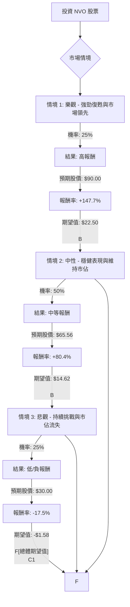

根據對美股公司 **NVO (Novo Nordisk A/S)** 的基本面數據和最新市場資訊的綜合分析，以下將使用決策樹分析和期望值分析來評估其目前的投資適合性。

### 核心假設

在進行決策樹分析之前，我們基於收集到的資訊建立以下核心假設：

*   **市場趨勢：** GLP-1 藥物市場（用於糖尿病和肥胖症）預計將持續顯著增長，預計到 2030 年將達到 2000 億美元。 口服 GLP-1 藥物的出現將擴大市場，但也將加劇價格競爭。
*   **競爭格局：** Eli Lilly (LLY) 是 NVO 的主要競爭對手，並已在 GLP-1 市場中獲得顯著市佔率。 市場正從供應短缺驅動轉向更具競爭的環境。
*   **NVO 產品線：** NVO 擁有強大的產品組合（如 Ozempic 和 Wegovy）和有前景的研發管線（如口服 Wegovy、Wegovy HD、UBT251、CagriSema）。 然而，部分新藥面臨競爭或早期試驗結果的挑戰。
*   **財務表現與展望：** NVO 在 2025 年第四季度業績超出預期，但 2026 年的財測疲軟，預計銷售額和營業利潤將下降 5-13%（按固定匯率計算）。
*   **專利與定價：** Semaglutide 的部分專利預計從 2026 年起在某些高銷量市場（如中國、巴西、印度、加拿大）到期，可能導致仿製藥競爭。 美國的藥品關稅和定價壓力也是持續存在的風險。
*   **分析師情緒：** 目前分析師普遍持「持有」評級，12 個月平均目標價為 65.56 美元，但目標價範圍廣泛，反映市場不確定性。

### 決策樹分析

**投資決策點：** 投資 NVO 股票

**當前股價：** 36.33 美元 (截至 2026 年 3 月 26 日)

---

---

### 計算過程

**1. 預期報酬 / 期望值 (Expected Value) 計算方式：**

每個情境的期望值 = (預期未來股價 - 當前股價) / 當前股價 * 機率

*   **當前股價 (Current Price):** 36.33 美元

**2. 情境定義與計算：**

*   **情境 1: 樂觀 - 強勁復甦與市場領先**
    *   **情境名稱：** NVO 成功應對競爭，口服 Wegovy 和新管線藥物（如 UBT251、Wegovy HD）表現出色，GLP-1 市場加速擴張，NVO 維持領先地位。定價壓力緩解，分析師情緒顯著改善，股價重新評級。
    *   **機率 (Probability)：** 25%
    *   **預期未來股價：** 90.00 美元 (基於分析師高目標價和強勁復甦潛力，但考慮到競爭，取一個相對保守的高值，而非極端值 175 美元)
    *   **報酬率：** (90.00 - 36.33) / 36.33 = 1.477 = +147.7%
    *   **期望值：** 1.477 * 0.25 = 0.36925 (或以股價計算：(90.00 - 36.33) * 0.25 = 13.4175 美元)

*   **情境 2: 中性 - 穩健表現與維持市佔**
    *   **情境名稱：** NVO 在與 Eli Lilly 的競爭中保持現有市場份額，口服 GLP-1 藥物帶來一定增長，但競爭限制了價格上漲。管線藥物進展符合預期，但未有重大突破。股價回歸分析師平均目標價。
    *   **機率 (Probability)：** 50%
    *   **預期未來股價：** 65.56 美元 (基於分析師 12 個月平均目標價)
    *   **報酬率：** (65.56 - 36.33) / 36.33 = 0.804 = +80.4%
    *   **期望值：** 0.804 * 0.50 = 0.402 (或以股價計算：(65.56 - 36.33) * 0.50 = 14.615 美元)

*   **情境 3: 悲觀 - 持續挑戰與市佔流失**
    *   **情境名稱：** Eli Lilly 在 GLP-1 市場持續擴大領先優勢，NVO 市場份額進一步流失。定價壓力加劇，部分市場專利到期影響收入。管線藥物遭遇挫折或推遲。2026 年財測表現不佳。股價停滯不前或進一步下跌。
    *   **機率 (Probability)：** 25%
    *   **預期未來股價：** 30.00 美元 (基於分析師最低目標價 31 美元 及當前股價的持續下跌趨勢，略低於最低目標價以反映悲觀情緒)
    *   **報酬率：** (30.00 - 36.33) / 36.33 = -0.174 = -17.4%
    *   **期望值：** -0.174 * 0.25 = -0.0435 (或以股價計算：(30.00 - 36.33) * 0.25 = -1.5825 美元)

**3. 總體期望值 (Overall Expected Value) 計算：**

總體期望值 = (情境 1 期望值) + (情境 2 期望值) + (情境 3 期望值)

*   **以報酬率計算：** 0.36925 + 0.402 + (-0.0435) = **0.72775**
*   **以股價增值計算：** 13.4175 + 14.615 + (-1.5825) = **26.45 美元**

這意味著，根據這些假設和機率，預期 NVO 股票在未來 12 個月內將有約 **72.78%** 的潛在報酬率，或每股增值約 **26.45 美元**。

### 最終結論

根據決策樹分析和期望值計算，NVO 股票的總體期望值為 **正值 (約 72.78% 的潛在報酬率)**。

因此，**NVO 目前適合投資。**

**簡短理由：**
儘管 NVO 面臨來自 Eli Lilly 的激烈競爭、部分市場專利到期以及 2026 年疲軟的財測，但其在快速增長的 GLP-1 市場中仍佔據重要地位，擁有強大的核心產品（Ozempic, Wegovy）和有前景的口服藥物及管線。 當前股價相對於分析師平均目標價有顯著的潛在上漲空間，且其估值 (Forward P/E 11) 相對於行業平均 (14.12) 存在折價。 雖然存在下行風險，但樂觀和中性情境下的潛在報酬足以抵消悲觀情境下的損失，使得整體投資具有吸引力。公司近期啟動的股票回購計劃也可能為股價提供支撐。