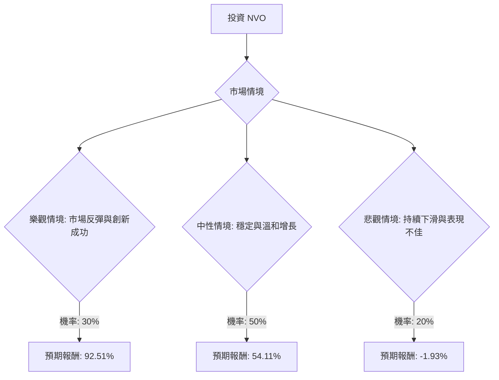

根據您提供的基本面數據以及最新的市場資訊，我們將使用決策樹分析和期望值分析來評估美股公司 NVO (Novo Nordisk) 目前是否適合投資。

### 最新資訊與核心假設

**NVO 最新動態摘要 (截至 2026 年 3 月初):**
*   **2025 年第四季度財報：** EPS 和營收均超出分析師預期。
*   **股價表現：** 儘管財報表現良好，但由於 2026 年銷售和營運利潤展望不佳，以及競爭加劇，股價在 2026 年 2 月大幅下跌，創下歷史最差單月跌幅 (約 37%)。目前股價約為 $37.45 - $37.61，接近 52 週低點。
*   **2026 年展望：** 管理層預計 2026 年調整後銷售額將下降 5% 至 13% (按固定匯率計算)，這讓投資者感到失望。
*   **競爭格局：** GLP-1 藥物市場預計在 2026 年成為全球最暢銷藥物，但 Eli Lilly (LLY) 在肥胖藥物市場的領先地位不斷加強，其 Tirzepatide (Mounjaro/Zepbound) 預計將超越 Novo Nordisk 的 Ozempic 成為 2026 年最暢銷藥物。
*   **產品線挑戰：** 新一代肥胖藥物 CagriSema 的臨床試驗數據令人失望，未能明顯優於 Eli Lilly 的競爭產品，導致股價在 2 月 23 日下跌 16%。
*   **定價壓力：** 由於與美國政府的協議以及 Semaglutide 在某些市場的專利到期，NVO 面臨定價壓力，並計劃降低 Ozempic 和 Wegovy 在美國的標價。
*   **新產品與適應症：** 口服 Wegovy (Semaglutide) 已於 2025 年 12 月 22 日獲 FDA 批准用於成人減重，並廣泛上市。Wegovy 也獲 FDA 批准用於治療非肝硬化 MASH (代謝功能障礙相關脂肪性肝炎)。
*   **分析師評級：** 共識評級為「持有」(Hold)，平均目標價約為 $56.00 - $56.07，較當前股價有約 46.75% - 49.54% 的上漲空間。最低目標價為 $42.00，最高為 $70.00 - $73.50。
*   **估值：** 目前本益比 (P/E) 約為 10.8 - 10.81，相對於市場平均水平較低。

**核心假設：**
*   **市場趨勢：** GLP-1 藥物市場 (糖尿病和肥胖症) 將持續高速增長，預計到 2031 年，全球肥胖藥物市場規模將以 25% 的複合年增長率增長。
*   **競爭環境：** Eli Lilly 將繼續是 NVO 最強大的競爭對手，市場份額爭奪將持續激烈。
*   **財務表現：** NVO 擁有強勁的盈利能力和現金流，但 2026 年的銷售增長將面臨挑戰，可能出現負增長。
*   **產品創新：** 口服 GLP-1 藥物和新適應症的拓展是 NVO 未來增長的關鍵，但新一代藥物的臨床試驗結果將對市場信心產生重大影響。

### 決策樹分析

我們將考慮投資 NVO 的決策，並預測未來一年可能的三種市場情境及其對應的報酬。

**起始點：投資 NVO (當前股價 $37.45)**

#### 節點計算過程與假設：

**1. 樂觀情境 (Optimistic Scenario): 市場反彈與創新成功**
*   **情境描述：** 儘管初期受挫，NVO 的口服 Wegovy 獲得強勁市場接受度，且公司有效打擊非法仿製藥。整體 GLP-1 市場的擴張為 NVO 帶來利好。定價壓力得到有效管理，未來產品線 (超越 CagriSema 的初步失望) 展現潛力。股價大幅回升至分析師目標價的高端。
*   **機率 (Probability)：** 30%
*   **預期報酬計算：**
    *   假設股價達到分析師最高目標價 $70.00。
    *   股價上漲：($70.00 - $37.45) / $37.45 = 87.9%
    *   股息收益：4.61% (來自基本面數據)
    *   總預期報酬 = 87.9% + 4.61% = **92.51%**

**2. 中性情境 (Moderate Scenario): 穩定與溫和增長**
*   **情境描述：** NVO 穩定其市場地位。競爭依然激烈，但 NVO 設法維持現有份額。2026 年銷售額下降幅度處於指導範圍的低端，未來增長溫和，符合分析師平均預期。股價回升至分析師平均目標價。
*   **機率 (Probability)：** 50%
*   **預期報酬計算：**
    *   假設股價達到分析師平均目標價 $56.00。
    *   股價上漲：($56.00 - $37.45) / $37.45 = 49.5%
    *   股息收益：4.61%
    *   總預期報酬 = 49.5% + 4.61% = **54.11%**

**3. 悲觀情境 (Pessimistic Scenario): 持續下滑與表現不佳**
*   **情境描述：** NVO 持續在市場份額上輸給競爭對手，尤其是 Eli Lilly。定價壓力超出預期，進一步侵蝕利潤。2026 年銷售額下降幅度處於指導範圍的高端，未來產品線未能帶來重大突破。股價難以恢復，甚至可能進一步下跌或維持在低位。
*   **機率 (Probability)：** 20%
*   **預期報酬計算：**
    *   假設股價未能達到分析師最低目標價，甚至略有下跌，例如跌至 $35.00 (低於當前價格，反映進一步下跌)。
    *   股價變化：($35.00 - $37.45) / $37.45 = -6.54%
    *   股息收益：4.61%
    *   總預期報酬 = -6.54% + 4.61% = **-1.93%**

### 期望值分析 (Expected Value Analysis)

現在我們計算投資 NVO 的整體期望值：

期望值 (EV) = (樂觀情境報酬 × 機率) + (中性情境報酬 × 機率) + (悲觀情境報酬 × 機率)

EV = (0.9251 × 0.30) + (0.5411 × 0.50) + (-0.0193 × 0.20)
EV = 0.27753 + 0.27055 + (-0.00386)
EV = 0.54422

**整體期望值 = 54.42%**

### 最終結論

根據我們的決策樹分析和期望值計算，投資 NVO 的整體期望值為 **54.42%**。

**判斷：適合投資**

**理由：**
儘管 Novo Nordisk 近期面臨激烈的市場競爭、令人失望的 2026 年展望以及新藥試驗的挫折，導致股價大幅下跌，但其目前的估值 (P/E 僅 10.8) 相對於其在高速增長的 GLP-1 市場中的領導地位和強勁的盈利能力 (毛利率 80.9%，營業利潤率 41.17%) 而言，顯得相對較低。

分析師的共識評級為「持有」，但平均目標價 $56.00 顯示出從當前 $37.45 的股價有顯著的潛在上升空間 (約 49.5%)。這表明市場可能對其短期挑戰反應過度，而忽略了其長期潛力，例如口服 Wegovy 的廣泛上市和新適應症的批准。

綜合考慮，即使在保守的中性情境下，NVO 仍能提供可觀的預期報酬。雖然存在競爭加劇和產品線風險，但其在糖尿病和肥胖症治療領域的強大基礎、持續的創新能力以及相對較低的估值，使其在當前價格下具有吸引力。因此，NVO 目前適合投資，但投資者應密切關注其競爭動態和未來產品線的發展。