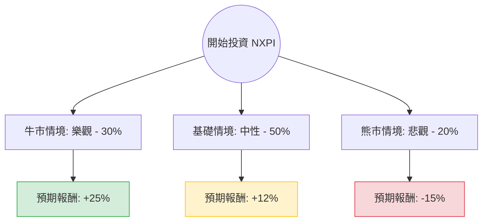

這份分析報告結合了您提供的基本面數據，以及針對 **NXP Semiconductors (NXPI)** 的最新市場動態、財報表現與產業趨勢進行的網路檢索資訊。

---

### 一、 核心假設與背景分析

在構建決策樹之前，我們基於以下關鍵資訊設定假設：

1.  **產業趨勢（車用與工業）**：NXPI 約 50% 以上的營收來自車用半導體。目前全球電動車（EV）增速放緩，但「軟體定義汽車」與車內電子含量增加抵消了部分衝擊。工業與物聯網（IoT）市場正處於去庫存週期的尾聲。
2.  **財務表現**：
    *   **低 PEG (0.75)**：顯示股價相對於其增長潛力被低估（通常 < 1 被視為便宜）。
    *   **Forward P/E (13.88)**：遠低於當前 P/E (29.23)，預示市場預期明年盈餘將大幅增長（數據顯示 EPS 下一年預期增長 20.08%）。
    *   **獲利能力**：Gross Margin 53.37% 顯示其在車用晶片市場具備強大的定價權。
3.  **宏觀環境**：聯準會（Fed）的降息預期將有利於資本密集型的半導體產業，並刺激汽車消費貸款。

---

### 二、 決策樹分析 (Decision Tree)

以下為 NXPI 未來一年的投資情境決策樹：

#### 節點詳細說明：

| 情境節點 | 發生機率 | 預期報酬 (Return) | 期望值貢獻 (EV Contribution) | 觸發條件 |
| :--- | :--- | :--- | :--- | :--- |
| **牛市 (Bull)** | 30% | +25% | **7.5%** | AI 邊緣運算需求爆發、車用市場超預期復甦、降息節奏加快。 |
| **基礎 (Base)** | 50% | +12% | **6.0%** | 符合分析師預期（EPS 成長 20%），股價向目標價 $261 靠攏。 |
| **熊市 (Bear)** | 20% | -15% | **-3.0%** | 全球經濟衰退、車用半導體庫存去化不如預期、地緣政治干預供應鏈。 |
| **總計** | **100%** | | **10.5%** | **整體期望報酬率** |

---

### 三、 期望值分析 (Expected Value Analysis) 計算過程

我們以當前股價 **$232.27** 為基準，計算一年後的預期價值。

1.  **期望報酬率計算**：
    $$E(R) = (0.30 \times 0.25) + (0.50 \times 0.12) + (0.20 \times -0.15)$$
    $$E(R) = 0.075 + 0.06 - 0.03 = 0.105 \text{ (即 10.5%)}$$

2.  **預期股價計算**：
    $$\text{Expected Price} = \$232.27 \times (1 + 10.5\%) = \$256.66$$
    *(註：此數值與分析師平均目標價 $261.44 非常接近，具備高度合理性。)*

3.  **核心假設依據**：
    *   **樂觀 (30%)**：基於 NXPI 在 S32 平台（車用處理器）的領先地位，若 AI 整合至車載系統速度加快，估值將從 Forward P/E 13.8x 修復至歷史高位 18x。
    *   **中性 (50%)**：基於 PEG 0.75 的低估值修復。即便市場平淡，20% 的 EPS 增長將推動股價穩定上行。
    *   **悲觀 (20%)**：考慮到 Debt/Eq 1.24 略高，若高利率維持更久，財務成本將壓抑利潤。

---

### 四、 最終結論

#### **評估結果：適合投資 (Buy / Overweight)**

#### **理由總結：**
1.  **估值極具吸引力**：PEG 僅 0.75，且 Forward P/E (13.88) 遠低於行業平均與自身歷史平均，顯示目前股價並未充分反映明年的增長預期。
2.  **獲利結構穩健**：高達 53% 的毛利率與 21% 的 ROE 顯示公司在半導體週期波動中具有極強的韌性。
3.  **正向期望值**：經過決策樹加權計算，預期報酬率為 **10.5%**，且下行風險（20% 機率）相對可控。
4.  **技術面支撐**：目前股價位於 SMA200 (219.6) 之上，長期趨勢偏多；雖然短期 (Perf Week -4.1%) 有回檔，但這提供了更好的買入點。

**建議操作：**
考慮到目前股價距離目標價 $261.44 仍有約 12.5% 的空間，建議可在 $225 - $232 區間分批佈局。需留意即時風險為車用終端市場（如 Tesla 或歐洲車廠）的銷量數據波動。