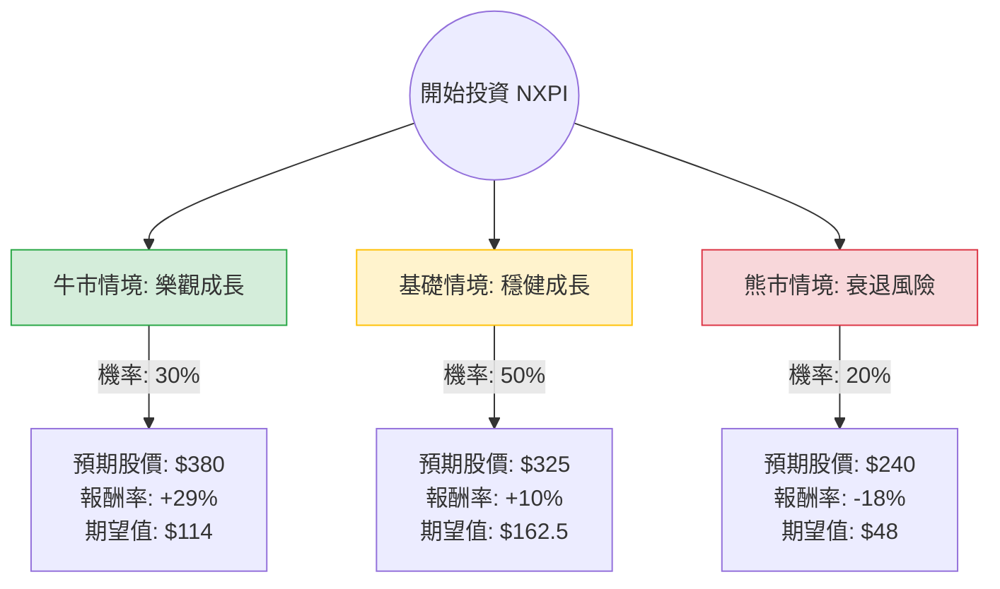

針對恩智浦半導體（NXP Semiconductors, **NXPI**）的投資評估，我結合了您提供的基本面數據以及最新的市場動態（包含 2024 年第一季財報表現與半導體產業趨勢）進行分析。

---

### 一、 市場背景與最新動態分析

1.  **財務表現**：NXPI 最新財報顯示，汽車業務（佔營收 50% 以上）雖面臨庫存調整，但表現優於同行（如 TI 或 STMicro）。其 **PEG 僅 0.87**，顯示股價相對於盈餘成長性被低估（通常 < 1 被視為便宜）。
2.  **產業趨勢**：
    *   **利多**：汽車電子化（EV/ADAS）長期趨勢未變；工業與 IoT 領域開始復甦；AI 邊緣運算（Edge AI）帶動新型晶片需求。
    *   **利空**：中國市場復甦緩慢；高利率環境壓抑消費者對汽車的貸款需求。
3.  **技術面**：股價目前在 $294 附近，接近 52 週高點，SMA20/50/200 均呈現多頭排列，動能強勁。

---

### 二、 決策樹分析（Decision Tree）

以下為未來 12 個月的投資情境預測：

---

### 三、 期望值分析與計算過程

#### 1. 核心假設
*   **牛市情境 (30%)**：汽車庫存調整提前結束，AI 邊緣運算晶片貢獻顯著營收，Forward P/E 從 17.5 倍修復至 22 倍。
*   **基礎情境 (50%)**：符合分析師預期（Target Price $299-$320），汽車業務穩健，隨聯準會降息預期帶動科技股估值。
*   **熊市情境 (20%)**：全球經濟衰退導致汽車銷量大跌，中國競爭對手在成熟製程晶片施壓，股價回測 SMA200 支撐位。

#### 2. 期望值 (Expected Value, EV) 計算
計算公式：$EV = \sum (情境股價 \times 對應機率)$

*   **牛市貢獻**：$380 \times 0.3 = 114$
*   **基礎貢獻**：$325 \times 0.5 = 162.5$
*   **熊市貢獻**：$240 \times 0.2 = 48$
*   **總期望股價**：$114 + 162.5 + 48 = \mathbf{\$324.5}$

#### 3. 預期報酬率
*   **當前股價**：$294.23
*   **預期漲幅**：$(324.5 - 294.23) / 294.23 \approx \mathbf{10.29\%}$
*   **加上股息收益**：$10.29\% + 1.33\% = \mathbf{11.62\%}$

---

### 四、 綜合評估與最終結論

#### **最終判斷：適合投資 (Buy / Overweight)**

#### **理由：**
1.  **估值極具吸引力**：NXPI 的 **PEG (0.87)** 與 **Forward P/E (17.48)** 在半導體板塊中屬於偏低水準，相較於 NVIDIA 或其他高估值 AI 股，NXPI 提供更高的安全邊際。
2.  **財務體質強健**：ROE 高達 **26.2%**，且營業利益率（Oper. Margin）達 **26.3%**，顯示其在車用半導體市場擁有強大的定價權與成本控制能力。
3.  **正向期望值**：經過決策樹計算，其 12 個月的預期總報酬率約為 **11.6%**。雖然短期股價接近 52 週高點可能會有小幅回檔，但長期基本面支撐其股價向 $320 區間邁進。
4.  **技術動能**：SMA 指標顯示強勁上升趨勢，且 Short Float（放空比例）僅 2.65%，市場看空情緒低。

#### **投資建議：**
*   **進場策略**：目前股價接近歷史高點，建議採取「分批進場」或等待股價回測 **$280-$285**（SMA20 附近）時建立核心部位。
*   **風險監控**：需密切關注汽車產業的庫存去化速度，以及中國車用晶片國產化對 NXPI 中低階產品的衝擊。