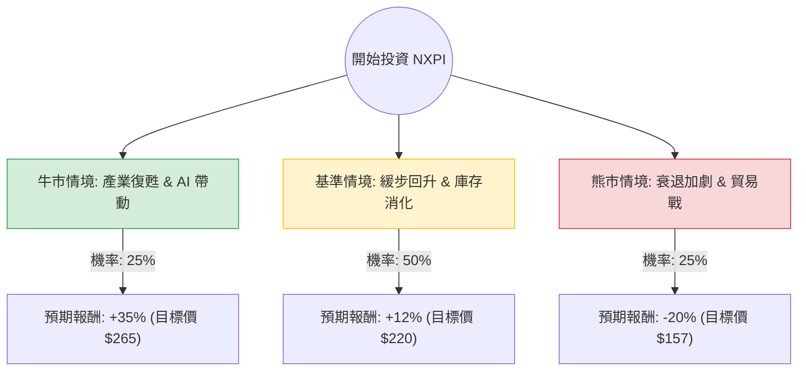

這份分析報告結合了您提供的基本面數據，以及針對 **NXP Semiconductors (NXPI)** 的最新市場動態（如 2024 Q3 財報表現、汽車半導體週期、宏觀經濟政策）進行的綜合評估。

---

### 一、 核心假設與市場背景分析

在構建決策樹之前，我們基於最新資訊設定以下核心假設：

1.  **產業週期（關鍵因素）**：NXPI 約 50% 的營收來自汽車領域。目前汽車半導體正處於「去庫存」階段，歐洲與美國車市需求放緩，這解釋了為何近期股價表現疲軟（SMA50/200 均為負值）。
2.  **估值水平**：目前 **Forward P/E 僅 11.77**，遠低於歷史均值與行業平均，且 **PEG 為 0.63**，顯示市場已過度反應利空，估值具有吸引力。
3.  **宏觀風險**：川普 2.0 政府可能的關稅政策對全球供應鏈的擾動，以及高利率環境對汽車貸款的壓制。
4.  **分析師預期**：目標價 $262.37 較現價有約 33% 的潛在漲幅。

---

### 二、 決策樹分析 (Decision Tree)

以下使用 Markdown 繪製 NXPI 未來 12 個月的投資決策路徑：

#### 決策樹節點詳細說明：

1.  **牛市情境 (Bull Case) - 25% 機率**：
    *   **條件**：汽車庫存調整在 2025 Q1 提前結束；工業與 IoT 領域受 AI 邊緣運算帶動強勁增長；聯準會降息刺激車市。
    *   **預期報酬**：回歸分析師目標價 $262-$265。
2.  **基準情境 (Base Case) - 50% 機率**：
    *   **條件**：汽車市場維持疲軟至 2025 年中，但 NXPI 憑藉高毛利（53.37%）與強大現金流維持獲利穩定。股價隨大盤緩步修復估值。
    *   **預期報酬**：回升至 SMA200 以上水平，約 $220。
3.  **熊市情境 (Bear Case) - 25% 機率**：
    *   **條件**：全球經濟衰退導致汽車需求崩潰；中美貿易摩擦升級導致供應鏈成本激增；EPS 增長不如預期。
    *   **預期報酬**：下探 52 週低點附近（約 $150-$160）。

---

### 三、 期望值分析 (Expected Value Analysis)

我們根據上述情境計算投資 NXPI 的預期收益率（Expected Return）：

#### 1. 計算公式：
$$EV = (P_{Bull} \times R_{Bull}) + (P_{Base} \times R_{Base}) + (P_{Bear} \times R_{Bear})$$

#### 2. 數值帶入：
*   **牛市**：$0.25 \times 35\% = 8.75\%$
*   **基準**：$0.50 \times 12\% = 6.00\%$
*   **熊市**：$0.25 \times (-20\%) = -5.00\%$

#### 3. 總計期望值：
**$EV = 8.75\% + 6.00\% - 5.00\% = 9.75\%$**

---

### 四、 綜合評估與最終結論

#### 1. 財務數據亮點與隱憂：
*   **優勢**：
    *   **PEG 0.63**：極具吸引力的增長估值比。
    *   **ROE 21.01%**：優異的股東權益回報。
    *   **Forward P/E 11.77**：顯示明年獲利預期將大幅改善（EPS next Y 預計增長 20%）。
    *   **股息率 2.06%**：在半導體股中提供了一定的下行保護。
*   **劣勢**：
    *   **技術面疲軟**：股價低於 SMA20, 50, 200，顯示短期內賣壓沉重，尚未止跌回穩。
    *   **短期動能**：EPS Q/Q 下降 7.16%，反映了當前汽車產業的逆風。

#### 2. 最終結論：**適合投資 (分批佈局)**

**判斷理由：**
雖然短期內受限於汽車產業去庫存與技術面空頭排列，但從**期望值分析（+9.75%）**來看，該股具備正向預期收益。

*   **估值安全邊際高**：Forward P/E 僅 11 倍，對於一家毛利率超過 50% 的龍頭半導體公司而言，已進入價值區。
*   **結構性增長未變**：電動車（EV）與自動駕駛（ADAS）對晶片含量的長期需求是不可逆的趨勢。
*   **投資建議**：不建議一次性歐印（All-in），因為 SMA 指標顯示短期仍有下行壓力。建議在 **$185 - $195** 區間採取**分批買進（Dollar-cost averaging）**策略，目標持有期為 12-18 個月，以等待產業週期拐點出現。

**風險提示：** 若全球汽車銷量持續低迷或貿易戰導致毛利率大幅下滑，需重新評估熊市機率。