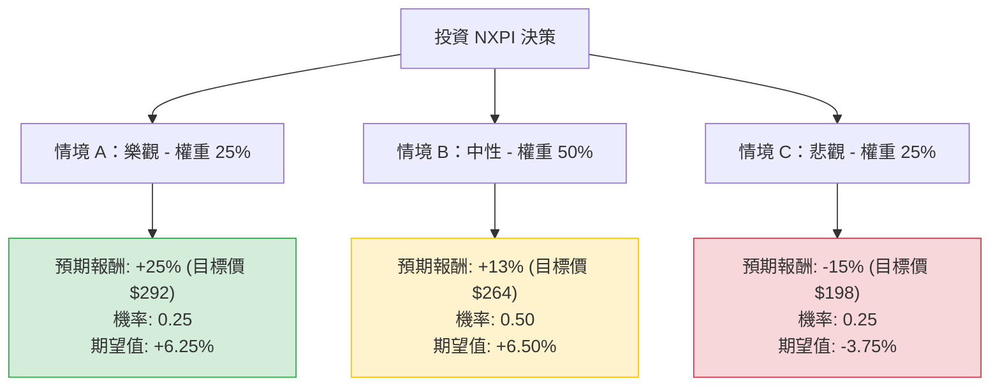

針對恩智浦半導體（NXP Semiconductors, **NXPI**）的投資評估，我結合了您提供的基本面數據以及最新的市場動態（包含 2024 年 Q1 財報表現與產業趨勢）進行分析。

---

### 一、 核心假設與市場背景分析

在構建決策樹之前，我們先釐清影響 NXPI 股價的三大核心變數：

1.  **汽車與工業市場復甦（權重最高）**：NXPI 超過 50% 的營收來自汽車領域。目前車用晶片庫存調整已接近尾聲，但電動車（EV）增速放緩是潛在風險。
2.  **降息預期與估值修復**：NXPI 的 Forward P/E 為 16.8，相較於歷史平均與同業（如 TI, ADI）並不高。若聯準會降息，有利於資本密集型的半導體股估值擴張。
3.  **AI 邊緣運算（Edge AI）**：NXPI 積極佈局邊緣 AI 處理器，這可能成為繼汽車之後的第二增長曲線。

---

### 二、 決策樹分析（Decision Tree）

以下使用 Markdown 繪製決策樹，模擬未來一年的投資情境：

#### 1. 樂觀情境 (Bull Case) - 25% 機率
*   **條件**：全球汽車銷量超預期，特別是混合動力與電動車對晶片需求激增；Edge AI 產品線貢獻顯著營收；聯準會啟動多次降息。
*   **預期報酬**：股價突破 52 週高點，觸及 $290 - $300 區間（約 +25%）。

#### 2. 中性情境 (Base Case) - 50% 機率
*   **條件**：符合分析師預期（EPS 明年增長 17%）。汽車市場平穩，工業與 IoT 領域緩步復甦。
*   **預期報酬**：達到分析師平均目標價 $264.81（約 +13%）。

#### 3. 悲觀情境 (Bear Case) - 25% 機率
*   **條件**：全球經濟衰退導致汽車需求萎縮；地緣政治影響中國市場營收（NXPI 中國營收佔比高）；高利率維持更久。
*   **預期報酬**：回測 200 日均線或更低，跌至 $190 - $200 區間（約 -15%）。

---

### 三、 期望值分析（Expected Value Analysis）

#### 1. 計算過程
我們將各情境的「預期報酬率」與「發生機率」相乘後加總：

*   **樂觀期望值**：$25\% \times 0.25 = 6.25\%$
*   **中性期望值**：$13\% \times 0.50 = 6.50\%$
*   **悲觀期望值**：$-15\% \times 0.25 = -3.75\%$

**總體期望報酬率 (Total EV)** = $6.25\% + 6.50\% - 3.75\% = \mathbf{9.0\%}$

#### 2. 財務數據支持點
*   **獲利能力**：ROE 21.19% 顯示公司管理層運用股東資本效率極高。
*   **估值吸引力**：Forward P/E 16.8 遠低於當前 P/E 28.66，暗示市場預期未來一年盈餘將大幅改善（與數據中 EPS next Y +17.09% 一致）。
*   **技術面**：目前股價高於 SMA50 (5.96%) 與 SMA200 (8.45%)，呈現多頭排列。
*   **股利**：1.75% 的殖利率提供了一定的下行保護。

---

### 四、 最終結論

**投資建議：適合投資（分批買入）**

#### 判斷理由：
1.  **正向期望值**：計算出的 9.0% 期望報酬率雖非暴利，但在半導體週期底部區域屬於穩健表現，且優於許多傳統產業。
2.  **盈餘拐點明確**：數據顯示今年 EPS 增長為負 (-10%)，但明年預期轉正且高達 17.09%。市場通常會提前 6-9 個月反應此類增長，目前正是佈局期。
3.  **目標價空間**：當前價格 $233.72 距離分析師目標價 $264.81 仍有約 13% 的上漲空間。
4.  **風險控管**：NXPI 的債務股本比 (Debt/Eq: 1.22) 略高，且內部人交易 (Insider Trans: -11.94%) 顯示近期有減持現象，這暗示短期內股價可能隨大盤震盪，不建議一次性重倉，建議在 $220 - $230 區間分批佈局。

**總結：** NXPI 是一家基本面紮實、正處於產業復甦前夕的優質標的。在汽車電子化長期趨勢不變的情況下，目前的估值具有投資價值。