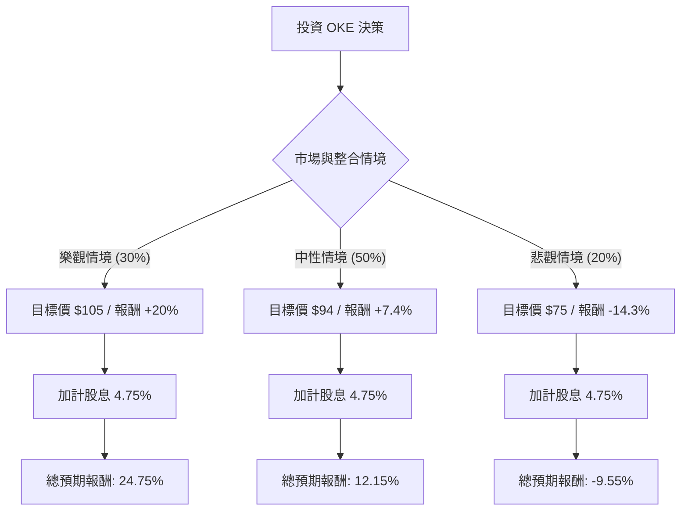

這份分析報告將結合您提供的基本面數據，以及最新的市場動態（特別是 ONEOK 近期的大型收購案與 AI 能源需求趨勢），利用**決策樹（Decision Tree）**與**期望值分析（Expected Value Analysis）**評估 OKE 的投資價值。

---

### 一、 最新市場動態與背景分析 (Web Search Summary)

在進行定量分析前，需考慮以下關鍵即時資訊：
1.  **大規模收購案**：ONEOK 近期宣布以約 59 億美元收購 **Medallion Midstream** 並取得 **EnLink Midstream (ENLC)** 的控股權。這標誌著 OKE 從純天然氣轉向更多元化的液體與 Permian 盆地佈局。
2.  **AI 與電力需求**：隨著 AI 數據中心對電力需求激增，天然氣作為穩定發電來源的需求看漲，OKE 作為全美最大的中游服務商之一，處於有利位置。
3.  **利率環境**：聯準會進入降息週期，對於高負債（Debt/Eq 1.47）且高股息（4.75%）的中游能源股是利多，能降低融資成本並提升股息吸引力。
4.  **財務整合風險**：頻繁的大型收購（先是 Magellan，現在是 EnLink）增加了整合風險與短期債務壓力。

---

### 二、 決策樹分析 (Decision Tree)

我們將未來一年的投資表現分為三種情境：**樂觀（Bull）**、**中性（Base）**、**悲觀（Bear）**。

#### 節點詳細說明：

1.  **樂觀情境 (Bull Case) - 30% 機率**：
    *   **條件**：EnLink/Medallion 整合順利，協同效應超預期；AI 數據中心帶動天然氣需求大幅增長；聯準會降息速度快於預期。
    *   **預期股價**：$105 (反映 Forward P/E 擴張至 17x)。
    *   **預期報酬**：+20% (資本利得) + 4.75% (股息) = **24.75%**。

2.  **中性情境 (Base Case) - 50% 機率**：
    *   **條件**：收購案進展平穩，債務水平受控；市場維持目前對能源中游的評價；達到分析師平均目標價。
    *   **預期股價**：$94 (參考數據中 Target Price $93.9)。
    *   **預期報酬**：+7.4% (資本利得) + 4.75% (股息) = **12.15%**。

3.  **悲觀情境 (Bear Case) - 20% 機率**：
    *   **條件**：收購整合出現困難，槓桿率過高導致信用評等壓力；全球經濟衰退導致能源需求萎縮；油氣價格劇烈波動。
    *   **預期股價**：$75 (回測 SMA200 以下支撐位)。
    *   **預期報酬**：-14.3% (資本利得) + 4.75% (股息) = **-9.55%**。

---

### 三、 期望值計算 (Expected Value Calculation)

#### 1. 核心假設
*   **當前股價**：$87.5
*   **持有期間**：12 個月
*   **股息收益率**：固定為 4.75% (OKE 具備穩定的增股息紀錄)
*   **機率分配**：基於近期收購案的積極市場反應，給予中性與樂觀較高權重 (共 80%)。

#### 2. 計算過程
期望值 (EV) = Σ (各情境總報酬 × 對應機率)

*   **樂觀貢獻**：$24.75\% \times 0.30 = 7.425\%$
*   **中性貢獻**：$12.15\% \times 0.50 = 6.075\%$
*   **悲觀貢獻**：$-9.55\% \times 0.20 = -1.91\%$

**總期望報酬率 (Total Expected Return) = 7.425% + 6.075% - 1.91% = 11.59%**

---

### 四、 最終結論與投資建議

#### **結論：適合投資 (Buy / Overweight)**

#### **理由分析：**

1.  **正向期望值**：計算出的年度期望報酬率為 **11.59%**，優於歷史美股平均長期回報，且具備 4.75% 的高現金流墊底，防禦性強。
2.  **戰略擴張成功**：OKE 透過收購 EnLink 和 Medallion，成功將版圖擴張至 Permian 盆地的原油與天然氣採集業務，這將顯著提升其 Q/Q 銷售額（數據顯示 Sales Q/Q 已達 +29.5%）。
3.  **基本面穩健**：
    *   **ROE (17.17%)** 表現優異，顯示管理層運用股東資本效率高。
    *   **Forward P/E (14.17)** 低於當前 P/E (16.17)，顯示市場預期未來獲利將增長。
    *   **PEG (1.91)** 雖略高，但考慮到中游能源股的穩定現金流特性，尚屬合理範圍。
4.  **技術面支撐**：股價目前位於 SMA20、SMA50、SMA200 之上，呈現多頭排列，且距離 52 週高點僅約 8% 空間，動能強勁。

#### **風險提示：**
*   **債務壓力**：Debt/Eq 1.47 偏高，需密切觀察收購後的去槓桿進度。
*   **整合風險**：連續的大型併購若無法產生預期的協同效應，可能導致利潤率 (Profit Margin 10.09%) 承壓。

**建議操作：** 可於 $85 - $88 區間分批佈局，長期持有以領取股息並參與能源轉型與 AI 電力需求的增長紅利。