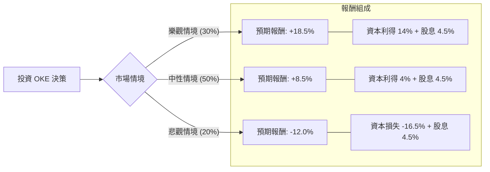

這份分析報告將結合您提供的基本面數據，以及最新的市場動態（包含近期收購案與產業趨勢），利用**決策樹（Decision Tree）**與**期望值分析（Expected Value Analysis）**來評估 ONEOK, Inc. (OKE) 的投資價值。

---

### 1. 市場動態與核心假設更新

在進行計算前，我們必須納入最新的市場資訊：
*   **併購擴張（關鍵動態）：** OKE 近期宣布以約 59 億美元收購 Medallion Midstream，並從 GIP 手中收購 EnLink Midstream 的股權。這顯示 OKE 正積極擴張其在二疊紀盆地（Permian Basin）的影響力，尋求規模經濟。
*   **利率環境：** 隨著聯準會（Fed）進入降息週期，對於高負債（Debt/Eq 1.47）且高股息（4.57%）的能源中游產業（Midstream）是利多，能降低融資成本並提升股息吸引力。
*   **估值壓力：** 目前股價（$92.12）已高於分析師平均目標價（$91.0），且處於 52 週高點附近，短期內可能面臨回檔壓力。

---

### 2. 決策樹分析 (Decision Tree)

我們將未來一年的投資情境分為三種：**樂觀（牛市）**、**中性（基準）**、**悲觀（熊市）**。

#### 節點詳細說明：

1.  **樂觀情境 (Probability: 30%)**
    *   **條件：** 成功整合 Medallion 與 EnLink，協同效應超出預期；天然氣需求因 AI 數據中心用電激增而大幅成長；降息速度快於預期。
    *   **預期報酬：** 股價挑戰 $105 + 4.5% 股息 ≈ **18.5%**。

2.  **中性情境 (Probability: 50%)**
    *   **條件：** 併購進度平穩，營收隨產量穩定增長；利率緩步下降；股價維持在當前估值區間震盪向上。
    *   **預期報酬：** 股價微升至 $96 + 4.5% 股息 ≈ **8.5%**。

3.  **悲觀情境 (Probability: 20%)**
    *   **條件：** 經濟衰退導致能源需求萎縮；高額負債在整合過程中產生財務壓力；市場資金流向成長股，拋售價值型收息股。
    *   **預期報酬：** 股價回測 SMA200 約 $77 + 4.5% 股息 ≈ **-12.0%**。

---

### 3. 期望值計算過程 (Expected Value Calculation)

期望值 (EV) 的計算公式為：
$$EV = \sum (Probability_i \times Return_i)$$

**計算步驟：**
1.  **樂觀貢獻：** $0.30 \times 18.5\% = 5.55\%$
2.  **中性貢獻：** $0.50 \times 8.5\% = 4.25\%$
3.  **悲觀貢獻：** $0.20 \times (-12.0\%) = -2.40\%$

**總期望報酬率：**
$$5.55\% + 4.25\% - 2.40\% = 7.40\%$$

---

### 4. 核心假設與風險評估

*   **財務槓桿風險：** OKE 的 Debt/Eq 為 1.47，LT Debt/Eq 為 1.38，負債比率偏高。雖然中游產業現金流穩定，但大規模併購後若現金流整合不如預期，將影響信用評等。
*   **成長動能：** EPS next Y 預計成長 8.4%，PEG 為 2.09。這顯示目前的股價相對於成長性並不便宜（PEG > 1），市場已給予較高的溢價。
*   **技術面：** 股價高於 SMA20, 50, 200，顯示強勢多頭排列，但與 SMA200 乖離率達 18.87%，短期有過熱跡象。

---

### 5. 最終結論

#### **判斷：適合投資 (建議：分批佈局 / 逢低買進)**

**理由：**
1.  **正向期望值：** 經過風險加權後的預期報酬率為 **7.40%**。雖然這不是一個暴利的數字，但考慮到其 **4.57% 的穩定股息**，對於追求現金流與穩健增長的投資者具有吸引力。
2.  **產業護城河：** OKE 透過近期併購進一步鞏固了在 NGL（液化天然氣）與中游基礎設施的地位。隨著 AI 數據中心對電力需求的增加，天然氣作為主要發電來源，長期趨勢看好。
3.  **降息利多：** 作為高股息與資本密集型企業，降息將直接減輕其債務利息負擔，並提升其股息殖利率的相對吸引力。

**投資建議：**
由於目前股價已超越分析師目標價 ($91.0) 且處於高位，**不建議在 $92 以上全力追高**。較理想的策略是等待股價回測 **SMA50 (約 $83-$85 區間)** 時分批進場，以降低悲觀情境發生時的下行風險，並鎖定更高的長期殖利率。