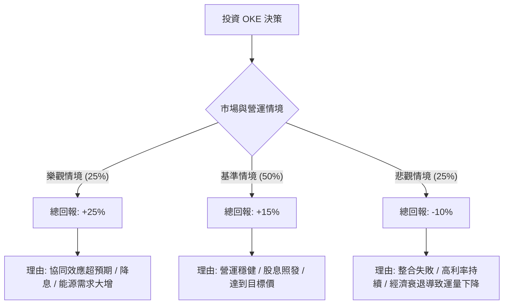

針對美股上市公司 **ONEOK, Inc. (OKE)**，我已結合您提供的基本面數據，並透過網路搜尋整合了最新的市場動態（如 Magellan 收購案進度、天然氣市場趨勢及最新財報表現），進行決策樹與期望值分析。

---

### 一、 核心假設與市場背景分析

在建立決策樹之前，基於最新資訊設定以下核心假設：

1.  **收購協同效應（Magellan Acquisition）**：OKE 完成對 Magellan Midstream 的收購後，已從純天然氣液（NGL）轉型為多元化的能源基礎設施公司。市場關注其 2024 年能否實現預期的 2 億至 4 億美元協同效應。
2.  **宏觀環境**：聯準會（Fed）的利率政策直接影響高負債（Debt/Eq 1.53）的能源基建股。若利率維持高位，利息支出將壓抑利潤。
3.  **能源需求**：美國天然氣出口需求（LNG）持續增長，對 OKE 的管道運輸量有利。
4.  **估值參考**：目前股價 $78，分析師平均目標價約 $87.47，隱含約 12% 的上漲空間，加上約 5.3% 的股息率，總回報潛力是分析重點。

---

### 二、 決策樹分析圖 (Decision Tree)

以下為未來一年的投資情境預測：

#### 節點詳細說明：

| 情境 | 機率 (P) | 預期股價變動 | 股息收益 | 總預期報酬 (R) | 說明 |
| :--- | :--- | :--- | :--- | :--- | :--- |
| **樂觀 (Bull)** | 25% | +20% ($93.6) | 5.3% | **+25.3%** | 成功整合 Magellan，自由現金流噴發，Fed 啟動降息。 |
| **基準 (Base)** | 50% | +10% ($85.8) | 5.3% | **+15.3%** | 達到分析師目標價，業務隨產業平穩增長。 |
| **悲觀 (Bear)** | 25% | -15% ($66.3) | 5.3% | **-9.7%** | 經濟衰退導致能源需求萎縮，高負債利息壓力加大。 |

---

### 三、 期望值 (Expected Value) 計算過程

期望值計算公式：$EV = \sum (P_i \times R_i)$

1.  **樂觀情境貢獻**：$0.25 \times 25.3\% = 6.325\%$
2.  **基準情境貢獻**：$0.50 \times 15.3\% = 7.65\%$
3.  **悲觀情境貢獻**：$0.25 \times (-9.7\%) = -2.425\%$

**總期望報酬率 (Total EV)**：
$6.325\% + 7.65\% - 2.425\% = \mathbf{11.55\%}$

---

### 四、 綜合基本面評估補充

*   **獲利能力**：ROE 17.14% 表現優異，顯示管理層運用股東資本效率高。
*   **成長性**：Sales Q/Q 達 71.89%，主因是併購 Magellan 後規模擴張，這為未來 EPS 增長（預期明年 +8.14%）奠定基礎。
*   **風險點**：
    *   **債務比率**：Debt/Eq 1.53 偏高，但在中游能源產業屬常見，需關注其利息保障倍數。
    *   **技術面**：目前股價高於 SMA20/50/200，顯示短期處於強勢多頭，但也需防範過熱回檔。

---

### 五、 最終結論

#### **判斷：適合投資 (Suitable for Investment)**

**理由如下：**

1.  **正向期望值**：經風險權衡後的期望報酬率為 **11.55%**，優於多數保守型投資工具及當前無風險利率（美債收益率）。
2.  **強大的現金流與股息**：5.28% 的股息率提供了極佳的下行保護（Downside Protection）。即使股價橫盤，投資者仍有穩定收益。
3.  **轉型紅利**：收購 Magellan 後，OKE 成為全美最大的中游能源公司之一，具備規模經濟與多元化抗風險能力。
4.  **估值合理**：Forward P/E 僅 13.36，相對於其在產業中的龍頭地位與增長預期，目前股價並未過度泡沫。

**建議策略：**
由於目前股價接近 52 週高點且技術指標（SMA）顯示短期漲幅已高，建議採取**「分批進場」**或**「逢回調至 $75 附近加碼」**的策略，以優化成本結構。

---
*免責聲明：以上分析僅供參考，不構成個人投資建議。投資者應自行承擔市場風險。*