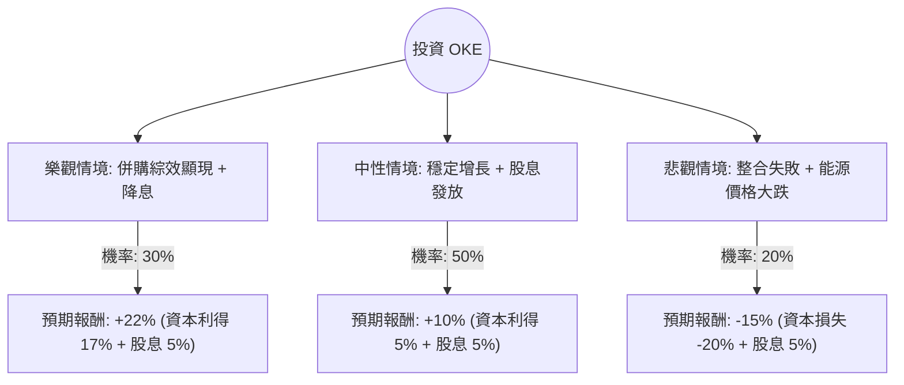

這份分析報告將結合您提供的數據與最新的市場動態（特別是 ONEOK 最近的大型收購案），利用**決策樹（Decision Tree）**與**期望值分析（Expected Value Analysis）**來評估 OKE 的投資價值。

---

### 1. 核心假設與市場背景分析

在建立決策樹之前，我們必須考慮以下關鍵因素：

*   **併購動態（關鍵變數）：** ONEOK 最近宣布以約 59 億美元收購 Medallion Midstream 並取得 EnLink Midstream 的控股權。這將大幅擴張其在二疊紀盆地（Permian Basin）的版圖。
*   **產業趨勢：** AI 數據中心對天然氣發電的需求激增，以及美國 LNG 出口能力的擴張，對中游能源商（Midstream）有利。
*   **財務狀況：** OKE 目前 P/E 約 16 倍，殖利率 4.76%。雖然債務比（Debt/Eq 1.53）偏高，但中游產業通常擁有穩定的現金流。
*   **技術面：** 目前股價（$87.33）已高於分析師平均目標價（$87.22），且近期漲幅較大（季漲幅 25.7%），短期可能面臨回檔壓力。

---

### 2. 決策樹分析 (Decision Tree)

我們預測未來一年的三種情境：**樂觀（牛市）**、**中性（基準）**、**悲觀（熊市）**。

#### 節點詳細說明：

1.  **樂觀情境 (30%)：**
    *   **條件：** EnLink 與 Medallion 併購案整合順利，產生的協同效應超出預期；聯準會降息導致高殖利率股受青睞。
    *   **預期報酬：** 股價挑戰 $102 (52W High 附近)，加上約 5% 股息，總回報約 22%。
2.  **中性情境 (50%)：**
    *   **條件：** 業務維持現狀，天然氣需求穩定增長。併購案帶來的債務壓力被現金流抵銷。
    *   **預期報酬：** 股價緩步推升至 $91.7，加上 5% 股息，總回報約 10%。
3.  **悲觀情境 (20%)：**
    *   **條件：** 併購導致債務負擔過重，信用評等受壓；全球經濟衰退導致能源需求萎縮。
    *   **預期報酬：** 股價回測 $70 支撐位，扣除股息後總回報為 -15%。

---

### 3. 期望值計算過程 (Expected Value Calculation)

期望值 (EV) = $\sum (機率 \times 預期報酬)$

*   **樂觀情境貢獻：** $0.30 \times 22\% = 6.6\%$
*   **中性情境貢獻：** $0.50 \times 10\% = 5.0\%$
*   **悲觀情境貢獻：** $0.20 \times (-15\%) = -3.0\%$

**總體期望報酬率 (Total Expected Return) = $6.6\% + 5.0\% - 3.0\% = 8.6\%$**

#### 核心假設依據：
*   **估值：** Forward P/E (14.98) 低於當前 P/E (16.06)，顯示市場預期明年盈利會增長。
*   **股息：** 4.76% 的殖利率提供了強大的下行保護（Margin of Safety）。
*   **風險：** 負債比率（Debt/Eq 1.53）是主要隱憂，若利率維持高位更久，利息支出將侵蝕利潤。

---

### 4. 最終結論

#### **判斷：適合投資 (建議：分批買入 / 逢低佈局)**

**理由：**
1.  **正向期望值：** 8.6% 的預期報酬率在公用事業/中游能源板塊中屬於穩健水平，且尚未計入潛在的超額併購綜效。
2.  **戰略擴張：** 收購 EnLink 和 Medallion 使 OKE 成為美國最大的中游服務商之一，擁有極強的定價權與完整的產業鏈（從採集到出口）。
3.  **宏觀利好：** AI 數據中心對天然氣的長期需求是結構性的增長動力，OKE 處於此趨勢的核心位置。
4.  **風險提示：** 目前股價已反映大部分利多（SMA20, 50, 200 均呈現多頭排列且偏離率較高），且高於分析師平均目標價。**不建議在當前 $87 以上價位全力追高，建議等待股價回落至 $82 - $84 區間（靠近 SMA50）時進場，以最大化安全邊際。**

**總結：** OKE 是一家基本面強勁、正處於擴張期的優質高息股。雖然短期估值稍高，但長期增長邏輯清晰，適合尋求穩定現金流與適度資本增長的投資者。