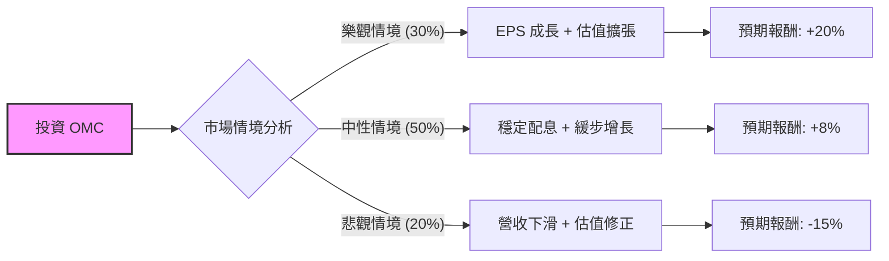

這份分析報告針對 **Omnicom Group Inc. (OMC)** 進行評估。OMC 是全球領先的廣告與行銷傳播集團，其業務高度依賴全球企業的行銷預算支出。

以下將透過「核心假設」、「決策樹模型」與「期望值計算」來評估其投資價值。

---

### 一、 核心假設 (Core Assumptions)

在建立模型前，我們基於當前市場環境、OMC 財報及產業趨勢設定以下假設：

1.  **宏觀經濟（市場）：** 假設未來 12 個月美國經濟實現「軟著陸」的機率較高，但高利率環境仍會壓抑部分企業的廣告支出。
2.  **財務表現：** OMC 的股息發放穩定（目前收益率約 3.0% - 3.5%），且公司持續進行股份回購。2024 年收購 Flywheel 後，數位商務能力提升。
3.  **產業趨勢：** 生成式 AI 對廣告業既是威脅（自動化取代人工）也是機會（提升效率）。OMC 轉向高成長領域（精密行銷、商務行銷）的轉型進度是關鍵。
4.  **估值基準：** 當前本益比 (P/E) 約為 12-14 倍，處於歷史中位數水平。

---

### 二、 決策樹分析（Decision Tree）

我們將未來 12 個月的投資預期分為三種情境：**樂觀（高成長）、中性（穩健成長）與悲觀（經濟衰退/競爭加劇）**。

#### 決策樹節點詳細資訊：

| 節點名稱 (情境) | 發生機率 (P) | 驅動因素 | 預期報酬 (R) | 期望值 (P * R) |
| :--- | :--- | :--- | :--- | :--- |
| **樂觀情境 (Optimistic)** | 30% (0.3) | AI 整合超預期、Flywheel 貢獻顯著、全球廣告預算激增。 | +20% | **6.0%** |
| **中性情境 (Base Case)** | 50% (0.5) | 經濟軟著陸、有機增長維持 3-5%、持續回購與穩定配息。 | +8% | **4.0%** |
| **悲觀情境 (Pessimistic)** | 20% (0.2) | 經濟衰退、廣告商縮減預算、AI 導致傳統廣告業務利潤縮減。 | -15% | **-3.0%** |

---

### 三、 期望值分析計算 (Expected Value Calculation)

我們使用加權平均公式計算整體的 **預期報酬期望值 (Expected Return)**：

$$E(R) = \sum (P_i \times R_i)$$

#### 計算過程：
1.  **樂觀貢獻：** $0.30 \times 20\% = 6.0\%$
2.  **中性貢獻：** $0.50 \times 8\% = 4.0\%$
3.  **悲觀貢獻：** $0.20 \times (-15\%) = -3.0\%$

#### 總計期望值：
$$E(R) = 6.0\% + 4.0\% - 3.0\% = \mathbf{7.0\%}$$

---

### 四、 投資評估結論

#### **最終判斷：適合投資 (中立偏多 / 適合防禦型配置)**

**判斷理由：**
1.  **期望值為正 (7%)：** 儘管 7% 的報酬率並非爆發性增長，但考慮到 OMC 屬於成熟型、高現金流的公司，此報酬率符合價值型投資的預期（若加上 3% 以上的股息，總報酬可能接近 10%）。
2.  **下行風險可控：** OMC 的估值目前處於合理區間（P/E < 15x），即便在悲觀情境下，強大的現金流與股息政策也提供了良好的下行保護（Safety Margin）。
3.  **數位轉型紅利：** 收購 Flywheel 讓 OMC 從傳統廣告轉向更具黏性的數位商務數據領域，這降低了被 AI 全面取代的風險。

#### **投資建議建議：**
*   **適合對象：** 追求穩定領息、希望降低投資組合波動率的防禦型投資者。
*   **買入策略：** 由於期望報酬中規中矩，建議在股價拉回至 P/E 11-12 倍左右時分批買入，以提高安全邊際。
*   **監控指標：** 需持續追蹤「有機營收增長率 (Organic Growth)」以及「AI 工具對人力成本的優化程度」。