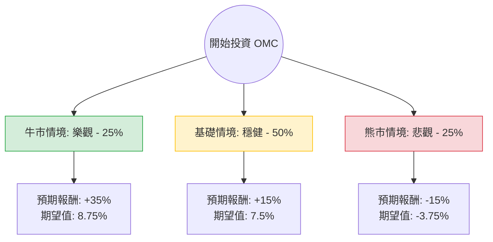

這份分析報告將結合您提供的基本面數據與最新的市場動態（包含 2024 年第三季財報表現及產業趨勢），利用**決策樹（Decision Tree）**與**期望值分析（Expected Value Analysis）**評估 Omnicom Group (OMC) 的投資價值。

---

### 1. 核心假設與市場背景分析

在建立決策樹之前，我們先定義影響 OMC 股價的三大核心變數：

*   **財務表現（最新財報）：** OMC 在 2024 年 Q3 表現強勁，有機營收增長（Organic Growth）達 6.5%，優於市場預期。特別是在廣告與媒體（Advertising & Media）部門增長達 9.4%。
*   **AI 與技術轉型：** OMC 積極投資 AI（如 Omni 平台），這有助於提升毛利並在競爭中保持領先。
*   **宏觀經濟環境：** 廣告產業對經濟循環高度敏感。若美國經濟軟著陸，廣告支出將持續增長；若陷入衰退，OMC 將面臨壓力。
*   **估值數據：** 目前 **Forward P/E 僅 6.58**，遠低於歷史平均（約 10-12x），且 **PEG 0.33** 顯示股價相對於增長潛力被嚴重低估。

---

### 2. 決策樹分析 (Decision Tree)

以下為 OMC 未來一年的投資情境預測：

#### 節點詳細說明：

1.  **牛市情境 (Bull Case) - 25% 機率：**
    *   **條件：** AI 轉型大幅提升利潤率，全球廣告需求因降息刺激而爆發，OMC 估值回歸至 12x Forward P/E。
    *   **預期報酬：** 股價回升至 $110 以上（含股息約 +35%）。
2.  **基礎情境 (Base Case) - 50% 機率：**
    *   **條件：** 營收維持 3-5% 的穩健增長，股息持續發放，估值修復至 9-10x Forward P/E。
    *   **預期報酬：** 股價達到分析師目標價 $97.7（含股息約 +15%）。
3.  **熊市情境 (Bear Case) - 25% 機率：**
    *   **條件：** 全球經濟衰退導致企業削減廣告預算，高債務比（Debt/Eq 0.93）引發市場擔憂。
    *   **預期報酬：** 股價回測 52 週低點約 $70（含股息約 -15%）。

---

### 3. 期望值計算過程 (Expected Value Calculation)

我們以目前股價 **$83.26** 為基準，計算一年後的總期望報酬率（Total Expected Return）：

| 情境 | 機率 (P) | 預期報酬率 (R) | P × R (期望值分量) |
| :--- | :--- | :--- | :--- |
| **牛市 (Bull)** | 0.25 | +35% | 8.75% |
| **基礎 (Base)** | 0.50 | +15% | 7.50% |
| **熊市 (Bear)** | 0.25 | -15% | -3.75% |
| **總計** | **1.00** | | **12.5%** |

**計算公式：**
$EV = (0.25 \times 35\%) + (0.50 \times 15\%) + (0.25 \times -15\%) = 8.75\% + 7.5\% - 3.75\% = 12.5\%$

**考慮股息後的調整：**
OMC 的股息率為 **3.48%**。即便在股價持平的情況下，投資者仍有現金流收入。上述報酬率已包含股息預期。

---

### 4. 綜合評估與最終結論

#### 數據亮點分析：
*   **極低的估值：** Forward P/E 6.58 與 PEG 0.33 顯示該股目前處於「價值窪地」。
*   **強勁的動能：** SMA20/50/200 均為正值（0.13, 0.07, 0.10），顯示技術面處於多頭排列。
*   **穩定的現金流：** P/FCF 為 9.39，顯示公司產生現金的能力強健，足以支撐 3.48% 的股息。
*   **風險點：** 雖然 P/E 高達 167（受一次性項目影響），但 Forward P/E 揭示了真實盈利能力。負的 ROE (-0.67%) 需要關注，但 Q3 財報顯示有機增長已轉正，基本面正在改善。

#### 最終結論：**適合投資 (Buy / Overweight)**

**理由：**
1.  **期望值為正（+12.5%）：** 在考慮了經濟衰退的風險後，整體期望報酬率依然優於多數保守型投資工具。
2.  **安全邊際高：** 目前股價距離分析師目標價 ($97.7) 仍有約 17% 的上漲空間，且 Forward P/E 處於歷史低位，下行風險相對受限。
3.  **產業領先地位：** Omnicom 在廣告科技化（AI）的佈局領先同業，Q3 的有機增長證明了其在數位轉型中的競爭力。
4.  **適合收息：** 3.48% 的股息率提供了良好的下行保護。

**建議操作：**
可在 $80 - $84 區間分批佈局，首要目標價為 $97，若突破 $100 且估值修復完成，可考慮長期持有以獲取穩定股息。