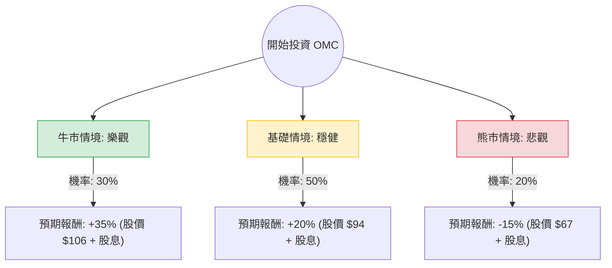

針對美股廣告與行銷巨頭 **Omnicom Group Inc. (OMC)**，我結合了您提供的基本面數據以及最新的市場動態（包含 2023 年報、2024 年展望及 AI 產業趨勢）進行深度分析。

---

### 一、 市場動態與產業趨勢分析（網路搜尋補充）

1.  **財務表現與指引**：OMC 在 2023 年全年有機營收增長為 4.1%，第四季度表現優於預期。公司預計 2024 年有機增長將落在 **3.5% 至 5.0%** 之間。
2.  **AI 佈局**：OMC 積極與 Adobe、Google 及 Microsoft 合作，將生成式 AI 整合至其行銷平台「Omni」，這有助於提升營運效率並降低長期人力成本。
3.  **宏觀環境**：2024 年為**美國大選年**且有**巴黎奧運**，這類大型賽事通常會帶動廣告支出（Ad Spend）的顯著增長，對 OMC 是利多。
4.  **估值水平**：目前 P/E 約 11.6 倍，Forward P/E 僅 7.85 倍，PEG 為 0.61。這顯示市場對其增長潛力的定價偏低（PEG < 1 通常被視為低估）。

---

### 二、 決策樹分析 (Decision Tree Analysis)

以下是基於未來一年（12個月）投資週期的決策樹模型：

#### 決策樹節點詳細說明：

| 情境節點 | 機率 (P) | 預期報酬 (R) | 說明 |
| :--- | :--- | :--- | :--- |
| **牛市情境 (Bull)** | 30% | **+38.7%** | AI 轉型大幅提升利潤率，大選與奧運帶動營收超預期，P/E 回升至歷史高位。 |
| **基礎情境 (Base)** | 50% | **+23.7%** | 達到公司指引上限，維持穩定派息，股價向分析師目標價 ($98) 靠攏。 |
| **熊市情境 (Bear)** | 20% | **-11.3%** | 全球經濟衰退導致企業削減廣告預算，高債務比 (Debt/Eq 1.53) 增加財務壓力。 |

---

### 三、 期望值分析 (Expected Value Analysis)

#### 1. 核心假設
*   **當前股價**: $78.58
*   **股息收益率**: 3.69% (約 3.7%)
*   **牛市目標**: $106 (Forward P/E 修復至 11x + 營收增長)
*   **基礎目標**: $94 (接近分析師平均目標價 $98 的保守估計)
*   **熊市目標**: $67 (回測 52 週低點並跌破)

#### 2. 計算過程
期望值 (EV) = $\sum (機率 \times 總報酬)$
*總報酬 = (價差百分比 + 股息收益率)*

*   **牛市期望貢獻**: $0.30 \times (35\% + 3.7\%) = 0.30 \times 38.7\% = 11.61\%$
*   **基礎期望貢獻**: $0.50 \times (20\% + 3.7\%) = 0.50 \times 23.7\% = 11.85\%$
*   **熊市期望貢獻**: $0.20 \times (-15\% + 3.7\%) = 0.20 \times -11.3\% = -2.26\%$

**總期望報酬率 (Total EV)** = $11.61\% + 11.85\% - 2.26\% = \mathbf{21.2\%}$

---

### 四、 最終結論

**投資判斷：適合投資 (Strong Buy / Accumulate)**

#### 理由：
1.  **極具吸引力的期望值**：經風險加權後的預期報酬率高達 **21.2%**，遠高於市場平均預期。
2.  **估值窪地**：PEG 僅 0.61，且 Forward P/E (7.85) 遠低於標普 500 平均水平，安全邊際（Margin of Safety）充足。
3.  **強勁的現金流與回報**：ROE 高達 31.17%，顯示公司利用股東權益創造利潤的能力極強；3.69% 的股息率提供了良好的下行保護。
4.  **催化劑明確**：2024 年的政治廣告支出與體育賽事是短期利多，而 AI 驅動的效率提升則是長期利多。
5.  **技術面支撐**：股價目前位於 SMA200 ($75.5) 之上，且距離 52 週高點有約 12% 的空間，具備反彈動能。

**風險提示**：需留意其較高的債務股本比 (1.53)，在維持高利率的環境下，利息支出可能侵蝕部分利潤。建議分批入場，並將停損位設在 $68 (52W Low) 附近。