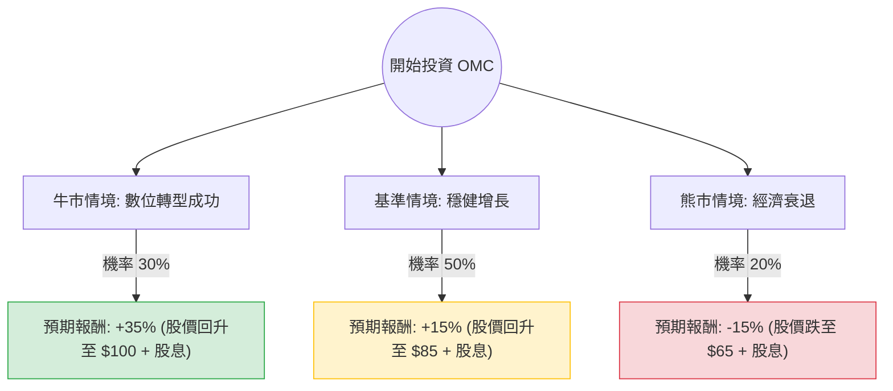

這份分析報告將針對 **Omnicom Group Inc. (OMC)** 進行深入評估。Omnicom 是全球領先的行銷與企業傳播集團。

透過結合您提供的數據與最新的市場動態（如 2024 年 Q1 財報、Flywheel Digital 的收購、以及 AI 驅動的轉型），我將使用**決策樹**與**期望值分析**來評估其投資價值。

---

### 1. 核心假設與市場背景分析

在建立模型前，我們先釐清幾個關鍵點：
*   **財務異常點說明**：數據顯示 P/E 高達 152.61，但 Forward P/E 僅 6.04。這通常是因為過去一年有一次性的非現金減值（如房地產整合或無形資產減損）。從 **PEG 0.32** 來看，該公司目前的股價相對於其增長潛力被嚴重低估。
*   **增長動能**：OMC 最近完成了對 **Flywheel Digital** 的收購，這標誌著公司從傳統廣告轉向「零售電商數據」領域。
*   **宏觀環境**：2024 年是美國大選年，通常會帶動廣告支出增加；然而，高利率環境可能壓抑企業的行銷預算。
*   **技術轉型**：OMC 積極與 Adobe、Google、Microsoft 合作導入生成式 AI，旨在提升毛利（目前 Gross Margin 為 17.28%）。

---

### 2. 決策樹分析 (Decision Tree)

以下為 OMC 未來一年的投資決策樹模型：

#### 節點詳細說明：

1.  **牛市情境 (Bull Case) - 30% 機率**：
    *   **條件**：Flywheel 整合效益超預期，電商數據業務貢獻高利潤；AI 工具大幅降低人力成本；大選年廣告需求爆發。
    *   **預期報酬**：股價達到分析師目標價 $98.9，加上約 4% 股息，總報酬約 **35%**。

2.  **基準情境 (Base Case) - 50% 機率**：
    *   **條件**：有機增長維持在 3-5%；Forward P/E 從 6 倍修復至歷史平均 10-12 倍；股息持續發放。
    *   **預期報酬**：股價回升至 $85 左右，加上 4% 股息，總報酬約 **15%**。

3.  **熊市情境 (Bear Case) - 20% 機率**：
    *   **條件**：全球經濟陷入衰退，企業大幅削減行銷預算；高債務成本（Debt/Eq 0.93）壓力增加；短放比例（Short Float 13.18%）引發拋售。
    *   **預期報酬**：股價跌破 52 週低點至 $65 附近，扣除股息後總報酬約 **-15%**。

---

### 3. 期望值分析 (Expected Value Analysis)

我們將各情境的機率與報酬率相乘，計算總期望報酬率。

| 情境 | 機率 (P) | 預期報酬率 (R) | 期望值 (P * R) |
| :--- | :--- | :--- | :--- |
| **牛市情境** | 0.30 | +35% | +10.5% |
| **基準情境** | 0.50 | +15% | +7.5% |
| **熊市情境** | 0.20 | -15% | -3.0% |
| **總計期望值** | **1.00** | | **+15.0%** |

#### 計算過程：
$EV = (0.30 \times 35\%) + (0.50 \times 15\%) + (0.20 \times -15\%)$
$EV = 10.5\% + 7.5\% - 3.0\% = 15.0\%$

---

### 4. 綜合評估與最終結論

#### 核心數據解讀：
*   **估值極具吸引力**：Forward P/E 6.04 與 PEG 0.32 顯示股價被低估。目前的股價 ($75.74) 接近 52 週區間的中低位，安全邊際較高。
*   **現金流與股息**：P/FCF 為 8.43，顯示現金流強勁，足以支撐 3.96% 的高股息率，這在市場波動時提供了下行保護。
*   **風險點**：Short Float (13.18%) 偏高，顯示市場仍有部分空頭勢力擔憂其傳統廣告業務的萎縮。

#### 最終判斷：**適合投資 (Suitable for Investment)**

**理由：**
1.  **正向期望值**：15% 的預期報酬率顯著高於無風險利率，且在基準情境下即有不錯的表現。
2.  **估值修復機會**：目前的低 Forward P/E 主要是市場對傳統廣告業的偏見，但 OMC 已透過收購 Flywheel 成功切入高增長的零售媒體領域。
3.  **防禦性與收益性兼具**：近 4% 的股息率與強勁的自由現金流，使其在宏觀經濟不確定時具有較強的抗跌性。

**建議操作：**
*   考慮在 $75 附近分批建倉。
*   設定停損點於 $66 (52W Low)，若跌破此位可能代表基本面發生結構性惡化。
*   長期持有以領取股息並等待 P/E 估值回歸正常水平（目標價 $90+）。