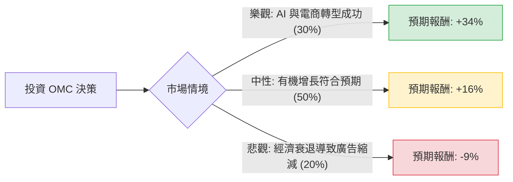

這份分析報告將結合您提供的基本面數據與最新的市場動態（包含 2024 年財報預期、AI 佈局及收購案），利用**決策樹（Decision Tree）**與**期望值分析（Expected Value Analysis）**評估 Omnicom Group (OMC) 的投資價值。

---

### 一、 核心背景與市場動態分析

在進入模型前，我們先釐清數據中的矛盾點與最新資訊：
1.  **估值陷阱辨析**：數據顯示 P/E 為 152.61，但 **Forward P/E 僅 6.14**。這通常意味著過去一年有一次性非經常性支出（如收購 Flywheel Digital 的相關費用或資產減計），而市場預期未來獲利將大幅回升。
2.  **增長動能**：OMC 最近以 8.5 億美元收購了電商數據平台 **Flywheel Digital**，這標誌著公司從傳統廣告轉向「精準行銷」與「電商轉化」。
3.  **AI 佈局**：OMC 已與 Google、Microsoft 及 Adobe 深度合作，將生成式 AI 整合至工作流，旨在降低成本並提高創意產出效率。
4.  **財務健康**：股息率高達 **3.96%**，且 PEG 僅 **0.34**，顯示相對於其增長預期，股價目前處於低估狀態。

---

### 二、 決策樹分析 (Decision Tree)

我們將未來一年的投資情境分為三種：**樂觀（牛市）**、**中性（基準）**、**悲觀（熊市）**。

#### 節點詳細說明：

| 情境節點 | 發生機率 (P) | 預期報酬率 (R) | 說明 |
| :--- | :--- | :--- | :--- |
| **樂觀情境** | 30% | **+34%** | 成功整合 Flywheel，AI 提升毛利，股價回升至目標價 $98.55，含股息。 |
| **中性情境** | 50% | **+16%** | 有機增長維持 3-5%，Forward P/E 修復至歷史均值 (約 10-12x)，含股息。 |
| **悲觀情境** | 20% | **-9%** | 全球經濟衰退，企業削減廣告預算，股價回測 52W 低點 ($66)，扣除股息後虧損。 |

---

### 三、 期望值計算過程 (Expected Value Calculation)

#### 1. 核心假設：
*   **現價 (Current Price)**: $75.74
*   **目標價 (Target Price)**: $98.55 (潛在漲幅 30%)
*   **股息收益 (Dividend Yield)**: 3.96% (約 4%)
*   **下行風險**: 參考 52W 低點 $66.33 (潛在跌幅 -13%)

#### 2. 各情境報酬計算：
*   **樂觀報酬**: 資本利得 30% + 股息 4% = **34%**
*   **中性報酬**: 資本利得 12% (估值部分修復) + 股息 4% = **16%**
*   **悲觀報酬**: 資本利得 -13% + 股息 4% = **-9%**

#### 3. 總期望值 (EV) 計算：
$$EV = (P_{Bull} \times R_{Bull}) + (P_{Base} \times R_{Base}) + (P_{Bear} \times R_{Bear})$$
$$EV = (0.30 \times 0.34) + (0.50 \times 0.16) + (0.20 \times -0.09)$$
$$EV = 0.102 + 0.080 - 0.018$$
$$EV = 0.164 = \mathbf{16.4\%}$$

---

### 四、 綜合評估與最終結論

#### 1. 數據亮點與風險：
*   **優勢**：
    *   **極低的 PEG (0.34)**：顯示股價被嚴重低估。
    *   **高股息 (3.96%)**：提供強大的下行保護（安全邊際）。
    *   **Forward P/E (6.14)**：遠低於標普 500 平均水平，具備價值修復空間。
*   **風險**：
    *   **高空單比例 (Short Float 10.58%)**：市場仍有部分資金看空廣告業在 AI 衝擊下的轉型。
    *   **負債比 (Debt/Eq 0.93)**：雖在可控範圍，但高利率環境下仍需關注利息支出。

#### 2. 最終判斷：
**結論：適合投資 (Buy / Overweight)**

#### 3. 判斷理由：
1.  **期望值正向**：16.4% 的預期年化報酬率顯著高於無風險利率（美債收益率），且在價值股中表現優異。
2.  **估值極具吸引力**：Forward P/E 僅 6 倍，反映了市場過度擔憂。隨著 Flywheel 數據業務的整合，OMC 的利潤率有望改善。
3.  **防禦性與進攻性兼備**：近 4% 的股息提供了防禦性，而 AI 與電商數據轉型提供了進攻性的想像空間。
4.  **技術面支撐**：目前股價接近 52 週區間的中下部，且距離分析師平均目標價 ($98.55) 有較大上漲空間。

**建議操作策略**：
考慮到目前 SMA20/50/200 均呈現微幅負值，顯示短期趨勢偏弱，建議採取**分批買入（Dollar Cost Averaging）**策略，以獲取穩定的股息並等待估值修復。