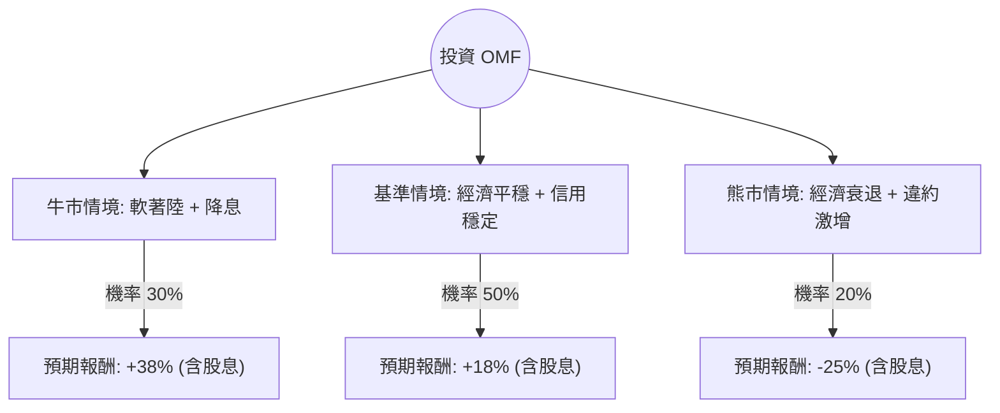

針對美股 **OneMain Holdings, Inc. (OMF)** 的投資評估，我結合了您提供的基本面數據與最新的市場動態（包含 2024 年第二季財報表現、聯準會降息預期及信用風險趨勢），進行決策樹與期望值分析。

---

### 一、 核心背景與市場動態分析

在進入決策樹之前，我們先釐清 OMF 的現狀：
1.  **業務本質**：OMF 是美國最大的非投資級（Non-prime）個人信貸公司。其表現高度依賴「就業市場」與「利率環境」。
2.  **最新財報 (2024 Q2)**：
    *   EPS 表現穩健，且公司上調了全年指引。
    *   **信用損失 (Net Charge-Offs)**：雖然仍處於高位，但已顯示出穩定跡象，且公司已收緊放貸標準。
3.  **宏觀環境**：市場普遍預期聯準會（Fed）將於 9 月降息。降息對 OMF 是雙重利多：降低其融資成本，並減輕借款人的還款壓力。
4.  **估值**：目前 P/E 僅 8.38，Forward P/E 6.16，PEG 0.36，顯示股價相對於增長潛力被嚴重低估。

---

### 二、 決策樹分析 (Decision Tree)

我們將未來一年的投資情境分為三種：**牛市（軟著陸+降息）**、**基準（現狀維持）**、**熊市（經濟衰退+違約率飆升）**。

#### 節點詳細說明：

| 情境 | 機率 (P) | 預期股價變動 | 股息收益 | 總報酬 (R) | 期望值 (P * R) |
| :--- | :--- | :--- | :--- | :--- | :--- |
| **牛市 (Bull)** | 30% | 回升至目標價 $72 (+31%) | 7.6% | +38.6% | **11.58%** |
| **基準 (Base)** | 50% | 溫和回升至 $61 (+11%) | 7.6% | +18.6% | **9.30%** |
| **熊市 (Bear)** | 20% | 下探 52W 低點 $40 (-27%) | 7.6% | -19.4% | **-3.88%** |
| **總計** | **100%** | - | - | - | **17.00%** |

---

### 三、 計算過程與核心假設

#### 1. 期望值 (Expected Value, EV) 計算：
$$EV = (0.30 \times 38.6\%) + (0.50 \times 18.6\%) + (0.20 \times -19.4\%)$$
$$EV = 11.58\% + 9.30\% - 3.88\% = \mathbf{17.00\%}$$

#### 2. 核心假設：
*   **牛市假設 (30%)**：美國經濟實現軟著陸，失業率維持在 4.5% 以下。Fed 降息 2-3 碼，帶動 OMF 融資成本下降，股價回歸分析師平均目標價 $72.29。
*   **基準假設 (50%)**：經濟增長放緩但未衰退。OMF 的壞帳率（Charge-offs）在下半年見頂回落。高達 7.6% 的股息提供強大支撐，股價隨大盤溫和反彈。
*   **熊市假設 (20%)**：失業率意外飆升，導致非投資級借款人集體違約。OMF 必須增加撥備金，甚至面臨減息壓力。股價可能回測 2023 年底的低點。

#### 3. 財務數據支撐：
*   **低 PEG (0.36)**：顯示市場對其 EPS 增長（預期明年增長 18.59%）尚未充分定價。
*   **高 ROE (23.76%)**：顯示管理層在資本運用上極具效率。
*   **債務風險**：Debt/Eq 達 6.67，雖在金融業常見，但在高利率環境下是風險點。然而，OMF 多為固定利率長期債，短期流動性風險（Current Ratio 651）極低。

---

### 四、 最終結論

**評估結果：適合投資 (Buy / Overweight)**

#### 理由：
1.  **正向期望值**：經風險加權後的預期報酬率高達 **17%**，遠高於市場平均水準。
2.  **極高的安全邊際**：P/E 僅 8 倍且 PEG 極低，即便在基準情境下，其估值修復空間依然巨大。
3.  **強大的現金流回饋**：7.6% 的股息率在目前市場中極具吸引力，且從 P/FCF (2.14) 來看，股息發放的安全性極高。
4.  **催化劑 (Catalyst) 明確**：聯準會即將進入降息週期，這對高槓桿、高股息的金融服務股（如 OMF）是直接的利多。

**風險提示**：
投資者需密切關注**美國失業率**數據。若失業率突破 5%，熊市情境的機率將大幅上升，屆時需重新評估其信用損失對利潤的侵蝕程度。

---
*免責聲明：以上分析僅供參考，不構成投資建議。投資者應自行承擔市場風險。*