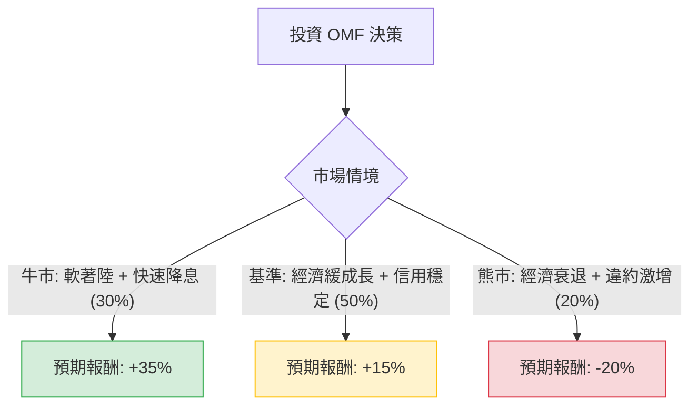

這份分析報告將結合您提供的基本面數據與最新的市場動態（包含聯準會降息預期、信用週期及 OneMain Financial (OMF) 的最新財報表現），利用**決策樹（Decision Tree）**與**期望值（Expected Value）**進行深度評估。

---

### 一、 外部環境與最新動態分析 (Web Search Summary)

在進入模型前，我們先整合當前市場對 OMF 的關鍵影響因素：
1.  **利率環境（利多）**：聯準會（Fed）已進入降息週期。作為非投資級信貸機構，降息能有效降低 OMF 的融資成本（Cost of Funds），進而擴大淨利差（NIM）。
2.  **資產品質（中性偏壓）**：最新財報顯示，雖然違約率（Delinquency Rates）仍處於高位，但已出現穩定跡象。OMF 過去一年收緊了授信標準，這有助於未來信貸損失的控制。
3.  **估值與股息（強利多）**：目前 P/E 僅 7.97，Forward P/E 6.15，PEG 0.4，顯示股價被嚴重低估。高達 7.8% 的股息率提供了強大的下行保護。
4.  **技術面（偏弱）**：股價目前低於 SMA20, 50, 200，顯示短期趨勢仍處於修正或盤整階段。

---

### 二、 決策樹分析 (Decision Tree)

我們將未來一年的投資情境分為三種：**牛市（軟著陸+降息）**、**基準（經濟平庸+信用穩定）**、**熊市（經濟衰退+違約率飆升）**。

#### 節點詳細說明：

1.  **牛市情境 (Probability: 30%)**
    *   **描述**：美國經濟成功軟著陸，Fed 降息節奏明確。
    *   **預期報酬計算**：股價回歸目標價 $67.79（約 +26%）+ 股息收益（7.8%）≈ **+34% ~ 35%**。
2.  **基準情境 (Probability: 50%)**
    *   **描述**：經濟低速增長，失業率小幅上升但受控，OMF 信用損失符合預期。
    *   **預期報酬計算**：股價回升至 SMA200 水準（約 $59）+ 股息收益（7.8%）≈ **+15% ~ 18%**。
3.  **熊市情境 (Probability: 20%)**
    *   **描述**：美國陷入衰退，失業率大幅上升導致底層消費者違約率失控。
    *   **預期報酬計算**：股價下探 52 週低點 $45（約 -16%）+ 股息收益（7.8%），但可能面臨縮減股息風險 ≈ **-20%**。

---

### 三、 期望值分析 (Expected Value Analysis)

#### 1. 核心假設
*   **買入價格**：$53.52
*   **持有期限**：12 個月
*   **股息假設**：假設公司維持現有派息政策（因其 P/FCF 僅 1.93，現金流極其充沛，減息風險低）。
*   **估值修復**：基於 PEG 0.4，市場最終會部分修復其過低的 P/E。

#### 2. 計算過程
期望值 (EV) = Σ (各情境機率 × 各情境報酬率)

*   **牛市貢獻**：$0.30 \times 35\% = 10.5\%$
*   **基準貢獻**：$0.50 \times 15\% = 7.5\%$
*   **熊市貢獻**：$0.20 \times (-20\%) = -4.0\%$

**總期望報酬率 (Total EV) = 10.5% + 7.5% - 4.0% = 14.0%**

---

### 四、 綜合評估與最終結論

#### 數據亮點總結：
*   **極高安全邊際**：P/E 7.97 與 PEG 0.4 顯示股價已反映大部分負面預期。
*   **強大現金流**：P/FCF 1.93 意味著公司每股產生的自由現金流非常高，足以支撐 7.8% 的股息。
*   **成長潛力**：EPS next Y 預期增長 19.23%，配合降息循環，基本面具備反轉動力。
*   **風險點**：Debt/Eq 6.63 較高（雖為金融業常態，但在衰退期是壓力來源）；短期技術面（SMA 指標）皆為負值，顯示買壓尚未回籠。

#### 最終判斷：**適合投資 (Buy / Overweight)**

**理由：**
1.  **期望值為正 (14%)**：即便在考慮 20% 衰退機率的情況下，整體期望報酬率仍顯著優於無風險利率。
2.  **股息護城河**：7.8% 的股息率在降息環境下極具吸引力，能有效抵禦股價波動。
3.  **估值極度低廉**：Forward P/E 僅 6.15，只要經濟不進入深度衰退，估值修復的空間遠大於下行空間。

**建議操作策略：**
由於目前技術面（SMA20/50/200）呈現空頭排列，建議採取**「分批買入」**策略，以應對短期可能的震盪，並長期持有以領取股息並等待降息帶來的估值重估。