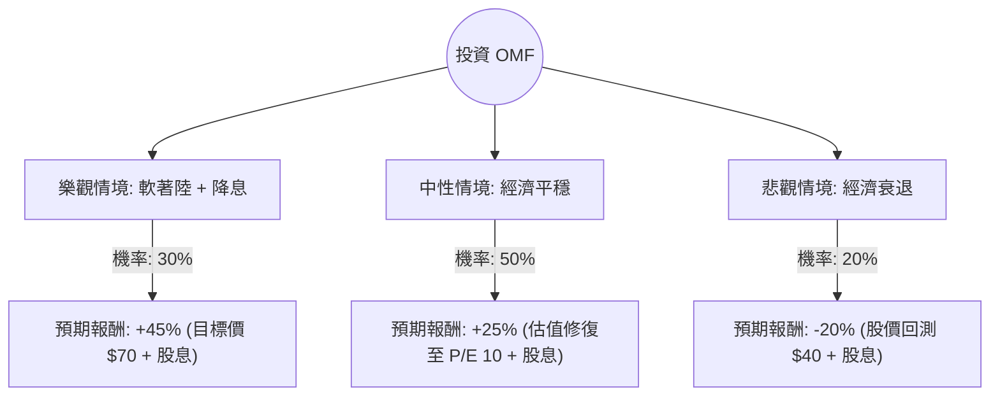

這份分析報告將結合您提供的基本面數據，以及最新的市場動態（如聯準會降息預期、消費金融產業趨勢），利用**決策樹（Decision Tree）**與**期望值分析（Expected Value Analysis）**評估 OneMain Holdings, Inc. (OMF) 的投資價值。

---

### 一、 核心背景與市場動態分析

在進入模型前，我們先整合最新資訊：
1.  **利率環境轉向**：OMF 主要從事非投資級個人貸款。聯準會（Fed）近期啟動降息循環，這對 OMF 是**雙重利多**：降低其融資成本，同時減輕借款人的還款壓力，降低違約率。
2.  **基本面亮點**：
    *   **低估值**：P/E 8.23，Forward P/E 僅 6.06，PEG 0.36 顯示相對於成長性，股價極度低估。
    *   **高股息**：7.74% 的殖利率提供強大的下行保護。
    *   **獲利能力**：ROE 高達 23.76%，顯示管理層運用股東資本效率極高。
3.  **風險因素**：Debt/Eq 6.67 偏高（雖為金融業特性，但在經濟衰退時風險較大）；近期股價較 52 週高點回落約 25%，顯示市場對消費信貸品質仍有疑慮。

---

### 二、 決策樹分析 (Decision Tree)

我們將未來一年的情境分為三種：**樂觀（軟著陸+降息）**、**中性（經濟平穩）**、**悲觀（經濟衰退+違約率上升）**。

#### 節點詳細說明：

1.  **樂觀情境 (Bull Case) - 30% 機率**：
    *   **條件**：美國經濟成功軟著陸，Fed 持續降息，失業率維持低檔。
    *   **預期報酬**：股價回升至分析師目標價 $69.93（約 +30%），加上約 8% 股息，總報酬約 **45%**。
2.  **中性情境 (Base Case) - 50% 機率**：
    *   **條件**：經濟增長放緩但未衰退，違約率穩定。
    *   **預期報酬**：Forward P/E 從 6 倍修復至歷史平均約 9-10 倍。股價預計回升至 $63 附近（約 +17%），加上 8% 股息，總報酬約 **25%**。
3.  **悲觀情境 (Bear Case) - 20% 機率**：
    *   **條件**：美國陷入經濟衰退，失業率飆升導致大規模違約，信貸損失撥備大幅增加。
    *   **預期報酬**：股價回測 52 週低點 $38 附近（約 -28%），扣除 8% 股息緩衝，總報酬約 **-20%**。

---

### 三、 期望值計算 (Expected Value Analysis)

我們根據上述決策樹節點進行加權計算：

| 情境 | 發生機率 (P) | 預期報酬率 (R) | 加權報酬 (P * R) |
| :--- | :--- | :--- | :--- |
| **樂觀** | 0.30 | +45% | +13.5% |
| **中性** | 0.50 | +25% | +12.5% |
| **悲觀** | 0.20 | -20% | -4.0% |
| **總計期望值** | **1.00** | | **+22.0%** |

#### 核心假設說明：
*   **估值修復**：假設市場在降息週期中會給予金融股更高的本益比（從 8x 提升至 10x）。
*   **股息穩定性**：OMF 現金流充沛（P/FCF 僅 2.02），假設其 7.7% 的股息發放不會中斷。
*   **下行風險控制**：即便在悲觀情境下，OMF 的高股息與低 P/B (1.86) 提供了較強的支撐，使其跌幅不至於像成長股般崩潰。

---

### 四、 最終結論

**投資建議：適合投資 (Strong Buy / Accumulate)**

#### 判斷理由：
1.  **期望值極具吸引力**：計算出的年度期望報酬率為 **22%**，遠高於標普 500 的歷史平均報酬。
2.  **極高的安全邊際**：
    *   **PEG 0.36** 顯示股價相對於 EPS 成長（預計明年成長 18.78%）非常便宜。
    *   **P/FCF 2.02** 顯示公司每股產生的自由現金流極高，足以支撐高額股息與債務償還。
3.  **宏觀環境轉向**：OMF 是典型的「降息受益股」。隨著融資成本下降與消費者負擔減輕，其利差（Net Interest Margin）有望擴大。
4.  **技術面支撐**：目前股價處於 SMA200 之下（-9.14%），且 YTD 下跌 20%，提供了良好的分批進場點（Mean Reversion 機會）。

**操作建議**：
*   **進場點**：目前 $54 附近即可分批佈局。
*   **風險監控**：需密切關注美國**失業率**數據。若失業率意外飆升至 4.5% 以上，需重新評估悲觀情境的機率。
*   **持有期限**：建議持有 6-12 個月，以完整捕捉降息循環帶來的估值修復。

***

**免責聲明：** 本分析僅供參考，不構成投資建議。投資股票具有風險，入市前請務必自行審慎評估或諮詢專業顧問。