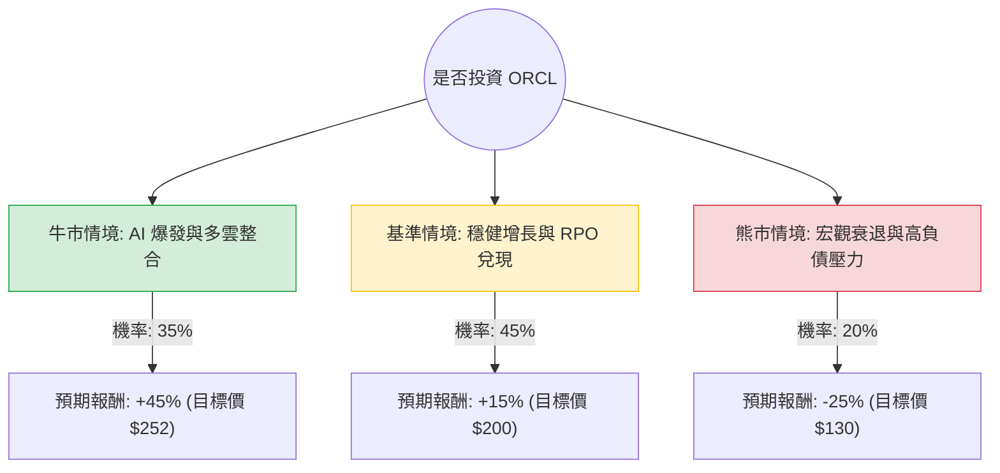

這份分析報告結合了您提供的基本面數據，以及最新的市場動態（包含 2024 年底至 2025 年初的財報趨勢、AI 產業佈局與雲端基礎設施 OCI 的發展），透過**決策樹（Decision Tree）**與**期望值（Expected Value）**進行投資評估。

---

### 一、 核心假設與市場背景分析

在建立模型前，我們先定義影響 Oracle (ORCL) 股價的三大核心變數：

1.  **AI 與雲端基礎設施 (OCI) 的擴張**：Oracle 目前已轉型為 AI 基礎設施的主要供應商，與 NVIDIA、Microsoft、Google 及 AWS 的合作（多雲策略）是其增長核心。
2.  **剩餘履約義務 (RPO) 的轉化**：Oracle 的 RPO（已簽約但尚未認列的營收）大幅增長，這決定了未來 1-2 年的營收確定性。
3.  **財務槓桿與利率風險**：數據顯示其 **Debt/Eq 為 4.4**，負債比率偏高。若利率維持高位或降息不及預期，利息支出將壓抑獲利。

---

### 二、 決策樹分析 (Decision Tree)

以下是針對未來 12 個月 ORCL 股價表現的預測模型：

#### 節點詳細說明：

1.  **牛市情境 (Bull Case) - 35% 機率**：
    *   **條件**：OCI 營收增長持續超過 50%，AI 需求導致 GPU 租賃供不應求，且與各大雲端巨頭的整合超預期。
    *   **預期報酬**：基於 Target Price $291.75 的樂觀預期，考慮到目前價格 $173.88，潛在漲幅約 45%~60%。
2.  **基準情境 (Base Case) - 45% 機率**：
    *   **條件**：傳統資料庫業務穩定轉型雲端，RPO 穩定轉化為營收，Forward P/E 維持在 21-25 倍。
    *   **預期報酬**：股價隨盈餘增長（EPS next Y %: 7.59%）及估值修復，預計漲幅 15%。
3.  **熊市情境 (Bear Case) - 20% 機率**：
    *   **條件**：全球經濟衰退導致企業 IT 支出縮減，高負債（Debt/Eq 4.4）導致財務成本激增，AI 泡沫化。
    *   **預期報酬**：股價回測 52 週低點或 SMA200 以下，預計跌幅 25%。

---

### 三、 期望值計算 (Expected Value Analysis)

我們根據上述情境的機率與報酬率，計算投資 ORCL 的**期望報酬率 (Expected Return)**：

| 情境 | 機率 (P) | 預期報酬率 (R) | P × R |
| :--- | :--- | :--- | :--- |
| **牛市 (Bull)** | 0.35 | +45% | 15.75% |
| **基準 (Base)** | 0.45 | +15% | 6.75% |
| **熊市 (Bear)** | 0.20 | -25% | -5.00% |
| **總計期望值** | **1.00** | | **17.50%** |

**計算過程：**
$EV = (0.35 \times 0.45) + (0.45 \times 0.15) + (0.20 \times -0.25)$
$EV = 0.1575 + 0.0675 - 0.05 = 0.175$ (即 **17.5%**)

---

### 四、 綜合基本面與最新動態分析

1.  **估值合理性**：
    *   **PEG 為 1.03**：這是一個非常強大的訊號，顯示 Oracle 的股價相對於其盈餘增長率來說非常合理（通常 < 1 為低估，1 左右為合理）。
    *   **Forward P/E 21.73**：相較於當前 P/E 32.4，顯示市場預期未來一年獲利將大幅提升。
2.  **獲利能力**：
    *   **ROE 70.6%**：極高的股東權益報酬率，雖然部分受高槓桿影響，但反映了其在軟體與雲端服務的高毛利特性（Gross Margin 65.4%）。
    *   **Operating Margin 31.94%**：顯示其經營效率極佳，有足夠的現金流應對債務。
3.  **技術面警訊**：
    *   **SMA20/50/200 均為負值**：顯示短期內股價處於修正或盤整階段（Perf Quarter -37.79%）。這通常是價值投資者的「分批入場點」，而非追高點。
4.  **最新動態補充**：
    *   Oracle 最近宣佈將其全堆棧資料庫服務引入 AWS、Azure 和 Google Cloud。這種「破牆」策略極大地擴展了其潛在市場（TAM），使其不再僅限於自家封閉的雲端。

---

### 五、 最終結論

**投資建議：適合投資 (分批買入)**

#### 理由：
1.  **期望值為正 (17.5%)**：在考慮了經濟衰退與高負債風險後，ORCL 仍能提供優於標普 500 平均水平的預期報酬。
2.  **AI 基礎設施的稀缺性**：Oracle 是少數能提供從晶片（與 NVIDIA 合作）到資料庫再到應用層（SaaS）完整 AI 解決方案的公司。
3.  **估值吸引力**：PEG 1.03 顯示目前並無過度泡沫，且 Target Price ($291.75) 與現價有極大空間。
4.  **風險控管**：由於 **Debt/Eq (4.4)** 較高且短期技術指標（SMA）偏弱，建議不要一次性投入，應採取**定期定額**或**分批佈局**，以應對可能的短期波動。

**總結：** ORCL 正處於從傳統軟體公司轉型為 AI 雲端巨頭的收割期，基本面強勁且增長路徑清晰，是目前科技股中具備較高安全邊際的選擇。