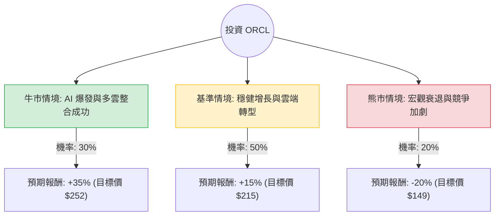

這份分析報告將結合您提供的數據與最新的市場動態（特別是 Oracle 近期在 AI 雲端基礎設施與多雲合作方面的進展），利用**決策樹（Decision Tree）**與**期望值分析（Expected Value Analysis）**評估 ORCL 的投資價值。

---

### 一、 核心假設與市場背景分析

在建立決策樹之前，我們基於最新資訊設定以下核心假設：

1.  **AI 驅動的增長（利多）**：Oracle 的 OCI（Oracle Cloud Infrastructure）需求極高，且與 AWS、Google Cloud、Microsoft Azure 的「多雲合作」打破了競爭壁壘，有利於其資料庫業務轉向雲端。
2.  **估值壓力（風險）**：目前 P/E 約 34.8，處於歷史高位區間。雖然 Forward P/E 為 24.25 較為合理，但市場已反映大部分預期。
3.  **財務結構（風險）**：Debt/Eq 高達 4.21，負債比率偏高，在維持高利率環境下，利息支出可能侵蝕利潤。
4.  **技術面**：股價近期表現強勁（Perf Month +40%），短期可能面臨過熱回調。

---

### 二、 決策樹分析 (Decision Tree)

以下決策樹模擬未來 12 個月內 ORCL 的三種可能情境：

#### 節點詳細說明：

1.  **牛市情境 (Bull Case) - 30%**：
    *   **描述**：OCI 訂單積壓（RPO）轉化為營收的速度超預期，AI 算力需求持續供不應求，且與 AWS 的合作帶來大量新客戶。
    *   **預期報酬**：+35%（參考 Target Price $241 並考慮超額增長）。
2.  **基準情境 (Base Case) - 50%**：
    *   **描述**：雲端營收維持 20% 以上增長，傳統資料庫業務穩定。估值維持在 Forward P/E 25x 左右。
    *   **預期報酬**：+15%（接近分析師平均目標價）。
3.  **熊市情境 (Bear Case) - 20%**：
    *   **描述**：全球經濟放緩導致企業 IT 支出縮減，高負債導致財務壓力增加，股價回測 SMA200（目前約 -8% 處，但考慮下行慣性設定為 -20%）。
    *   **預期報酬**：-20%。

---

### 三、 期望值計算過程 (Expected Value Calculation)

我們將各情境的「機率」與「預期報酬率」相乘並加總，得出整體期望報酬率。

**計算公式：**
$$EV = (P_{Bull} \times R_{Bull}) + (P_{Base} \times R_{Base}) + (P_{Bear} \times R_{Bear})$$

**代入數值：**
1.  **牛市貢獻**：$0.30 \times 35\% = 10.5\%$
2.  **基準貢獻**：$0.50 \times 15\% = 7.5\%$
3.  **熊市貢獻**：$0.20 \times (-20\%) = -4.0\%$

**總期望報酬率 (Total EV)：**
$$10.5\% + 7.5\% - 4.0\% = 14.0\%$$

**換算為預期股價：**
$$186.83 \times (1 + 14.0\%) = \$213.00$$

---

### 四、 綜合評估與最終結論

#### 1. 數據洞察：
*   **成長性**：EPS Q/Q 達 24.34%，Sales Q/Q 達 21.66%，顯示公司正處於強勁的擴張期。
*   **獲利能力**：ROE 58.7% 極高，說明公司利用股東權益創造利潤的能力極強（雖有部分受高槓桿影響）。
*   **估值**：PEG 1.14 顯示相對於其增長速度，目前的股價雖然不便宜，但尚未進入嚴重泡沫區（通常 PEG > 2 為過熱）。

#### 2. 投資判斷：
**結論：適合投資 (Buy / Overweight)**

#### 3. 理由總結：
1.  **正向期望值**：計算出的期望報酬率為 **14.0%**，優於標普 500 指數的長期平均回報。
2.  **戰略轉型成功**：Oracle 已成功從傳統軟體商轉型為雲端基礎設施巨頭。與三大雲端服務商（AWS/Azure/GCP）從競爭轉為合作，極大地擴張了其潛在市場（TAM）。
3.  **AI 護城河**：其資料庫技術在處理 AI 大型語言模型所需的數據時具有結構性優勢，這將支撐其未來 1-2 年的營收增長。
4.  **風險提示**：由於短期漲幅已大（Perf Month > 40%），且 Debt/Eq 較高，建議採取**「分批買入」**策略，或等待股價回測 SMA20 ($171 附近) 時再行加碼，以降低追高風險。

**最終建議：** 考慮到 14% 的期望回報與強勁的 AI 基本面，ORCL 目前是雲端運算板塊中具備高度競爭力的標的，適合尋求成長性的投資者。