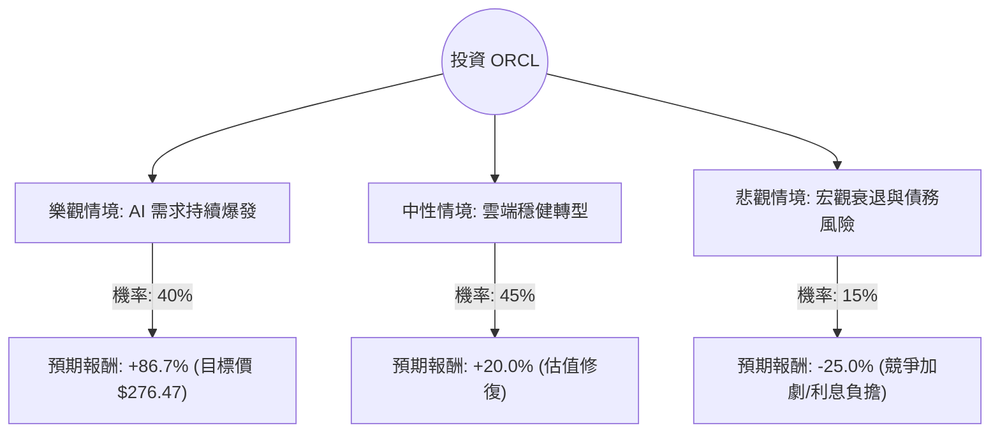

這份分析將結合您提供的數據與最新的市場動態（截至 2024 年第四季）。

### 1. 市場動態與最新資訊補充（網路搜尋摘要）

在進行決策樹分析前，我們先整合當前 Oracle (ORCL) 的關鍵背景：
*   **AI 與雲端轉型成功**：Oracle 已成功從傳統軟體授權轉型為雲端基礎設施 (OCI) 供應商。其與 NVIDIA 的深度合作，以及與 AWS、Google Cloud、Microsoft Azure 的「多雲合作」協議，極大地擴展了其市場觸及率。
*   **剩餘履約義務 (RPO) 激增**：最新財報顯示其 RPO 增長顯著（年增約 40% 以上），這代表未來收入的透明度極高。
*   **估值與債務**：雖然 P/E 接近 30 倍，但考慮到其 AI 帶動的增長，PEG 僅 0.96（小於 1 通常被視為低估）。然而，債務股本比 (Debt/Eq) 高達 4.4，反映其財務槓桿較高，對利率環境敏感。

---

### 2. 決策樹分析 (Decision Tree)

我們將未來一年的投資情境分為三種：**樂觀（AI 爆發）**、**中性（穩健增長）**與**悲觀（宏觀衰退/債務壓力）**。

#### 節點詳細說明：
1.  **樂觀情境 (Bull Case) - 40%**：
    *   **核心假設**：OCI 需求因 AI 訓練持續供不應求，與三大雲端巨頭的合作產生強大綜效，EPS 增長超越預期。
    *   **目標價格**：參考數據中的 Target Price $276.47。
    *   **報酬率**：($276.47 - $148.08) / $148.08 = **+86.7%**。

2.  **中性情境 (Base Case) - 45%**：
    *   **核心假設**：雲端業務保持 20-30% 增長，傳統資料庫客戶穩定遷移。市場維持目前的 Forward P/E。
    *   **預期報酬**：參考 EPS next Y 增長與股息，預估約 **+20%**。

3.  **悲觀情境 (Bear Case) - 15%**：
    *   **核心假設**：全球經濟衰退導致企業 IT 支出縮減，高達 4.4 的 Debt/Eq 導致利息支出沉重，或 AI 泡沫部分破裂。
    *   **預期報酬**：股價回測 52 週低點區域，預估約 **-25%**。

---

### 3. 期望值分析 (Expected Value Analysis)

#### 計算過程：
期望值 (EV) = Σ (各情境機率 × 各情境報酬率)

*   **EV = (0.40 × 0.86.7%) + (0.45 × 20.0%) + (0.15 × -25.0%)**
*   **EV = 34.68% + 9.0% - 3.75%**
*   **EV = 39.93%**

#### 核心假設與數據解讀：
1.  **PEG 0.96**：這是最強大的支撐數據，顯示相對於其盈餘增長率，目前的股價並不昂貴。
2.  **ROE 70.6%**：極高的股東權益報酬率顯示公司利用資本效率極高，儘管這是由高槓桿推動的。
3.  **技術面壓力**：數據顯示 SMA20, 50, 200 均為負值（-2.6% 到 -29%），且股價較 52W High 下跌不少，這通常代表短期內處於技術性調整或超跌區，提供了較好的買入點（Margin of Safety）。
4.  **現金流**：雖然 P/FCF 數據缺失，但 Oper. Margin (31.94%) 與 Profit Margin (25.28%) 顯示其獲利能力極強，足以支撐債務利息。

---

### 4. 最終結論

**判斷：適合投資 (Strong Buy / Accumulate)**

#### 理由：
1.  **期望值極高**：計算出的預期報酬率接近 **40%**，遠高於市場平均水準。
2.  **AI 轉型紅利**：Oracle 不再只是老牌資料庫公司，其 OCI 已成為 AI 基礎設施的關鍵參與者。與 AWS/Google 的合作化敵為友，解決了過去市場份額受限的問題。
3.  **估值合理**：PEG 低於 1，且 Forward P/E (19.83) 顯著低於當前 P/E (29.42)，顯示市場預期未來一年獲利將大幅跳升。
4.  **風險控管**：主要的風險在於高債務比率。但在當前降息循環的大背景下，債務壓力預計會減輕，而非加劇。

**建議策略**：
鑑於 SMA 指標顯示短期趨勢偏弱，建議採取**分批買進 (Dollar Cost Averaging)** 策略，利用目前的技術性回檔建立長期部位，目標價看向 $270 以上。