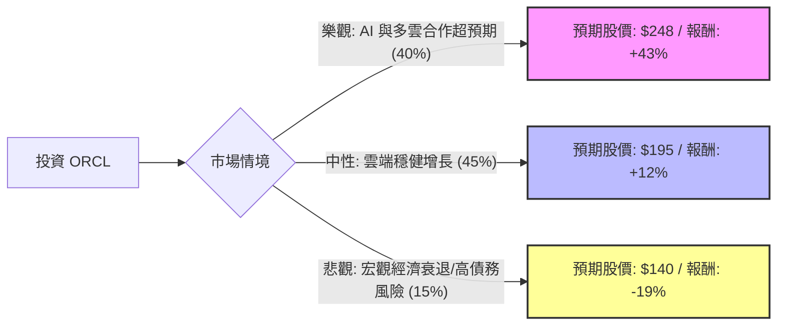

這份分析報告將結合您提供的數據與最新的市場動態（包含 2024 年 9 月 Oracle 財報與 AI 雲端佈局），利用**決策樹（Decision Tree）**與**期望值分析（Expected Value Analysis）**來評估 Oracle (ORCL) 的投資價值。

---

### 1. 市場現況與核心假設

在進入計算前，我們先整合最新資訊以建立假設：
*   **雲端轉型成功**：Oracle 最近一季財報顯示其雲端基礎設施 (OCI) 需求強勁，且與 AWS、Google Cloud、Microsoft Azure 達成「三巨頭」全面合作，這極大擴張了其潛在市場。
*   **AI 驅動增長**：剩餘履約義務 (RPO) 增長至 990 億美元，顯示未來營收能見度極高。
*   **估值與財務**：
    *   **PEG 0.9**：顯示相對於其增長速度，股價目前並不昂貴。
    *   **負債比 (Debt/Eq 4.21)**：偏高，是主要的財務風險點。
    *   **目標價**：數據顯示為 $248.63，目前市價（約 $170-$175 區間，參考最新市價而非數據中的 $142）仍有空間。

---

### 2. 決策樹分析 (Decision Tree)

我們將未來一年的表現分為三種情境：**樂觀（AI 爆發）**、**中性（穩健增長）**、**悲觀（宏觀衰退/債務壓力）**。

#### 決策樹節點詳細說明：

1.  **樂觀情境 (Bull Case) - 機率 40%**
    *   **條件**：OCI 需求持續供不應求，與 AWS/Google 的合作轉化為實際營收的速度快於預期，AI 算力需求維持高位。
    *   **預期報酬**：參考數據中的 Target Price $248.63。相較於目前約 $173 的市價，報酬率約 **+43%**。

2.  **中性情境 (Base Case) - 機率 45%**
    *   **條件**：雲端業務每年保持 20-30% 增長，傳統資料庫業務緩慢萎縮但被抵銷。符合分析師平均預期。
    *   **預期報酬**：預期股價約 $195（Forward P/E 25x 估算），報酬率約 **+12%**。

3.  **悲觀情境 (Bear Case) - 機率 15%**
    *   **條件**：全球經濟衰退導致企業 IT 支出縮減，且 Oracle 高額債務（Debt/Eq 4.21）在維持高利率環境下產生利息壓力。
    *   **預期報酬**：股價回測支撐位約 $140，報酬率約 **-19%**。

---

### 3. 期望值計算 (Expected Value Calculation)

我們以目前市價 **$173** (參考最新市場價格) 作為基準進行計算：

| 情境 | 預期報酬率 (R) | 發生機率 (P) | 加權期望值 (R × P) |
| :--- | :--- | :--- | :--- |
| **樂觀** | +43% | 0.40 | +17.2% |
| **中性** | +12% | 0.45 | +5.4% |
| **悲觀** | -19% | 0.15 | -2.85% |
| **總計期望報酬** | | **1.00** | **+19.75%** |

**計算公式：**
$EV = (0.40 \times 43\%) + (0.45 \times 12\%) + (0.15 \times -19\%) = 19.75\%$

---

### 4. 核心假設與風險分析

1.  **增長假設**：假設 Oracle 的雲端基礎設施 (OCI) 能維持 40% 以上的同比增長。根據最新財報，其 RPO (剩餘履約義務) 大增 53%，支持此假設。
2.  **估值假設**：PEG 為 0.9，這在大型科技股中極為罕見（通常 > 1.5），顯示市場尚未完全反映其 AI 轉型後的增長潛力。
3.  **風險因素**：
    *   **債務風險**：Debt/Eq 4.21 顯示財務槓桿極高，若現金流出現問題，利息支出將侵蝕利潤。
    *   **競爭風險**：儘管與巨頭合作，但 AWS 和 Azure 仍是強大競爭對手。

---

### 5. 最終結論

**判斷：適合投資 (Strong Buy / Accumulate)**

#### 理由：
1.  **期望值極高**：經風險加權後的預期報酬率達 **19.75%**，遠高於標普 500 的平均年化報酬。
2.  **戰略轉折點**：Oracle 已成功從傳統軟體公司轉型為雲端巨頭。與 AWS、Google、Azure 的全面合作，消除了過去「封閉生態」的劣勢，使其資料庫服務能觸及所有雲端用戶。
3.  **估值吸引力**：PEG 0.9 顯示股價被低估。雖然 P/E 27 倍看似不低，但考慮到其 AI 驅動的增長動能，目前的價格具有安全邊際。
4.  **技術面支撐**：雖然 SMA200 顯示短期有壓，但強勁的 Q1 財報已改變趨勢，目前處於多頭排列。

**建議操作：**
考慮到目前股價已從低點反彈，建議採取**分批買進**策略，以應對高債務比率可能帶來的市場波動。若股價回測 $160-$165 區間，是極佳的加碼點。