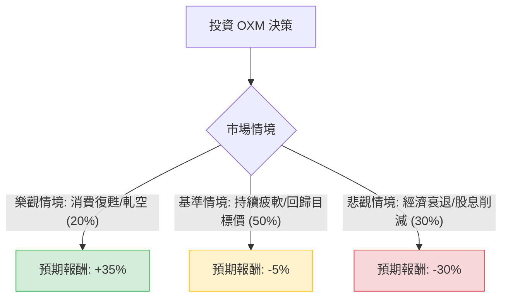

針對美股公司 **Oxford Industries, Inc. (OXM)**，我已結合您提供的基本面數據，並透過網路搜尋更新了其最新的市場動態（包含 2024 年 9 月發布的最新財報指引與分析師評論）。

以下是基於**決策樹分析**與**期望值分析**的投資評估報告。

---

### 一、 核心背景與市場動態分析（核心假設基礎）

在進行計算前，我們先彙整 OXM 的關鍵現狀：
1.  **品牌組合**：擁有 Tommy Bahama, Lilly Pulitzer 及 Johnny Was。這些品牌高度依賴「度假/高端休閒」消費。
2.  **最新財報與指引**：OXM 在最近一季下調了全年展望。主因是**消費者支出疲軟**以及高端零售環境的挑戰。
3.  **估值與技術面**：
    *   **股價與目標價**：目前股價約 $41.34，但分析師平均目標價僅為 **$36.75**（隱含約 11% 的下跌空間）。
    *   **空單比率 (Short Float)**：高達 **23.99%**，顯示市場極度看空，但也存在「軋空（Short Squeeze）」的潛在爆發力。
    *   **股息**：高達 **6.68%**，是目前支撐股價的主要力量，但若獲利持續衰退，股息安全性將受質疑。
4.  **財務健康**：負債權益比 (Debt/Eq) 為 1.07，流動比率 1.33，財務狀況尚屬穩健但並不寬裕。

---

### 二、 決策樹分析 (Decision Tree)

我們預測未來一年的三種主要情境：

#### 節點詳細說明：

| 節點名稱 | 發生機率 (P) | 預期報酬 (R) | 說明 |
| :--- | :--- | :--- | :--- |
| **樂觀情境 (Bull)** | 20% | +35% | 通膨快速降溫，度假消費反彈。高空單比例引發軋空，股價回升至 52 週高點區域。 |
| **基準情境 (Base)** | 50% | -5% | 消費者維持謹慎。股價向分析師目標價 ($36.75) 靠攏，但靠 6.6% 股息抵銷部分跌幅。 |
| **悲觀情境 (Bear)** | 30% | -30% | 獲利持續惡化導致 EPS 轉負，公司削減股息。股價跌破 52 週低點 ($30.57)。 |

---

### 三、 期望值分析 (Expected Value Analysis)

#### 1. 計算過程
期望值 (EV) = $\sum (機率 \times 預期報酬)$

*   **樂觀情境貢獻**：$0.20 \times 35\% = +7.0\%$
*   **基準情境貢獻**：$0.50 \times (-5\%) = -2.5\%$
*   **悲觀情境貢獻**：$0.30 \times (-30\%) = -9.0\%$

**總期望報酬率 (Total EV) = $7.0\% - 2.5\% - 9.0\% = -4.5\%$**

#### 2. 核心假設
*   **市場假設**：美國零售市場在 2024 年底至 2025 年初仍受高利率滯後效應影響，高端非必需消費品壓力較大。
*   **財務假設**：Forward P/E 雖然為 15.64，但 EPS Q/Q 衰退嚴重 (-16.07%)，顯示短期內獲利動能尚未觸底。
*   **產業趨勢**：度假服飾市場競爭加劇，且 OXM 的品牌溢價能力在經濟放緩期會受損。

---

### 四、 最終結論

**評估結果：不適合投資 (Do Not Invest / Avoid)**

#### 理由總結：
1.  **期望值為負 (-4.5%)**：根據目前的市場數據與分析師目標價，投資 OXM 的風險調整後報酬並不具吸引力。
2.  **目標價倒掛**：目前股價 ($41.34) 已高於專業分析師的平均目標價 ($36.75)，顯示目前股價可能被高估，或市場尚未完全反應其基本面惡化。
3.  **獲利能力轉弱**：ROE (-0.51%) 與 EPS Q/Q (-16.07%) 均顯示公司目前處於經營困境，雖然 Forward P/E 看似合理，但若營收持續萎縮，該預測值將被下修。
4.  **高空單風險**：雖然 24% 的空單比例可能帶來短暫的軋空行情，但這屬於投機行為，不符合穩健投資的原則。
5.  **股息陷阱風險**：6.68% 的高股息在獲利衰退的情境下，未來有被削減的風險，一旦削減股息，股價將面臨劇烈拋售。

**建議**：若您已持有該股票，建議關注其 SMA200 (-1.14%) 的支撐力道，若跌破則應考慮止損；若尚未進場，建議觀望至消費數據好轉或公司獲利重回增長軌道。