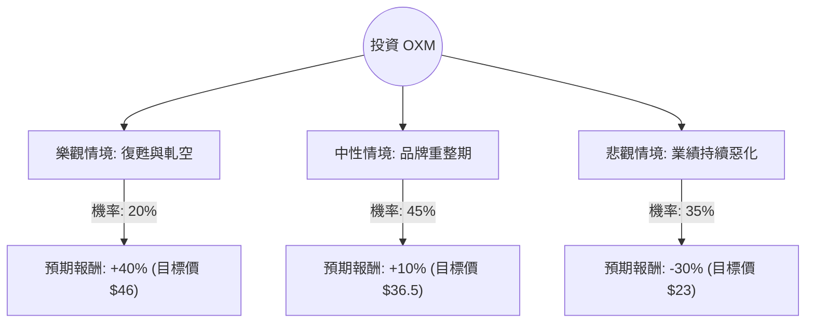

這份分析報告將結合您提供的基本面數據與最新的市場動態（截至 2024 年第三季末），利用**決策樹（Decision Tree）**與**期望值分析（Expected Value Analysis）**評估 Oxford Industries, Inc. (OXM) 的投資價值。

---

### 一、 市場背景與最新動態分析

在進入決策樹之前，我們先整合數據與最新市場資訊：

1.  **品牌組合與表現**：OXM 旗下擁有 Tommy Bahama、Lilly Pulitzer 及 Johnny Was。最新財報顯示，由於消費者支出轉向謹慎，這些高階休閒品牌的同店銷售額出現下滑。
2.  **財務警訊**：
    *   **獲利轉負**：ROE (-0.51%) 與 EPS (-0.66) 均為負值，顯示公司目前處於虧損狀態。
    *   **指引下調**：公司在最近的財報會議中下調了全年營收與獲利指引，主因是宏觀經濟壓力影響了百貨公司通路與電商表現。
    *   **高空單比例**：Short Float 高達 **25.77%**，這反映了市場極度看空，但也存在「軋空（Short Squeeze）」的潛在機會。
3.  **估值與股利**：
    *   **P/B 0.93**：股價已跌破帳面價值，具備價值投資的安全邊際。
    *   **8.37% 殖利率**：股息極高，但以目前的負 EPS 來看，股息發放的永續性面臨挑戰。

---

### 二、 決策樹分析 (Decision Tree)

我們將未來一年的投資情境分為三種：**樂觀（復甦/軋空）**、**中性（震盪/盤整）**、**悲觀（衰退/減息失敗）**。

#### 決策樹節點詳細說明：

| 節點 (情境) | 機率 (P) | 預期報酬 (R) | 說明 |
| :--- | :--- | :--- | :--- |
| **樂觀情境** | 20% | +40% | 消費者信心回升，公司成功控制成本，觸發 25% 的空單回補軋空。 |
| **中性情境** | 45% | +10% | 股價在 P/B 1.0 附近震盪，領取 8% 股息，股價微幅回升至分析師目標價 $36.5。 |
| **悲觀情境** | 35% | -30% | 營收持續萎縮，公司被迫削減股息，股價跌破 52 週低點，尋求更低支撐。 |

---

### 三、 期望值計算與核心假設

#### 1. 期望值 (Expected Value, EV) 計算過程：
$$EV = (P_{Bull} \times R_{Bull}) + (P_{Base} \times R_{Base}) + (P_{Bear} \times R_{Bear})$$
*   **樂觀部分**：$0.20 \times 40\% = +8.0\%$
*   **中性部分**：$0.45 \times 10\% = +4.5\%$
*   **悲觀部分**：$0.35 \times (-30\%) = -10.5\%$

**總體期望報酬率 (Total EV) = 8.0% + 4.5% - 10.5% = 2.0%**

#### 2. 核心假設：
*   **市場假設**：假設美國經濟不會陷入深度衰退，但高階消費在未來 6 個月內難以爆發性成長。
*   **財務假設**：OXM 的負債比 (Debt/Eq 1.07) 尚在可控範圍，但現金流必須足以支撐其 8% 的股息，否則悲觀情境機率會上升。
*   **技術假設**：目前股價遠低於 SMA20/50/200，處於極度超賣區，短期內有技術性反彈需求。

---

### 四、 最終結論

#### **評估結果：不適合投資 (或僅建議極小量投機性持有)**

#### **理由：**
1.  **期望值過低**：計算出的期望報酬率僅為 **2.0%**，遠低於目前無風險利率（美債殖利率約 4%）以及標普 500 的平均預期報酬。這意味著承擔的高風險（35% 機率大跌）與潛在收益不成正比。
2.  **基本面惡化**：EPS 為負、ROE 為負、營收成長停滯 (Sales Q/Q -0.22%)。雖然 P/B 低於 1 看似便宜，但這通常是「價值陷阱（Value Trap）」的特徵，反映了市場對其品牌競爭力的質疑。
3.  **股息風險**：8.37% 的殖利率在虧損狀態下極其脆弱。一旦公司宣佈削減股息，股價將面臨二次探底。
4.  **空頭壓力**：25.77% 的空單比例雖然可能引發軋空，但這屬於高風險博弈，不符合穩健投資原則。

**建議：**
如果您是價值投資者，應等待公司 **EPS 轉正** 或 **同店銷售額（Same-store sales）止跌回升** 後再行介入。目前 OXM 雖然股價便宜，但缺乏上漲催化劑（Catalyst），資金效率較低。