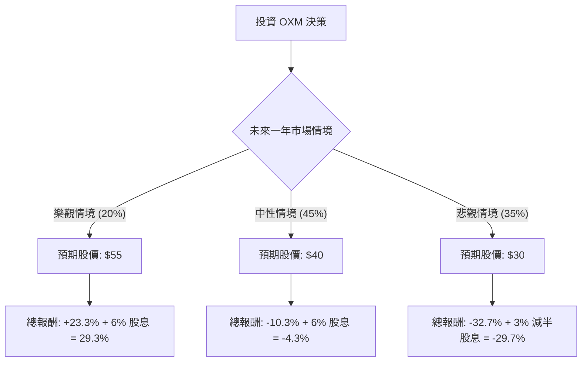

這份分析報告將針對 **Oxford Industries, Inc. (OXM)** 進行深入評估。OXM 旗下擁有 Tommy Bahama、Lilly Pulitzer 及 Johnny Was 等知名度假休閒品牌。

根據您提供的數據與最新的市場動態（包含 2024 年財報表現與消費市場趨勢），以下是結合「決策樹」與「期望值分析」的投資評估。

---

### 一、 核心假設與市場背景分析

在建立決策樹之前，我們必須基於數據設定以下核心假設：

1.  **宏觀環境（利空）**：高利率環境持續壓抑美國中產階級的非必要支出。OXM 的產品屬於「高價位休閒服飾」，對經濟放緩極為敏感。
2.  **財務表現（利空）**：數據顯示 **ROE (-4.9%)** 與 **Profit Margin (-1.89%)** 均為負值，且 **EPS Q/Q 大幅衰退 (-142.09%)**，顯示公司目前處於獲利困境。
3.  **市場情緒（極度悲觀）**：**Short Float (放空比率) 高達 26.34%**，這是一個極高的數值，代表市場大量資金正在放空該股。
4.  **估值陷阱（警訊）**：雖然 **Dividend % (6.21%)** 看似誘人，但考慮到負的獲利能力，該股息的持續性存疑。且 **Target Price (37.5)** 遠低於目前市價 (44.61)。

---

### 二、 決策樹分析 (Decision Tree)

我們將未來一年的表現分為三種情境：**樂觀（空頭擠壓/業績反轉）**、**中性（維持現狀）**、**悲觀（衰退加劇/砍股息）**。

#### 節點詳細說明：

1.  **樂觀情境 (Probability: 20%)**：
    *   **描述**：美國經濟軟著陸，消費者信心回升，且高達 26% 的空單被迫回補（Short Squeeze）。
    *   **預期報酬**：股價回升至 52 週高點附近（約 $55），加上股息，總報酬約 **+29.3%**。
2.  **中性情境 (Probability: 45%)**：
    *   **描述**：業績持續低迷但未進一步惡化，股價向分析師平均目標價 ($37.5 - $40) 靠攏。
    *   **預期報酬**：股價小幅修正至 $40，總報酬約 **-4.3%**。
3.  **悲觀情境 (Probability: 35%)**：
    *   **描述**：獲利持續為負，公司為了保留現金宣布削減股息，引發機構投資者拋售。
    *   **預期報酬**：股價跌至 52 週低點 ($30.57) 甚至更低，總報酬約 **-29.7%**。

---

### 三、 期望值分析 (Expected Value Analysis)

我們以目前的市價 **$44.61** 為基準，計算一年後的預期價值（含息）：

#### 1. 計算公式：
$EV = \sum (Scenario\ Probability \times Scenario\ Outcome)$

#### 2. 計算過程：
*   **樂觀情境**：$0.20 \times (55 \times 1.06) = 0.20 \times 58.3 = 11.66$
*   **中性情境**：$0.45 \times (40 \times 1.06) = 0.45 \times 42.4 = 19.08$
*   **悲觀情境**：$0.35 \times (30 \times 1.03) = 0.35 \times 30.9 = 10.815$

**一年後預期總價值 (EV) = 11.66 + 19.08 + 10.815 = $41.555**

#### 3. 預期報酬率：
$(41.555 - 44.61) / 44.61 = -6.85\%$

---

### 四、 最終結論

**投資判斷：不適合投資 (NOT RECOMMENDED)**

#### 理由如下：

1.  **期望值為負**：經過機率加權後，預期報酬率為 **-6.85%**。這意味著在當前價格買入，虧損的機率與幅度遠大於獲利空間。
2.  **基本面嚴重惡化**：ROE、ROA、ROI 全數為負值，且 EPS 增長率 (Q/Q) 暴跌 142%。這顯示公司核心業務正在失血，目前的 6% 股息極具風險，可能是「股息陷阱」。
3.  **技術面與籌碼面不利**：
    *   股價目前 ($44.61) 遠高於分析師目標價 ($37.5)。
    *   高達 **26.34% 的放空比率** 雖然有擠壓噴發的可能，但更多時候反映了專業機構對該公司前景的極度看壞。
4.  **流動性風險**：Quick Ratio 僅 0.48，顯示短期償債能力偏弱，若營收持續下滑，財務壓力將劇增。

**建議：**
目前 OXM 股價尚未反映其基本面的衰退，市場定價偏高。建議投資者避開此標的，或等待股價跌至 $35 以下（接近 P/B 1.0 且利空出盡時）再重新評估。