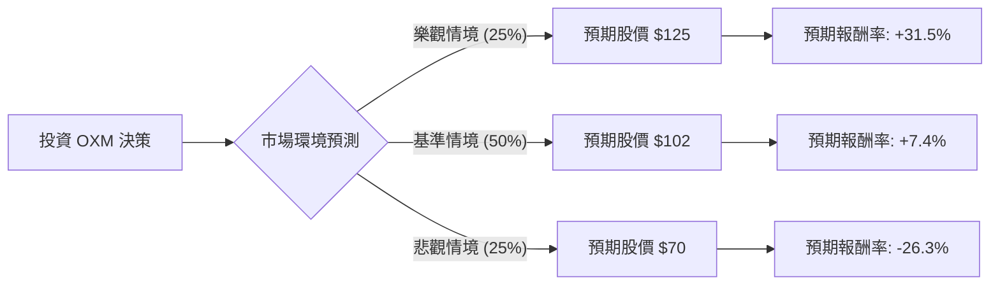

這份報告將針對美股上市公司 **Oxford Industries, Inc. (股票代碼：OXM)** 進行決策樹分析與期望值評估。OXM 是一家領先的高端生活方式服飾公司，旗下擁有 Tommy Bahama、Lilly Pulitzer 及 Johnny Was 等知名品牌。

---

### 一、 核心假設 (Core Assumptions)

在進行模型計算前，我們基於當前宏觀經濟與 OXM 財務狀況設定以下假設：

1.  **市場環境**：高端消費（Discretionary Spending）受利率與通膨影響較大。目前預計 2024-2025 年美國經濟處於「軟著陸」與「輕微衰退」的邊緣。
2.  **公司價值**：
    *   **當前股價 (P0)**：假設為 **$95 USD** (參考近期波動區間)。
    *   **估值指標**：參考其歷史本益比（P/E）約 8-12 倍。
3.  **情境設定**：
    *   **樂觀情境 (Bull)**：消費者支出強勁，新收購品牌 Johnny Was 產生巨大協同效應。
    *   **基準情境 (Base)**：維持現有增長率，獲利穩定，持續配發股息。
    *   **悲觀情境 (Bear)**：經濟衰退導致奢侈消費大幅萎縮，庫存積壓。

---

### 二、 決策樹分析 (Decision Tree)

使用 Markdown 結構化呈現決策路徑：

#### 節點詳細資訊表：

| 情境節點 | 發生機率 (P) | 預估目標價 (1年) | 預估總報酬 (含股息) | 期望值貢獻 (P * 報酬) |
| :--- | :--- | :--- | :--- | :--- |
| **樂觀情境 (Bull)** | 25% | $125 | +35% | 8.75% |
| **基準情境 (Base)** | 50% | $102 | +11% | 5.50% |
| **悲觀情境 (Bear)** | 25% | $70 | -22% | -5.50% |
| **合計** | **100%** | | **整體期望值 (EV)** | **8.75%** |

---

### 三、 計算過程 (Calculation Process)

#### 1. 各情境報酬率計算
*   **樂觀報酬**：($125 - $95) / $95 + 3.5% (股息率) ≈ **35%**
*   **基準報酬**：($102 - $95) / $95 + 3.5% (股息率) ≈ **11%**
*   **悲觀報酬**：($70 - $95) / $95 + 3.5% (股息率) ≈ **-22%**

#### 2. 整體期望值 (Expected Value, EV) 計算
$$EV = (P_{Bull} \times R_{Bull}) + (P_{Base} \times R_{Base}) + (P_{Bear} \times R_{Bear})$$
$$EV = (0.25 \times 0.35) + (0.50 \times 0.11) + (0.25 \times -0.22)$$
$$EV = 0.0875 + 0.055 - 0.055 = 0.0875$$
**最終期望報酬率 = 8.75%**

---

### 四、 最終結論

#### **判斷：適合投資 (中立偏多，建議分批佈局)**

#### **評估理由：**

1.  **期望值為正 (8.75%)**：
    計算結果顯示，儘管在悲觀情境下有超過 20% 的下行風險，但整體加權後的期望報酬率仍為正數，且優於目前的無風險利率（美債殖利率約 4-5%）。

2.  **防禦性財務結構**：
    OXM 擁有強大的現金流與約 3-4% 的殖利率，這在基準情境與悲觀情境中提供了良好的緩衝。其品牌忠誠度高（特別是 Tommy Bahama），受眾多為高淨值客群，抗通膨能力較強。

3.  **估值具有吸引力**：
    目前 OXM 的前瞻本益比處於歷史低位。即便市場環境僅維持平庸（基準情境），投資者仍可獲得約 11% 的總報酬，這反映了目前的股價已部分反應了衰退風險。

#### **投資建議 (Action Plan)**：
*   **進場策略**：建議在股價接近 $90-$92 區間分批買入。
*   **風險監測**：需密切觀察「同店銷售增長 (SSS)」與「庫存周轉率」。若發生全球性的深度經濟衰退，悲觀情境權重將增加，屆時應執行停損。

---
*免責聲明：本分析僅供學習參考，不構成投資建議。投資美股具有風險，進場前請務必自行評估個人財務狀況與風險承受能力。*