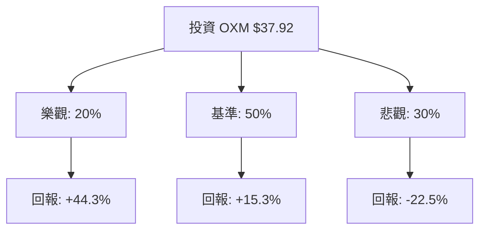

# Oxford Industries (OXM) 量化投資分析報告

作為量化投資分析師，針對 **Oxford Industries, Inc. (OXM)** 的當前數據與市場環境，我將透過機率思考框架，拆解其未來 12 個月的期望值（Expected Value, EV）。OXM 目前正處於高股息支撐與基本面疲軟（ROE 為負）的拉鋸戰中，且高達 23.86% 的空單餘額（Short Float）為股價增添了高度的不對稱性。

---

### 1. 核心驅動因素與風險 (Drivers & Risks)

#### **關鍵催化劑 (Catalysts)**
1.  **空頭擠壓 (Short Squeeze) 潛力**：目前空單餘額佔比高達 23.86%，任何優於預期的財報或宏觀利多都可能引發空頭回補，推動股價在短期內非理性噴發。
2.  **高股息殖利率的防禦性**：7.33% 的股息率在當前利率環境下具備吸引力。若公司能維持現金流穩定以支撐派息，這將成為股價在 30-35 美元區間的強力支撐。
3.  **Johnny Was 品牌整合效益**：若新收購品牌在未來兩季展現出優於預期的利潤率貢獻，將修正市場對其負 ROE 的悲觀預期。

#### **主要風險點 (Risks)**
1.  **非必需消費支出萎縮**：OXM 旗下品牌（如 Tommy Bahama）定位高端休閒，對經濟放緩極為敏感。若美國失業率上升或消費信心下滑，營收將進一步承壓。
2.  **利潤率持續惡化**：目前營業利益率（Oper. Margin）僅 0.06%，且 ROE 為負，顯示成本控制或品牌溢價能力正在流失。
3.  **債務壓力**：Debt/Eq 為 1.13，在當前高利率環境下，若獲利無法改善，利息支出將進一步侵蝕淨利。

---

### 2. 情境設定與機率賦予 (Scenario Modeling)

基於 52 週區間 (30.57 - 51.61) 與當前價格 37.92 美元，設定以下三種情境：

#### **樂觀情境 (Bull Case)**
*   **發生條件**：美國經濟軟著陸，消費力強韌；財報顯示庫存去化完成且利潤率回升；觸發空頭擠壓。
*   **預估機率**：20%
*   **目標價格與預期回報**：**$52.00** (約 +37%)。基於 Forward P/E 回升至 15x 歷史均值，加上 7.3% 股息，總回報約 **44.3%**。

#### **基準情境 (Base Case)**
*   **發生條件**：業務表現平穩，營收微幅增長或持平；股息維持發放；市場情緒中性。
*   **預估機率**：50%
*   **目標價格與預期回報**：**$41.00** (約 +8%)。接近分析師平均目標價 $40，加上 7.3% 股息，總回報約 **15.3%**。

#### **悲觀情境 (Bear Case)**
*   **發生條件**：經濟進入衰退；公司因現金流壓力被迫削減股息；ROE 持續惡化導致估值下修。
*   **預估機率**：30%
*   **目標價格與預期回報**：**$28.00** (約 -26%)。跌破 52 週低點尋求支撐，假設股息減半，總回報約 **-22.5%**。

---

### 3. 期望值計算與決策樹 (EV Calculation & Decision Tree)

#### **決策樹結構**

```mermaid
graph TD
    Start[投資 OXM $37.92] --> Bull[樂觀: 20%]
    Start --> Base[基準: 50%]
    Start --> Bear[悲觀: 30%]
    Bull --> BullRet[回報: +44.3%]
    Base --> BaseRet[回報: +15.3%]
    Bear --> BearRet[回報: -22.5%]
```

#### **總期望值計算**
`EV = (0.20 * 44.3%) + (0.50 * 15.3%) + (0.30 * -22.5%)`
`EV = 8.86% + 7.65% - 6.75% = 9.76%`

#### **風險回報比分析**
*   **上行潛力**：+44.3% (樂觀)
*   **下行風險**：-22.5% (悲觀)
*   **風險回報比**：1 : 1.97。每承擔 1 單位風險，預期可獲得約 2 單位回報，具備統計學上的博弈價值。

---

### 4. 決策總結 (Decision Summary)

| 情境 | 發生機率 (%) | 預期報酬率 (%) | 關鍵驅動/觸發因素 |
| :--- | :--- | :--- | :--- |
| **樂觀 (Bull)** | 20% | +44.3% | 空頭擠壓、利潤率超預期回升、經濟軟著陸 |
| **基準 (Base)** | 50% | +15.3% | 股息穩定、品牌整合平穩、符合市場預期 |
| **悲觀 (Bear)** | 30% | -22.5% | 股息削減、消費衰退、債務風險上升 |
| **整體期望值** | **100%** | **9.76%** | **具備正向期望值，但受限於基本面弱勢** |

**最終結論：**
1. **投資建議**：**持有 (Hold) / 逢低買入 (Buy on Weakness)**
2. **核心逻辑**：OXM 的投資價值目前由 7.3% 的高股息與極高的空單比例支撐。雖然負 ROE 顯示基本面堪憂，但 9.76% 的期望值與近 2 倍的風險回報比顯示，市場已過度定價悲觀情緒。這是一筆典型的「高不對稱性」交易，適合尋求收益且能容忍波動的投資者。
3. **風控建議**：若股價跌破 **$30.00**（52 週低點）或公司宣佈**削減股息**，應立即觸發強制止損，因為這意味著基準情境失效，投資邏輯轉向永久性資本損失。