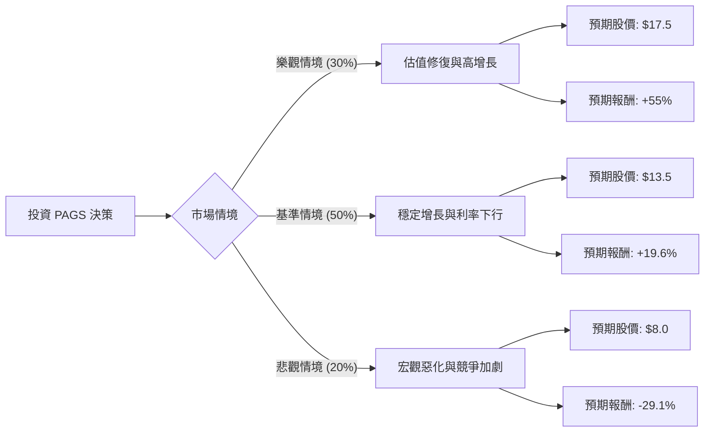

這份分析報告將結合您提供的基本面數據與最新的市場動態（巴西宏觀經濟、利率走勢、競爭格局），利用**決策樹（Decision Tree）**與**期望值分析（Expected Value Analysis）**評估 PagSeguro Digital Ltd. (PAGS) 的投資價值。

---

### 一、 核心背景與假設 (Core Assumptions)

在建立模型前，我們先整合最新資訊：
1.  **巴西利率環境 (Selic Rate)**：巴西央行目前處於降息週期。PAGS 作為金融科技公司，降息能有效降低其融資成本（Financial Expenses），並刺激消費，對利潤率有顯著提振。
2.  **PagBank 轉型成功**：PAGS 已從單純的支付處理商轉型為全方位數位銀行（PagBank）。其 TPV（總交易額）持續增長，且存款規模擴大有助於降低資金成本。
3.  **估值低廉**：目前 Forward P/E 僅 6.91，PEG 0.72，顯示市場對其成長潛力的定價偏低。
4.  **風險因素**：巴西政治風險、匯率波動（BRL/USD）、以及與 StoneCo (STNE) 的激烈競爭。

---

### 二、 決策樹分析 (Decision Tree)

我們預測未來一年的三種主要情境：

#### 節點詳細說明：

| 情境 | 機率 (P) | 預期股價 (Target) | 預期報酬率 (R) | 說明 |
| :--- | :--- | :--- | :--- | :--- |
| **樂觀 (Bull)** | 30% | $17.5 | +55.0% | 巴西降息超預期，EPS 增長 >20%，P/E 回升至 12x。 |
| **基準 (Base)** | 50% | $13.5 | +19.6% | 符合分析師預期，EPS 增長 12-15%，P/E 維持在 9x。 |
| **悲觀 (Bear)** | 20% | $8.0 | -29.1% | 巴西通膨回升停止降息，競爭導致毛利萎縮，P/E 降至 6x。 |

---

### 三、 期望值計算 (Expected Value Calculation)

#### 1. 預期股價期望值 (EV of Stock Price)
$$EV_{price} = (P_{bull} \times Price_{bull}) + (P_{base} \times Price_{base}) + (P_{bear} \times Price_{bear})$$
$$EV_{price} = (0.30 \times 17.5) + (0.50 \times 13.5) + (0.20 \times 8.0)$$
$$EV_{price} = 5.25 + 6.75 + 1.6 = \mathbf{13.60}$$

#### 2. 預期報酬率期望值 (EV of Return)
$$EV_{return} = (0.30 \times 55.0\%) + (0.50 \times 19.6\%) + (0.20 \times -29.1\%)$$
$$EV_{return} = 16.5\% + 9.8\% - 5.82\% = \mathbf{20.48\%}$$

#### 3. 計算過程假設：
*   **當前股價**：$11.29
*   **樂觀目標價 ($17.5)**：基於 Forward EPS $1.65 與歷史平均 P/E (10-12x) 計算。
*   **基準目標價 ($13.5)**：略高於分析師平均目標價 ($12.22)，考量到近期強勁的財報表現與降息紅利。
*   **悲觀目標價 ($8.0)**：考慮到 52 週低點 ($6.46) 與基本面支撐，設定在 P/E 6x 的極端低估水準。

---

### 四、 綜合評估與最終結論

#### 1. 基本面優勢分析：
*   **極具吸引力的估值**：PEG 0.72 顯示該股被嚴重低估。P/FCF 僅 3.72，代表公司產生現金流的能力極強。
*   **獲利能力穩健**：ROE 14.28% 且營業利潤率 (Oper. Margin) 高達 36.24%，在金融科技領域表現優異。
*   **技術面動能**：股價位於 SMA20, 50, 200 之上，呈現多頭排列，且過去一年漲幅達 43.6%，顯示市場信心正在回歸。

#### 2. 風險提示：
*   **債務比率**：Debt/Eq 2.89 較高，雖然金融業負債較高屬正常，但在高利率環境下仍需關注利息支出。
*   **空頭部位**：Short Float 11.76% 偏高，顯示市場仍有部分投機者看空，可能導致股價波動劇烈。

#### 3. 最終判斷：

**結論：適合投資 (Strong Buy / Buy)**

**理由：**
1.  **正向期望值**：經決策樹計算，預期報酬率高達 **20.48%**，遠高於市場平均預期。
2.  **安全邊際 (Margin of Safety)**：目前的 P/E (8.82) 處於歷史低位，即便在基準情境下也有近 20% 的上漲空間。
3.  **宏觀利好**：巴西進入降息週期是 PAGS 獲利擴張的核心驅動力，目前數據顯示此趨勢尚未結束。
4.  **成長性**：EPS next Y 預期增長 12.45%，配合低估值，具備「戴維斯雙擊」（盈餘與估值同時提升）的潛力。

**建議操作：**
可在 $11.0 - $11.5 區間分批建倉，首個目標價設為 $13.5，若巴西宏觀數據持續改善，可持有至 $17 以上。停損點可設在 $9.5 (跌破 SMA200)。