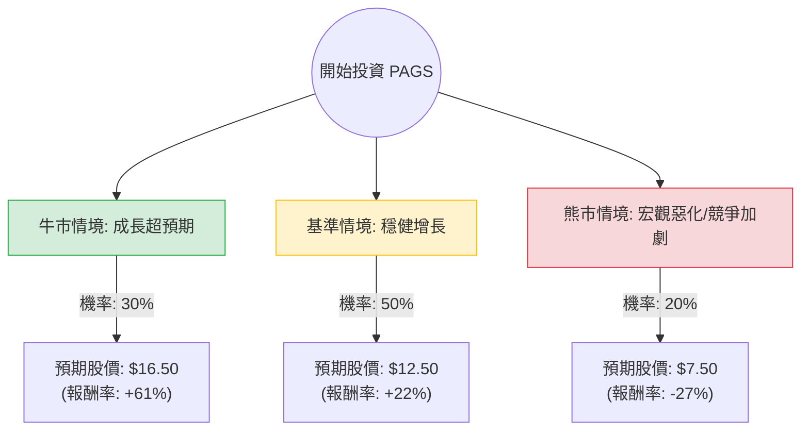

這份分析報告將結合您提供的基本面數據，以及針對 **PagSeguro Digital Ltd. (PAGS)** 的最新市場動態（如巴西宏觀經濟、競爭對手 StoneCo 與 Nubank 的表現、以及 PagBank 的轉型進度）進行綜合評估。

---

### 一、 核心假設與市場背景分析

在建立決策樹之前，我們基於最新資訊設定以下核心假設：

1.  **宏觀環境（巴西利率 Selic）**：巴西央行目前的利率政策直接影響 PAGS 的融資成本與利息收入。若利率維持高位或緩步下降，有利於其銀行業務（PagBank）的淨利差（NIM）。
2.  **估值修復**：目前 PAGS 的 **P/E 僅 8.03**，**Forward P/E 5.44**，**PEG 0.59**。這在金融科技領域屬於「極度低估」，主要受巴西國家風險溢價影響。
3.  **業務轉型**：PAGS 已從單純的支付處理商轉型為數位銀行（PagBank）。其 **ROE 15.03%** 顯示轉型成效顯著，但高達 **3.03 的 Debt/Eq** 反映了銀行業的高槓桿特性。
4.  **競爭壓力**：面臨 StoneCo (STNE) 的價格戰以及 Nubank (NU) 的用戶爭奪。

---

### 二、 決策樹分析 (Decision Tree)

以下為 PAGS 未來 12 個月的投資情境決策樹：

#### 節點詳細說明：

1.  **牛市情境 (Bull Case) - 30% 機率**：
    *   **條件**：巴西降息速度快於預期，消費支出激增；PagBank 存款規模大幅成長，壞帳率控制良好。
    *   **估值邏輯**：P/E 回升至歷史平均 12x。
    *   **預期報酬**：$16.50 (基於 EPS 成長與估值修復)。

2.  **基準情境 (Base Case) - 50% 機率**：
    *   **條件**：公司維持目前 **Sales Q/Q 13.02%** 的增長；分析師目標價 $12.33 達成。
    *   **估值邏輯**：P/E 維持在 8-9x，股價隨盈利增長。
    *   **預期報酬**：$12.50 (接近 Target Price)。

3.  **熊市情境 (Bear Case) - 20% 機率**：
    *   **條件**：巴西政治動盪導致匯率 (BRL) 大貶；與 StoneCo 的價格戰導致毛利 (Gross Margin) 跌破 45%。
    *   **估值邏輯**：股價回測 52 週低點。
    *   **預期報酬**：$7.50。

---

### 三、 期望值分析 (Expected Value Analysis)

#### 1. 計算過程
我們將各情境的預期股價乘以其發生機率，得出一年後的預期價值（Expected Value, EV）：

*   **EV = (牛市股價 × 30%) + (基準股價 × 50%) + (熊市股價 × 20%)**
*   **EV** = ($16.50 × 0.3) + ($12.50 × 0.5) + ($7.50 × 0.2)
*   **EV** = $4.95 + $6.25 + $1.50 = **$12.70**

#### 2. 預期報酬率計算
*   **當前價格 ($P_0$)**：$10.24
*   **預期報酬率** = ($12.70 - $10.24) / $10.24 = **+24.02%**

#### 3. 風險調整後評估
*   **PEG 0.59**：顯示每 1% 的增長僅需支付 0.59 倍的市盈率，安全邊際極高。
*   **Short Float 15%**：空頭比例較高，若財報利多可能引發軋空（Short Squeeze），增加上行潛力。

---

### 四、 最終結論

**投資建議：適合投資 (Buy / Overweight)**

#### 理由如下：

1.  **極具吸引力的估值**：P/E 8.03 倍與 Forward P/E 5.44 倍顯示市場已過度反應巴西的宏觀風險。相較於美股金融科技公司，PAGS 處於價值窪地。
2.  **強勁的盈利能力**：ROE 15.03% 且營業利潤率 (Oper. Margin) 高達 37.58%，顯示其在支付市場擁有強大的定價權與成本控制能力。
3.  **正向期望值**：經過決策樹計算，預期報酬率達 **24.02%**，且基準情境（50%機率）即可帶來 22% 的收益，風險報酬比（Risk-Reward Ratio）優異。
4.  **股息與回購**：3.86% 的股息率為投資者提供了下行保護（Cash Yield），在等待估值修復期間仍有現金流。

**風險提示**：
*   **匯率風險**：PAGS 以美金計價，但收入為巴西雷亞爾，需留意 BRL/USD 匯率波動。
*   **高槓桿**：Debt/Eq 3.03 需持續關注其利息覆蓋倍數，但在銀行業轉型過程中尚屬可接受範圍。

**建議操作**：可在 $10.00 - $10.50 區間分批建倉，首個目標價設為 $12.30，若突破則看至 $16.00。