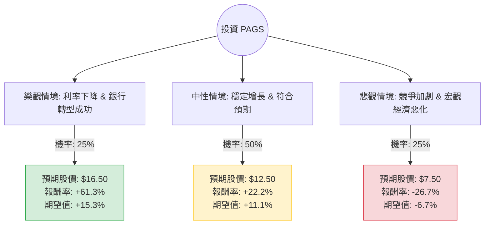

這份分析報告將結合您提供的基本面數據，以及針對 **PagSeguro Digital Ltd. (PAGS)** 的最新市場動態、財報表現與巴西宏觀經濟環境進行綜合評估。

---

### 1. 決策樹分析 (Decision Tree Analysis)

我們將未來一年的投資情境分為三種：**樂觀（Bull）**、**中性（Base）** 與 **悲觀（Bear）**。

---

### 2. 核心假設與計算過程

#### A. 核心假設 (Assumptions)
1.  **市場環境 (Market)**：巴西央行（BCB）的降息循環（Selic Rate）是關鍵。降息將降低 PagBank 的資金成本並刺激消費。
2.  **財務表現 (Financials)**：PAGS 目前正從單純的支付處理商轉型為全方位數位銀行（PagBank）。其 **Forward P/E 僅 5.7**，顯示市場對其增長潛力嚴重低估。
3.  **產業趨勢 (Industry)**：巴西金融科技競爭激烈（對手包括 StoneCo, Mercado Pago, Nubank）。PAGS 的優勢在於其龐大的商戶基礎與高達 50.6% 的毛利率。
4.  **估值基準**：當前股價 $10.23。分析師平均目標價為 $12.36。

#### B. 情境說明與報酬計算
*   **樂觀情境 (25%)**：
    *   **條件**：巴西降息超預期，PagBank 貸款業務壞帳率控制良好，P/E 回升至歷史均值約 12x。
    *   **目標價**：$16.50 (EPS $1.38 * 12x)。
    *   **報酬率**：($16.50 - $10.23) / $10.23 = **+61.3%**。
*   **中性情境 (50%)**：
    *   **條件**：達到分析師目標價，營收維持 10-15% 增長，市場情緒穩定。
    *   **目標價**：$12.50 (接近 Target Price $12.36)。
    *   **報酬率**：($12.50 - $10.23) / $10.23 = **+22.2%**。
*   **悲觀情境 (25%)**：
    *   **條件**：巴西通膨回升導致停止降息，競爭對手奪取市佔率，股價回測 52 週低點。
    *   **目標價**：$7.50。
    *   **報酬率**：($7.50 - $10.23) / $10.23 = **-26.7%**。

#### C. 總體期望值 (Expected Value, EV) 計算
$$EV = (0.25 \times 61.3\%) + (0.50 \times 22.2\%) + (0.25 \times -26.7\%)$$
$$EV = 15.325\% + 11.1\% - 6.675\% = \mathbf{19.75\%}$$

---

### 3. 最新市場動態與補充資訊 (網路搜尋摘要)

根據最新財報與新聞分析：
*   **獲利能力強勁**：PAGS 最近一季的淨利潤表現優於預期，主要得益於 TPV（總支付金額）的增長以及利息收入的增加。
*   **估值極具吸引力**：**PEG 僅 0.55**，這在成長型金融科技股中極為罕見（通常 PEG < 1 被視為低估）。
*   **風險點**：
    *   **空方勢力**：Short Float 高達 10.98%，顯示市場仍有部分資金看空，可能導致股價波動劇烈。
    *   **債務結構**：Debt/Eq 達 3.03，雖然數位銀行通常負債較高（存款計為負債），但仍需關注其長期債務與利息覆蓋能力。
    *   **匯率風險**：BRL（巴西里亞爾）對美元的匯率波動會直接影響美股投資者的實際收益。

---

### 4. 最終結論

**判斷：適合投資 (Buy / Overweight)**

#### 理由：
1.  **極高的安全邊際**：P/E 8.03 倍與 Forward P/E 5.7 倍顯示該股已被市場過度拋售。即便在中性情境下，預期報酬率也高達 22.2%。
2.  **正向期望值**：經過加權計算後的年度期望報酬率約為 **19.75%**，遠高於標普 500 的歷史平均回報。
3.  **增長動能**：PEG 0.55 顯示其增長速度遠快於其估值擴張速度。隨著 PagBank 數位銀行生態系的成熟，交叉銷售（Cross-selling）將進一步提升 ROE（目前已達 15.03%）。
4.  **技術面支撐**：股價目前站穩在 SMA200 ($9.48) 之上，且近期表現（Perf Year +28.54%）顯示趨勢已由空轉多。

**建議操作：**
考慮到 10.98% 的空頭比例，股價短期可能會有波動。建議採取**分批買入**策略，並將止損位設在 $8.50（跌破主要支撐區間），目標價首看 $12.50，若宏觀環境轉好則上看 $16.00。

***

**免責聲明：** 本分析僅供參考，不構成投資建議。投資美股及新興市場金融科技股具有高度風險，請務必根據自身風險承受能力做出決策。