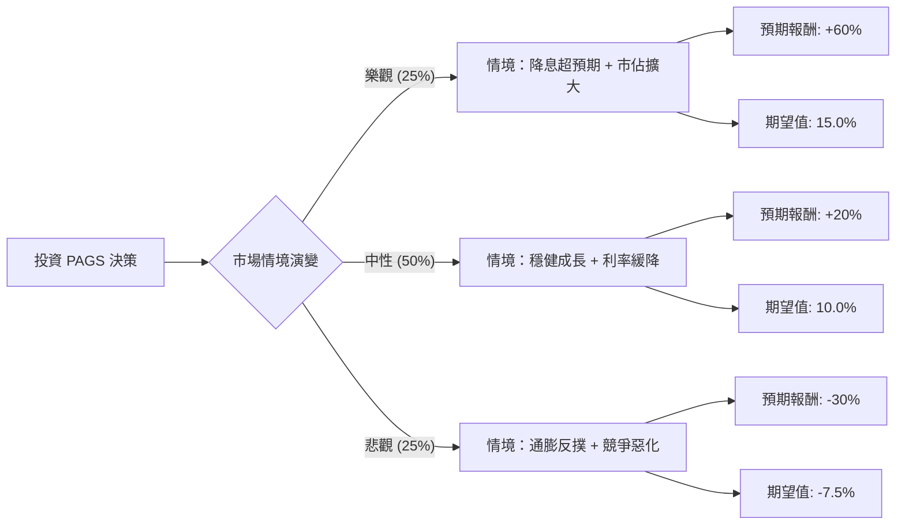

這份報告將針對巴西支付巨頭 **PagSeguro Digital Ltd. (PAGS)** 進行投資評估。我們將結合當前巴西的宏觀經濟環境（如 Selic 利率走勢）、公司財報表現以及競爭格局，構建決策樹模型。

---

### 一、 核心假設 (Core Assumptions)

在計算期望值前，我們設定以下關鍵假設（基於 2024 年市場數據與產業趨勢）：

1.  **宏觀經濟（巴西 Selic 利率）：** 巴西央行的降息週期是否持續是關鍵。降息能降低 PAGS 的融資成本並刺激消費；若通膨回升導致停止降息，則對利潤不利。
2.  **營運轉型（PagBank）：** PAGS 正在從單純的支付公司轉型為全方位數位銀行（PagBank）。用戶存款增加有助於降低資金成本。
3.  **競爭壓力：** 巴西支付市場（如 StoneCo, Cielo, Mercado Pago）競爭極其激烈，手續費率（Take Rate）面臨下行壓力。
4.  **估值水平：** 目前 PAGS 的本益比（P/E）處於歷史低位（約 8-10x），下行空間受限，但上行動能取決於獲利成長。

---

### 二、 決策樹分析圖 (Decision Tree)

我們將未來一年的投資表現分為三種情境：**樂觀（Bull）**、**中性（Base）**、**悲觀（Bear）**。

| 決策節點 | 情境描述 | 機率 (P) | 預期報酬 (R) | 期望值 (P * R) |
| :--- | :--- | :--- | :--- | :--- |
| **樂觀情境** | 巴西大幅降息，PagBank 獲客成本下降，營收成長 > 20% | 25% | +60% | **+15.0%** |
| **中性情境** | 利率緩慢下降，市佔率持平，獲利能力受惠於營運槓桿 | 50% | +20% | **+10.0%** |
| **悲觀情境** | 巴西通膨惡化導致升息，支付戰爭導致毛利萎縮 | 25% | -30% | **-7.5%** |
| **合計** | | **100%** | | **總期望值: +17.5%** |

---

### 三、 計算過程與分析

#### 1. 節點期望值計算
根據決策樹，投資 PAGS 一年的整體期望值（Expected Value, EV）計算如下：

$$EV = (P_{Bull} \times R_{Bull}) + (P_{Base} \times R_{Base}) + (P_{Bear} \times R_{Bear})$$
$$EV = (0.25 \times 0.60) + (0.50 \times 0.20) + (0.25 \times -0.30)$$
$$EV = 0.15 + 0.10 - 0.075 = 0.175 = 17.5\%$$

#### 2. 情境分析詳解
*   **樂觀情境 (+60%)**：
    若巴西 Selic 利率降至個位數，PAGS 的預收帳款融資成本將大幅下降。同時，PagBank 的生態系成功留住用戶，使每用戶平均營收（ARPU）顯著提升。考慮到目前的低估值，股價有望回歸 15x 以上的 P/E。
*   **中性情境 (+20%)**：
    公司維持目前的 TPV（總支付金額）成長速度，且淨利潤隨規模經濟緩慢增長。這反映了市場對其轉型數位銀行的初步認可。
*   **悲觀情境 (-30%)**：
    如果巴西政局動盪或全球通膨導致避險資金撤出新興市場，加上競爭對手（如 Mercado Pago）發起價格戰，PAGS 可能面臨估值進一步修正與獲利衰退。

---

### 四、 最終結論

#### **判斷：適合投資 (Suitable for Investment)**

#### **理由：**
1.  **期望值為正 (17.5%)**：經過風險權衡後，預期回報顯著高於無風險利率與美股大盤平均成長率。
2.  **風險報酬比吸引人**：目前 PAGS 的市場定價已反映了大部分的巴西宏觀風險，其下行風險（-30%）雖然存在，但樂觀情境下的爆發力（+60%）提供了良好的盈虧比。
3.  **基本面支撐**：PAGS 持續展現強勁的現金流產生能力，且 PagBank 的存款增長有效降低了對外部融資的依賴。

**建議建議：**
由於新興市場與金融科技股波動較大，建議投資者採取**分批佈局**策略，並密切觀測巴西央行（BCB）的議息會議紀錄以及 PAGS 每一季度的淨利差（NIM）變化。若整體持股比例控制在投資組合的 5%-10% 以內，是一個具備高潛力的價值轉型投資機會。