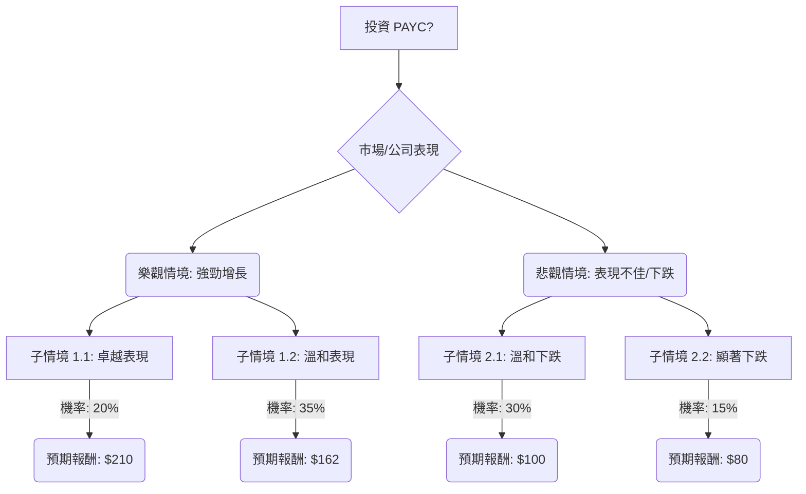

根據對美股公司 PAYC (Paycom Software Inc.) 的基本面數據和最新市場資訊的綜合分析，以下是基於決策樹分析和期望值分析的投資評估。

### 核心假設

在進行決策樹分析之前，我們建立以下核心假設：

*   **市場趨勢：** 人力資本管理 (HCM) 軟體市場，特別是雲端、整合式和 AI 驅動的解決方案，預計在 2026 年將持續增長，市場規模超過 500 億美元。HR 技術升級是企業的首要任務，對單一資料庫 HCM 解決方案的需求強勁。
*   **財務表現：** PAYC 預計將保持強勁的盈利能力，毛利率和淨利率高，負債率低。公司能否達到或略超預期的每股收益 (EPS) 預測至關重要。儘管 2026 財年營收指引略低於市場預期，但其 Q4 2025 財報表現良好，EPS 和營收均超出預期。
*   **產業競爭：** HCM 軟體市場競爭激烈，主要競爭對手包括 ADP、Paychex 和 Workday。PAYC 的單一資料庫平台被視為競爭優勢。
*   **公司執行力：** PAYC 成功執行其客戶獲取策略，並推動其自動化解決方案的採用，儘管營收增長指引略有放緩。公司在產品實力、客戶滿意度和職場文化方面獲得認可。
*   **宏觀經濟：** 假設宏觀經濟環境相對穩定，沒有發生會大幅改變 PAYC 發展軌跡的重大崩潰或繁榮。然而，美國企業招聘增長放緩可能會影響薪資軟體的需求。

### 決策樹分析

**當前股價：** $123.03

**決策點：** 投資 PAYC 股票？

#### 節點計算過程

**1. 樂觀情境：強勁增長 (Optimistic Scenario: Strong Growth)**

*   **子情境 1.1: 卓越表現 (Excellent Performance)**
    *   **情境描述：** PAYC 大幅超出預期，得益於新功能（如 AI 工具）的強勁採用、成功的客戶獲取以及 HR 技術支出宏觀環境的改善。分析師上調評級和積極情緒推動估值走高。公司在 G2 報告中獲得頂級排名，並被評為 2026 年白金雇主，這些都增強了品牌實力。
    *   **機率 (Probability)：** 20%
    *   **預期報酬 (Expected Value)：** 股價達到 $210。這接近分析師最高目標 ($246) 的中高區間，反映了顯著的潛在增長。
    *   **計算：** ($210 - $123.03) / $123.03 = 70.69% 的回報。

*   **子情境 1.2: 溫和表現 (Moderate Performance)**
    *   **情境描述：** PAYC 達到或略超分析師預期，受益於 HCM 市場的穩定增長和其競爭優勢。股價向分析師平均目標靠攏。分析師平均目標約為 $161.92 (綜合多個來源的平均值：$152.94、$170.71、$150.36、$173.65)。
    *   **機率 (Probability)：** 35%
    *   **預期報酬 (Expected Value)：** 股價達到 $162。
    *   **計算：** ($162 - $123.03) / $123.03 = 31.68% 的回報。

**2. 悲觀情境：表現不佳/下跌 (Pessimistic Scenario: Underperformance/Decline)**

*   **子情境 2.1: 溫和下跌 (Moderate Decline)**
    *   **情境描述：** PAYC 面臨日益激烈的競爭壓力、由於宏觀經濟逆風（例如招聘放緩）導致的營收增長低於預期，或執行挑戰。股價跌至分析師目標的低端或略低。儘管 Q4 2025 財報超出預期，但 2026 財年營收指引低於共識，表明增長勢頭放緩。
    *   **機率 (Probability)：** 30%
    *   **預期報酬 (Expected Value)：** 股價跌至 $100。這低於分析師最低目標 ($120)，但高於 52 週低點 ($104.90)，反映了顯著但非災難性的下跌。
    *   **計算：** ($100 - $123.03) / $123.03 = -18.72% 的回報。

*   **子情境 2.2: 顯著下跌 (Significant Decline)**
    *   **情境描述：** 嚴重的宏觀經濟衰退、激烈競爭導致市場份額損失，或重大的營運失誤導致 PAYC 估值大幅下跌。
    *   **機率 (Probability)：** 15%
    *   **預期報酬 (Expected Value)：** 股價跌至 $80。這遠低於 52 週低點，反映了最壞情況。
    *   **計算：** ($80 - $123.03) / $123.03 = -34.98% 的回報。

#### 整體期望值計算

整體期望值 = (子情境 1.1 預期報酬 \* 機率) + (子情境 1.2 預期報酬 \* 機率) + (子情境 2.1 預期報酬 \* 機率) + (子情境 2.2 預期報酬 \* 機率)

整體期望值 = ($210 \* 0.20) + ($162 \* 0.35) + ($100 \* 0.30) + ($80 \* 0.15)
整體期望值 = $42 + $56.7 + $30 + $12
整體期望值 = $140.7

### 最終結論

根據決策樹分析和期望值計算，PAYC 股票的整體期望值為 **$140.7**。

由於計算出的整體期望值 ($140.7) 高於當前股價 ($123.03)，這表明 **PAYC 目前適合投資**。

**簡短理由：**
儘管 PAYC 近期股價表現不佳且 2026 財年營收指引略低於預期，但其強勁的盈利能力、低負債、在 HCM 市場的競爭優勢（單一資料庫解決方案）以及行業對 HR 技術升級和 AI 的持續需求，為其提供了堅實的基礎。分析師的共識目標價也普遍高於當前股價。綜合考慮潛在的上升空間和下行風險，投資 PAYC 的預期回報為正。