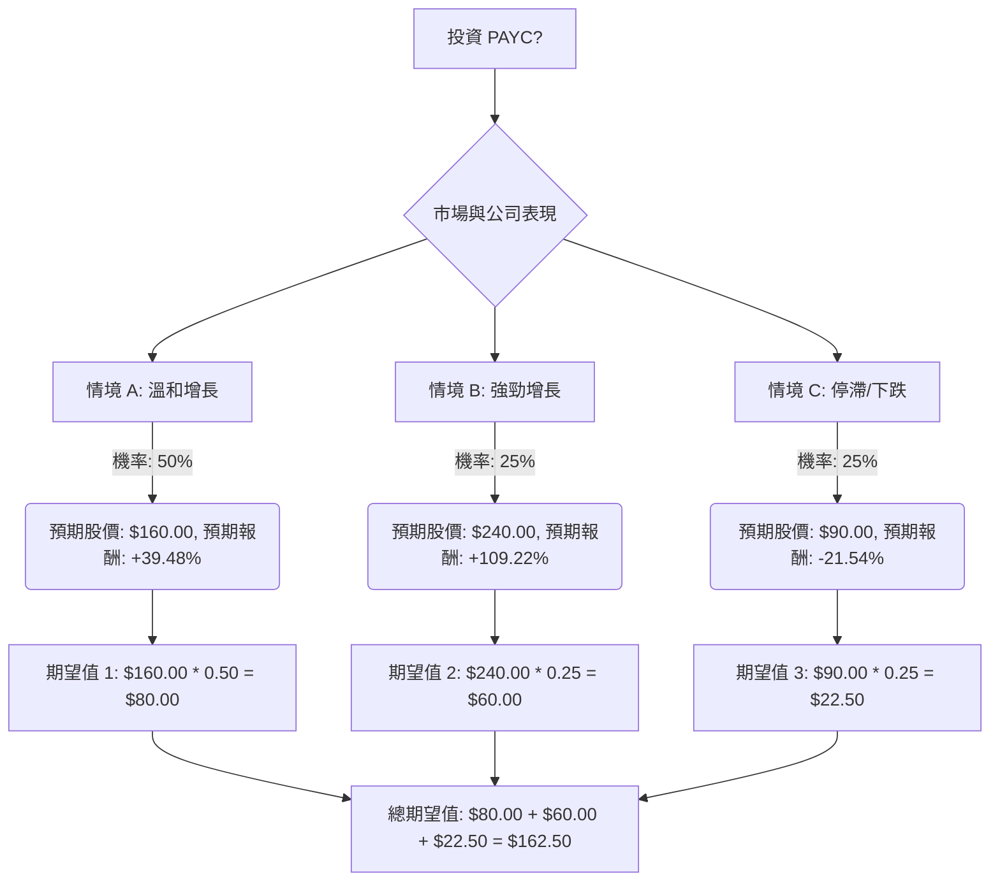

根據您提供的基本面數據以及最新的市場資訊，我們將使用決策樹分析和期望值分析來評估美股公司 PAYC 目前是否適合投資。

### 核心假設

在進行決策樹分析之前，我們基於收集到的資訊，建立以下核心假設：

*   **時間範圍：** 1年。
*   **當前股價 (P0)：** $114.71 (來自您提供的數據)。
*   **市場趨勢：** HR軟體市場預計在2024年至2029年間以11-12%的複合年增長率增長，主要受雲端解決方案和數位化HR系統的推動。北美市場是主要貢獻者，對創新HR解決方案的需求強勁。
*   **財務表現：** PAYC在2025年第四季度營收和EPS符合或略超預期。然而，2026年全年營收指引為6-7%的增長，低於分析師預期，顯示增長放緩。公司擁有高客戶留存率（2025財年為91%）、無債務、強勁的自由現金流。毛利率略有下降趨勢。
*   **產業趨勢：** AI和自動化在HR軟體中日益重要，PAYC的「IWant」和「Beti」等AI工具被視為競爭優勢。然而，AI代理可能取代傳統軟體的擔憂也帶來了行業焦慮。競爭激烈，客戶保留率面臨壓力。
*   **分析師共識：** 分析師對PAYC的共識評級介於「持有」到「溫和買入」之間。平均12個月目標價約為$160.00 (綜合多個來源的平均值)。最高目標價約為$240.00，最低目標價約為$115.00。

### 決策樹分析

我們將考慮三種主要情境來評估投資 PAYC 的潛在結果：

#### 節點說明與計算過程：

**根節點：投資 PAYC?**
這是我們的決策點。

**中間節點：市場與公司表現**
此節點分支為三種可能的情境，每種情境都有其預期結果和機率。

1.  **情境 A: 溫和增長 (Moderate Growth)**
    *   **預測情境名稱：** PAYC 繼續在成長中的 HR 軟體市場中穩健發展，其 AI 創新（如 IWant 和 Beti）有助於維持客戶留存率和效率，但整體營收增長速度放緩符合2026年指引。分析師的平均目標價得以實現。
    *   **對應的機率 (Probability)：** 50%
        *   **理由：** 分析師普遍給予「持有」至「溫和買入」評級，且公司基本面穩健（高留存率、無債務、強勁現金流），但近期增長放緩是事實。這是最可能發生的情境。
    *   **預期報酬 / 期望值 (Expected Value)：**
        *   預期股價 (P1_A)：$160.00 (綜合分析師平均目標價)
        *   預期報酬率：($160.00 - $114.71) / $114.71 = 39.48%
        *   期望值貢獻：$160.00 * 0.50 = $80.00

2.  **情境 B: 強勁增長 (Strong Growth)**
    *   **預測情境名稱：** PAYC 的 AI 策略（IWant、Beti）取得超預期成功，顯著提升市場份額和客戶滿意度，同時成功拓展新市場或產品線，克服競爭壓力，實現分析師最高目標價。
    *   **對應的機率 (Probability)：** 25%
        *   **理由：** 公司在 AI 創新方面有潛力，且 HR 軟體市場整體增長強勁。然而，近期增長指引放緩以及市場對 AI 影響的擔憂使得實現最高目標價的機率相對較低。
    *   **預期報酬 / 期望值 (Expected Value)：**
        *   預期股價 (P1_B)：$240.00 (綜合分析師最高目標價)
        *   預期報酬率：($240.00 - $114.71) / $114.71 = 109.22%
        *   期望值貢獻：$240.00 * 0.25 = $60.00

3.  **情境 C: 停滯/下跌 (Stagnation/Decline)**
    *   **預測情境名稱：** PAYC 面臨更激烈的競爭、客戶流失加劇、AI 顛覆性影響超出預期，或宏觀經濟逆風導致企業對 HR 軟體支出減少，導致營收增長停滯甚至下降，股價跌至或跌破52週低點。
    *   **對應的機率 (Probability)：** 25%
        *   **理由：** 儘管公司有優勢，但增長放緩、毛利率壓力、客戶保留率曾有下降趨勢以及市場對 AI 顛覆的擔憂構成風險。一些統計模型甚至預測2026年底股價可能更低。我們採用一個比最低分析師目標價更保守的下跌價格。
    *   **預期報酬 / 期望值 (Expected Value)：**
        *   預期股價 (P1_C)：$90.00 (低於52週低點 $104.90 和部分統計模型預測的低點 $73.69)
        *   預期報酬率：($90.00 - $114.71) / $114.71 = -21.54%
        *   期望值貢獻：$90.00 * 0.25 = $22.50

**最終期望值計算：**

總期望值 = (情境 A 期望值貢獻) + (情境 B 期望值貢獻) + (情境 C 期望值貢獻)
總期望值 = $80.00 + $60.00 + $22.50 = $162.50

### 最終結論

根據上述決策樹分析和期望值計算，投資 PAYC 的**總期望值為 $162.50**。

由於當前股價為 $114.71，而計算出的總期望值為 $162.50，這表示預期未來股價高於當前股價。

**判斷：適合投資**

**簡短理由：**
儘管 PAYC 面臨增長放緩的挑戰和激烈的市場競爭，但其在 HR 軟體市場的穩固地位、持續的 AI 創新（如 IWant 和 Beti）、高客戶留存率、健康的財務狀況（無債務、強勁自由現金流）以及分析師普遍給予的「持有」至「溫和買入」評級 共同支撐了其潛在的上升空間。綜合考慮不同情境下的機率和報酬，其整體期望值高於當前股價，表明在未來一年內存在合理的投資回報潛力。投資者應密切關注公司在 AI 應用和市場拓展方面的進展，以及宏觀經濟對企業 HR 支出的影響。