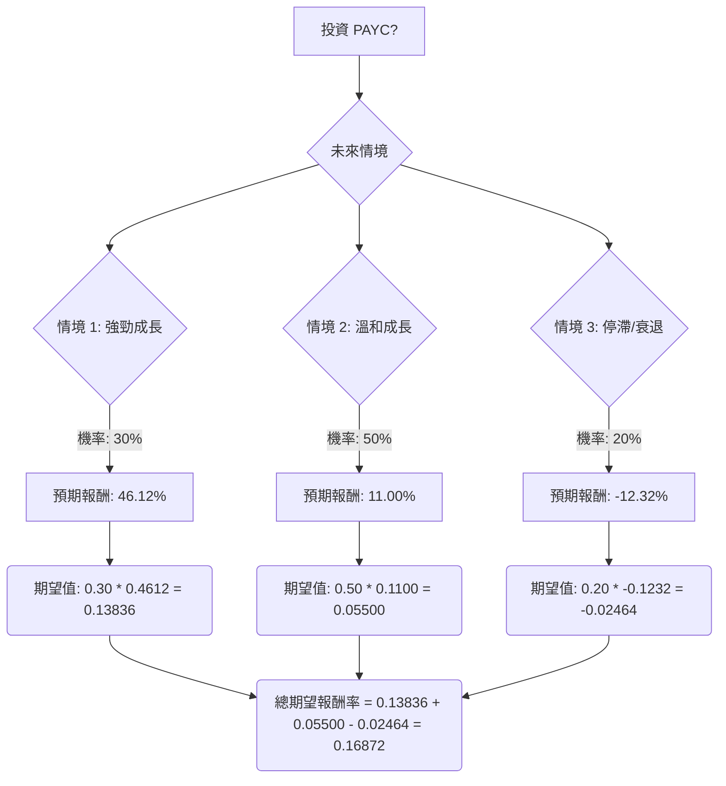

根據對美股公司 PAYC 的基本面數據、最新市場資訊、財報、產業趨勢以及分析師評級的綜合評估，以下將使用決策樹分析和期望值分析來判斷其目前是否適合投資。

### **核心假設**

1.  **市場趨勢：** 預計整體市場將保持穩定或溫和成長，但科技股可能面臨利率和宏觀經濟不確定性的影響。
2.  **財務表現：** PAYC 展現出強勁的盈利能力（高毛利率、營業利潤率、ROE、ROA）和健康的流動性。儘管 2026 年營收指引較為保守，但 Q1 2026 業績超出預期，且公司積極進行股票回購和派發股息，顯示管理層對未來現金流的信心。
3.  **產業趨勢 (HCM)：** 人力資本管理 (HCM) 產業正經歷轉型，朝向整合式、AI 驅動的解決方案發展。技能導向的勞動力規劃和 AI 輔助決策是主要趨勢。PAYC 的 AI 引擎 "IWant™" 和其整合平台策略使其在這一趨勢中具有競爭優勢。
4.  **分析師預期：** 分析師對 PAYC 的評級多為「持有」或「等權」，但也有部分「買入」評級，平均目標價顯示溫和上漲空間。GuruFocus 認為 PAYC 被低估。

### **決策樹分析**

**決策點：投資 PAYC 股票？**

*   **當前股價 (P0):** $136.87

#### **情境定義與計算過程：**

1.  **情境 1: 強勁成長 (Optimistic Scenario)**
    *   **情境名稱：** AI 驅動市場份額擴大與宏觀經濟強勁復甦。
    *   **情境描述：** PAYC 成功利用其 AI 技術和整合平台，顯著超越其保守的營收指引，並在 HCM 產業的 AI 轉型中取得領先地位。宏觀經濟環境超預期改善，企業招聘需求大增，推動 PAYC 產品需求。分析師普遍上調評級和目標價。
    *   **預期目標價 (P1_optimistic):** $200.00 (參考分析師高目標價 $183 及 GuruFocus 估值 $245.44，取一個較為樂觀但合理的價格)。
    *   **預期報酬率：** ($200.00 - $136.87) / $136.87 = 0.4612 (即 46.12%)
    *   **機率 (Probability)：** 30% (考慮到公司強勁的基本面、AI 潛力，但仍需克服宏觀不確定性和競爭)
    *   **期望值：** 0.30 \* 0.4612 = 0.13836

2.  **情境 2: 溫和成長 (Moderate Scenario - Base Case)**
    *   **情境名稱：** 符合公司指引與市場預期。
    *   **情境描述：** PAYC 按照其 2026 年營收指引（6-7% 成長）穩健發展，並達到或略超分析師的平均預期。HCM 市場保持穩定成長，PAYC 維持其競爭地位。宏觀經濟環境保持穩定。
    *   **預期目標價 (P1_moderate):** $151.93 (採用提供的「Target Price」數據，與分析師中位數目標價 $148.0 相近)。
    *   **預期報酬率：** ($151.93 - $136.87) / $136.87 = 0.1100 (即 11.00%)
    *   **機率 (Probability)：** 50% (這是最有可能的情境，反映了公司目前的指引和分析師的普遍看法)
    *   **期望值：** 0.50 \* 0.1100 = 0.05500

3.  **情境 3: 停滯/衰退 (Pessimistic Scenario)**
    *   **情境名稱：** 宏觀經濟逆風與競爭加劇。
    *   **情境描述：** 宏觀經濟狀況惡化，導致企業削減 IT 和 HR 支出，招聘活動放緩。PAYC 面臨來自競爭對手（如 Workday, ADP）的激烈競爭，或其 AI 產品的市場接受度不如預期，導致營收成長停滯甚至下滑，未能達到指引。
    *   **預期目標價 (P1_pessimistic):** $120.00 (參考分析師最低目標價 $120.00 - $121.2 及 52 週低點 $104.90)。
    *   **預期報酬率：** ($120.00 - $136.87) / $136.87 = -0.1232 (即 -12.32%)
    *   **機率 (Probability)：** 20% (考慮到公司強勁的基本面和 AI 投資，完全衰退的可能性較低，但宏觀經濟風險仍存)
    *   **期望值：** 0.20 \* (-0.1232) = -0.02464

#### **整體期望報酬率計算：**

總期望報酬率 = (情境 1 期望值) + (情境 2 期望值) + (情境 3 期望值)
總期望報酬率 = 0.13836 + 0.05500 - 0.02464 = 0.16872

### **最終結論**

根據上述決策樹分析和期望值計算，投資 PAYC 股票的**總期望報酬率為 16.87%**。

**判斷：適合投資**

**簡短理由：**
儘管 PAYC 面臨宏觀經濟逆風和較為保守的 2026 年營收指引，但其強勁的 Q1 2026 業績、高利潤率、健康的資產負債表、積極的股票回購計劃以及在 AI 驅動的 HCM 產業趨勢中的領先地位，為其提供了堅實的基礎。 16.87% 的正向期望報酬率表明，在考慮了不同情境及其機率後，投資 PAYC 具有吸引力的潛在收益。此外，GuruFocus 認為該股票被低估，也為其提供了潛在的上漲空間。 雖然過去一年股價表現不佳，但目前的價格可能提供了一個較好的切入點。