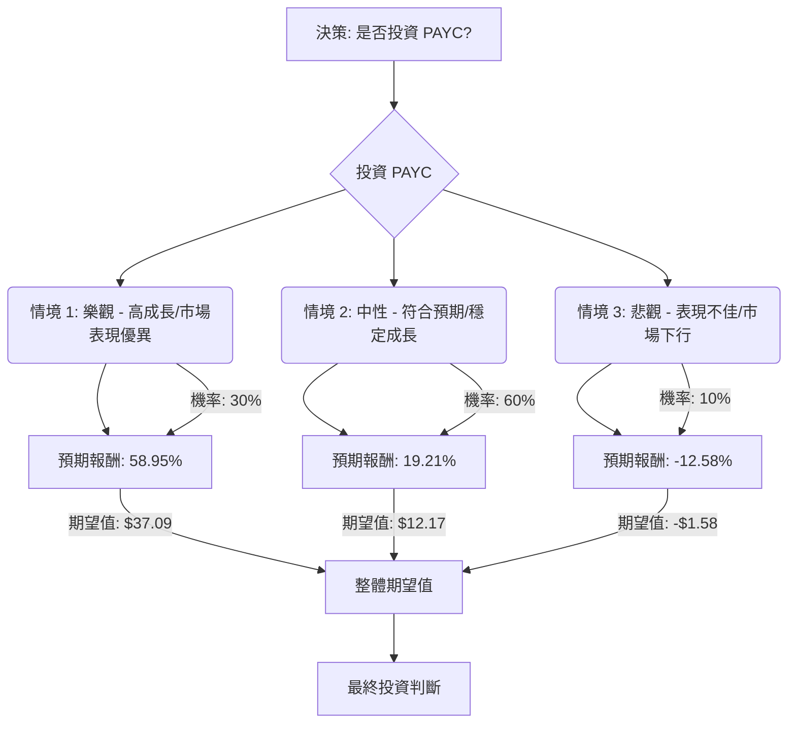

根據對美股公司 PAYC（Paycom Software Inc.）的基本面數據、最新市場資訊、財報、分析師評級及產業趨勢的綜合評估，以下將透過決策樹分析與期望值分析，判斷 PAYC 目前是否適合投資。

### **核心假設**

在進行決策樹分析前，我們建立以下核心假設：

*   **市場趨勢：** 人力資源（HR）軟體市場持續增長，主要受數位化轉型、人工智慧（AI）和機器學習（ML）的採用、以及對員工體驗平台和數據分析日益增長的需求所驅動。
*   **財務狀況：** PAYC 預計將維持其強勁的資產負債表，截至 2024 年 3 月 31 日無債務。 公司預計將繼續產生強勁的營運現金流。
*   **產業競爭：** PAYC 面臨來自 Paylocity、ADP、Rippling 等主要競爭對手的激烈競爭。 公司能否成功推廣其新產品（如 Beti）並改善客戶留存率，將是其未來表現的關鍵。

### **決策樹分析**

**決策點：投資 PAYC 股票**

*   **當前股價 (Current Price):** $125.83

#### **節點詳情與計算過程**

**1. 情境定義與機率分配：**

我們根據分析師評級和公司近期表現來分配各情境的機率。多數分析師給予 PAYC「持有」或「溫和買入」的評級，同時公司在 Q1 2024 財報中表現超出預期，但 2026 年的營收增長指引有所放緩。

*   **情境 1: 樂觀 - 高成長/市場表現優異**
    *   **預測情境名稱：** PAYC 成功推動新產品（如 Beti）的採用，國際市場擴張順利，並在競爭激烈的 HR 軟體市場中脫穎而出。公司營收和盈利能力顯著超出分析師預期。
    *   **機率 (Probability)：** 30% (基於部分分析師的「強烈買入」評級和公司超出預期的 Q1 2024 財報表現)
    *   **預期股價：** $200.00 (參考分析師最高目標價 $210-$240，並取一個較保守的數值)
    *   **預期報酬 (Expected Return)：** (($200.00 - $125.83) / $125.83) = 58.95%
    *   **期望值 (Expected Value)：** 0.30 * 58.95% = 17.685% (或每股 $125.83 * 0.5895 = $74.19 的潛在收益)

*   **情境 2: 中性 - 符合預期/穩定成長**
    *   **預測情境名稱：** PAYC 達到其自身和分析師的平均預期，營收和客戶增長保持穩定，客戶留存率維持在當前水平（約 90-91%）。
    *   **機率 (Probability)：** 60% (基於多數分析師的「持有」或「溫和買入」評級，以及公司穩健的 2024 年財測指引)
    *   **預期股價：** $150.00 (參考分析師平均目標價 $148.21-$158.25)
    *   **預期報酬 (Expected Return)：** (($150.00 - $125.83) / $125.83) = 19.21%
    *   **期望值 (Expected Value)：** 0.60 * 19.21% = 11.526% (或每股 $125.83 * 0.1921 = $24.17 的潛在收益)

*   **情境 3: 悲觀 - 表現不佳/市場下行**
    *   **預測情境名稱：** PAYC 面臨更激烈的競爭，客戶留存率進一步下降，或宏觀經濟環境惡化導致企業 HR 軟體支出減少，公司未能達到預期。
    *   **機率 (Probability)：** 10% (儘管「賣出」評級較少，但仍需考慮潛在風險)
    *   **預期股價：** $110.00 (略低於分析師最低目標價 $115-$129.75，以反映較大的下行風險)
    *   **預期報酬 (Expected Return)：** (($110.00 - $125.83) / $125.83) = -12.58%
    *   **期望值 (Expected Value)：** 0.10 * -12.58% = -1.258% (或每股 $125.83 * -0.1258 = -$15.83 的潛在損失)

**2. 整體期望值計算：**

整體期望值 = (情境 1 期望值) + (情境 2 期望值) + (情境 3 期望值)
整體期望值 = 17.685% + 11.526% + (-1.258%)
整體期望值 = 27.953%

這表示投資 PAYC 的預期報酬率為 27.953%。

**3. 投資的期望價值：**

投資的期望價值 = 當前股價 * (1 + 整體期望值)
投資的期望價值 = $125.83 * (1 + 0.27953)
投資的期望價值 = $125.83 * 1.27953
投資的期望價值 = $161.01

### **最終結論**

根據上述決策樹分析和期望值計算，PAYC 的整體期望報酬率為 **27.953%**，投資的期望價值為每股 **$161.01**。由於期望價值 ($161.01) 高於當前股價 ($125.83)，因此判斷 **適合投資**。

**簡短理由：**

PAYC 在 Q1 2024 的財報表現超出預期，且公司擁有穩健的資產負債表（無債務）和強勁的現金流。 儘管面臨競爭壓力且客戶留存率在 2023 年略有下降（但 2025 年有所改善），但公司在 HR 軟體市場的增長趨勢中處於有利地位，特別是在 AI 和自動化領域的投入。 分析師的共識評級多為「溫和買入」或「持有」，且平均目標價顯示出可觀的上漲空間。 綜合來看，PAYC 具有良好的增長潛力，其預期報酬率足以彌補潛在風險。