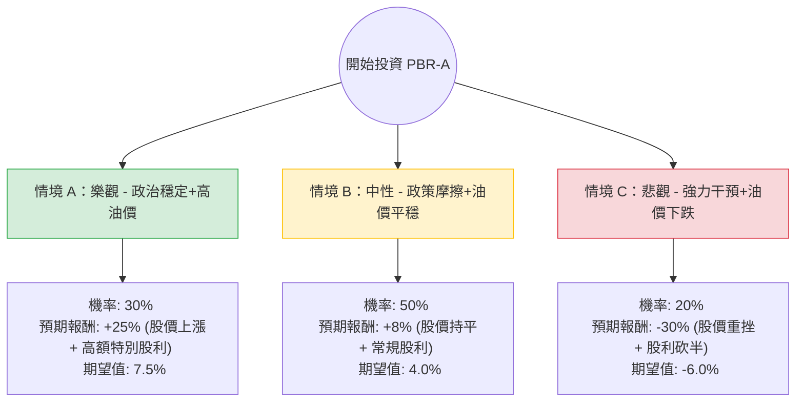

這份分析報告將結合您提供的基本面數據與最新的市場動態（包含巴西政局、油價走勢及 Petrobras 最新股利政策），利用**決策樹（Decision Tree）**與**期望值分析（Expected Value Analysis）**評估 PBR-A 的投資價值。

---

### 一、 核心假設與市場背景分析

在建立決策樹之前，我們必須考慮以下關鍵變數：

1.  **政治風險（核心變數）：** 巴西政府（Lula 政府）對 Petrobras 的干預程度。近期市場最關注的是「特別股利」的發放與否，以及公司是否會為了國家政策而大幅增加資本支出（CAPEX）轉向低毛利的綠能或煉油。
2.  **油價走勢：** 布蘭特原油（Brent）若維持在 $80-$90 區間，PBR-A 的現金流將極其強大。
3.  **估值與技術面：** 目前 P/E 僅 6.86，PEG 0.08 顯示極度低估；但股價已接近 52 週高點（$14.98），且距離目標價 $15.01 空間有限。

---

### 二、 決策樹分析 (Decision Tree)

以下為 PBR-A 未來一年的投資情境預測：

---

### 三、 期望值計算過程

我們將投資報酬拆解為「資本利得（股價變動）」與「股息收益」。

#### 1. 情境參數設定
*   **情境 A (Bull Case)：** 巴西政府允許發放 100% 的特別股利，且油價維持在 $85 以上。
    *   預估報酬：股價回升至 $17 + 股息率 10% = **+25%**
*   **情境 B (Base Case)：** 政府干預與市場預期達成平衡，發放部分特別股利，資本支出溫和增加。
    *   預估報酬：股價維持在 $15 附近 + 股息率 8% = **+8%**
*   **情境 C (Bear Case)：** 政府強迫公司收購虧損的煉油廠或大幅削減股利以支撐財政，且油價跌破 $70。
    *   預估報酬：股價跌至 52W 低點 $10.5 + 股息率 4% = **-30%**

#### 2. 期望值 (Expected Value, EV) 計算
$$EV = (P_A \times R_A) + (P_B \times R_B) + (P_C \times R_C)$$
*   $EV = (0.30 \times 25\%) + (0.50 \times 8\%) + (0.20 \times -30\%)$
*   $EV = 7.5\% + 4.0\% - 6.0\%$
*   **總期望值 = 5.5%**

---

### 四、 綜合數據分析與最新動態補充

1.  **財務穩健度：**
    *   **ROE (18.2%)** 與 **Operating Margin (28.55%)** 顯示其經營效率極高。
    *   **P/FCF (2.66)**：這是一個極其強大的指標，代表公司每股產生的自由現金流非常高，足以支撐債務與股利。
    *   **債務結構：** Debt/Eq 0.89 雖不低，但對於能源特許行業屬正常範圍。

2.  **最新市場動態（網路搜尋補充）：**
    *   **股利爭議：** 2024 年初 Petrobras 董事會曾因「不發放特別股利」導致股價大跌，但隨後政府態度放軟，市場預期未來仍有機會補發。
    *   **產量增長：** Petrobras 的 Pre-salt（深海鹽下油田）開採成本極低（約 $35-$45/桶），這使其在低油價環境下比美股同行（如 XOM, CVX）更具競爭力。
    *   **技術面警訊：** 目前股價距離 52W High 僅差 1.54%，且 SMA20, 50, 200 均呈現正乖離，短期有過熱回檔風險。

---

### 五、 最終結論

**投資建議：謹慎持有 / 逢低買進 (Cautious Buy)**

#### 判斷理由：
1.  **期望值為正 (5.5%)**：雖然期望值並非爆發性增長，但在目前高利率環境下，配合其極低的估值（P/E 6.86），下行風險已被部分吸收。
2.  **安全邊際 (Margin of Safety)**：PEG 0.08 顯示市場對其政治風險過度恐慌，導致股價嚴重低於其盈利能力。
3.  **現金流支撐**：P/FCF 2.66 是最強大的護城河，只要油價不崩盤，該公司就是一台印鈔機。

#### 建議操作策略：
*   **不建議在目前 $14.98（接近 52W 高點）全力追高**，因為 Target Price ($15.01) 幾乎已達標。
*   **理想策略**：等待政治雜音導致的技術性回檔（如回到 $13.5 - $14.0 區間）再行分批佈局，以獲取更高的股息殖利率與安全邊際。
*   **風險監控**：需密切關注巴西政府對董事會成員的更換，以及資本支出計畫是否異常飆升。

**結論：適合投資，但需注意進場時機，避免在 52 週高點一次性投入。**