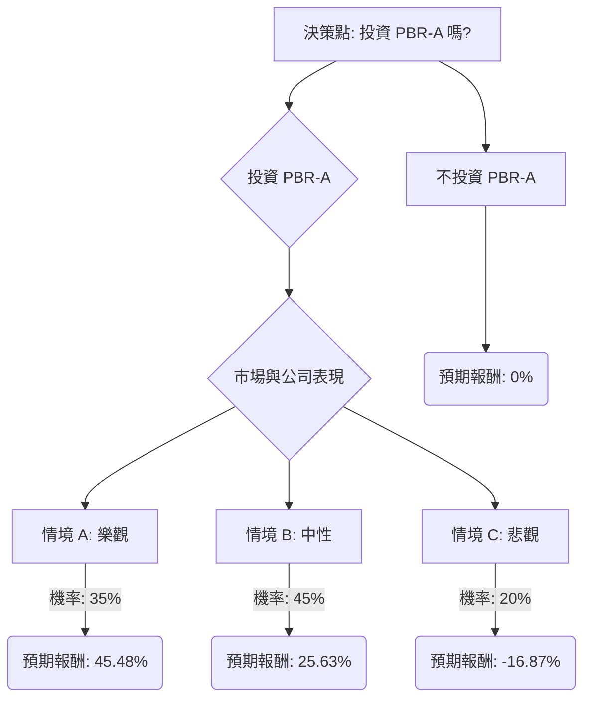

根據您提供的基本面數據以及對美股公司 PBR-A (Petrobras) 的最新市場資訊、財報、產業趨勢和巴西政治動態的綜合評估，以下是使用決策樹分析和期望值分析的投資評估。

### **核心假設 (Core Assumptions)**

1.  **市場假設 (Market Assumptions):**
    *   **全球原油價格波動：** 根據美國能源信息署 (EIA) 的預測，2026 年布倫特原油價格預計將平均為每桶 56 美元，較 2025 年下降 19%，並在 2027 年進一步降至 54 美元，原因是全球石油產量超過需求。然而，地緣政治不確定性仍可能導致短期價格波動。
    *   **全球能源轉型：** 儘管長期趨勢是轉向低碳能源，但石油和天然氣在可預見的未來仍將是全球能源結構的重要組成部分。
2.  **財務假設 (Financial Assumptions):**
    *   **股息政策：** PBR-A 預計將維持其高股息政策，但在不利的市場或政治環境下，股息可能會減少。
    *   **公司業績：** Petrobras 在 2025 年實現了創紀錄的石油產量，並計劃在 2026 年將煉油廠產能提高到 95%，顯示出穩健的運營表現。 儘管提供的數據顯示「EPS next Y_%」為 -0.263，但 Zacks 的最新預測 (2026 年 1 月 21 日) 顯示 2026 財年 EPS 將增長 8.05%，營收持平，這表明近期前景較為穩定。
3.  **產業趨勢假設 (Industry Trend Assumptions):**
    *   石油和天然氣行業正積極採用新技術，如生產優化、AI 驅動的勘探、碳捕獲、利用與儲存 (CCUS) 以及氫能整合。
    *   南美洲預計將在 2027 年成為全球液體燃料生產增長的主要驅動力之一。
4.  **政治風險假設 (Political Risk Assumptions):**
    *   作為巴西國有控股公司，Petrobras 容易受到政府政策干預的影響，這可能影響其定價策略、投資決策和股息分配。
    *   歷史上的腐敗醜聞 (如「洗車行動」) 提醒投資者需警惕巴西政治環境對公司治理的潛在影響。

### **決策樹分析 (Decision Tree Analysis)**

**決策點：投資 PBR-A 嗎？**

#### **節點計算與情境說明**

**起始股價 (Current Stock Price):** $12.70 (根據提供數據)

**情境 A: 樂觀 (Optimistic Scenario)**
*   **情境名稱:** 高油價、巴西政策有利、公司執行力強勁。
*   **情境描述:** 全球原油需求強勁，油價維持高位或上漲。巴西政府對 Petrobras 的干預減少，公司能夠專注於盈利和效率。Petrobras 繼續實現或超越生產目標，並有效執行其擴張計劃。
*   **機率 (Probability):** 35%
    *   理由: 考慮到 Petrobras 近期創紀錄的產量和分析師上調評級，以及公司擴大船隊的積極舉措，此情境有一定可能性。
*   **預期報酬 (Expected Return):**
    *   股價預期: 達到分析師高目標價 $17.50。
    *   股息預期: 維持全額高股息收益率 (7.68% of $12.70)。
    *   **計算過程:**
        *   資本利得 = (($17.50 - $12.70) / $12.70) = 37.80%
        *   股息收益 = 7.68%
        *   總報酬 = 37.80% + 7.68% = **45.48%**

**情境 B: 中性 (Moderate Scenario)**
*   **情境名稱:** 油價穩定、巴西政策中性、公司表現穩健。
*   **情境描述:** 全球油價保持相對穩定，符合 EIA 的預期。巴西政府對 Petrobras 的干預維持在可控範圍內，不對公司核心業務造成重大負面影響。公司業績穩健，符合分析師的平均預期。
*   **機率 (Probability):** 45%
    *   理由: Zacks 給予「持有」評級，且分析師平均目標價顯示溫和上漲空間，加上油價預期趨於穩定，此為最可能的情境。
*   **預期報酬 (Expected Return):**
    *   股價預期: 達到分析師平均目標價 $14.98。
    *   股息預期: 維持全額高股息收益率 (7.68% of $12.70)。
    *   **計算過程:**
        *   資本利得 = (($14.98 - $12.70) / $12.70) = 17.95%
        *   股息收益 = 7.68%
        *   總報酬 = 17.95% + 7.68% = **25.63%**

**情境 C: 悲觀 (Pessimistic Scenario)**
*   **情境名稱:** 低油價、巴西政策不利/政治不穩、公司表現疲軟。
*   **情境描述:** 全球原油價格大幅下跌，或巴西政治環境惡化，政府對 Petrobras 進行過度干預，例如強制壓低燃料價格或改變股息政策。公司營運效率下降，盈利能力受損。
*   **機率 (Probability):** 20%
    *   理由: EIA 預測油價下跌，以及 Petrobras 作為國有企業歷史上曾面臨的政治干預和腐敗風險，此情境雖非最可能，但風險不容忽視。
*   **預期報酬 (Expected Return):**
    *   股價預期: 跌至 52 週低點 $10.07 (根據提供數據)。
    *   股息預期: 股息可能因業績不佳或政策調整而大幅削減 (假設削減 50%)，即 7.68% * 0.5 = 3.84%。
    *   **計算過程:**
        *   資本利得 = (($10.07 - $12.70) / $12.70) = -20.71%
        *   股息收益 = 3.84%
        *   總報酬 = -20.71% + 3.84% = **-16.87%**

**不投資 PBR-A (Do Not Invest in PBR-A)**
*   **預期報酬 (Expected Value):** 0% (假設資金保留現金或投資於無風險、零報酬的替代方案)。

### **期望值計算 (Expected Value Calculation)**

**投資 PBR-A 的整體期望值 (Expected Value of Investing in PBR-A):**
= (情境 A 報酬 * 情境 A 機率) + (情境 B 報酬 * 情境 B 機率) + (情境 C 報酬 * 情境 C 機率)
= (45.48% * 0.35) + (25.63% * 0.45) + (-16.87% * 0.20)
= 15.918% + 11.5335% - 3.374%
= **24.0775%**

### **最終結論 (Final Conclusion)**

根據決策樹分析和期望值計算，投資美股公司 PBR-A 的整體期望值為 **24.08%**。

因此，基於目前的分析，**PBR-A 目前適合投資**。

**簡短理由 (Brief Justification):**
儘管 Petrobras 面臨巴西政治干預和全球油價波動的固有風險，但其目前的估值 (低 P/E 和 P/B)、極具吸引力的高股息收益率，以及公司近期在生產和煉油能力方面的積極表現，共同推高了其投資的整體期望值。 分析師普遍給予「買入」或「強烈買入」評級，且平均目標價顯示出可觀的潛在資本利得。 即使在悲觀情境下，由於其高股息的緩衝作用，潛在損失也相對可控。