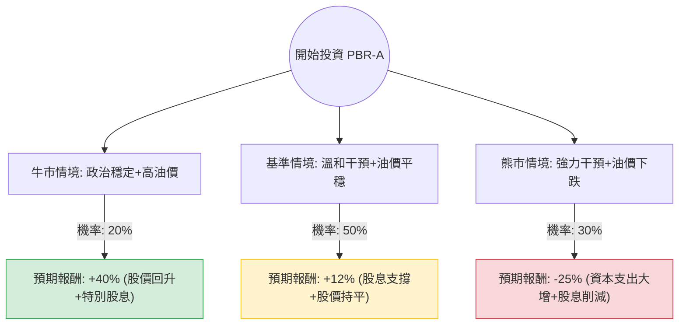

這份分析報告將結合您提供的財務數據與最新的市場動態（包含巴西政局、油價走勢及 Petrobras 內部人事變動），利用**決策樹（Decision Tree）**與**期望值分析（Expected Value Analysis）**評估 PBR-A（巴西石油優先股）的投資價值。

---

### 一、 核心假設與市場背景分析

在建立模型前，我們必須考慮以下關鍵變數：

1.  **政治風險（權重最高）**：巴西政府（Lula 政府）對 Petrobras 的干預程度。近期原 CEO Jean Paul Prates 遭解雇，由 Magda Chambriard 接任，市場擔憂這象徵政府將加強干預，將資金從「派發股息」轉向「擴大資本支出（煉油、能源轉型）」。
2.  **股息政策**：PBR-A 過去以超高股息著稱，但 2024 年初曾發生「不發放特別股息」的爭議，雖後來補發部分，但未來股息發放率（Payout Ratio）存在不確定性。
3.  **油價走勢**：布蘭特原油（Brent）目前在 75-85 美元區間震盪。
4.  **估值數據**：目前 P/E 僅 6.22，Forward P/E 5.2，P/FCF 3.49。這顯示市場已對政治風險進行了大幅度的「折價」。

---

### 二、 決策樹分析圖 (Decision Tree)

我們預測未來一年的三種主要情境：

---

### 三、 期望值計算過程

#### 1. 情境參數設定
*   **牛市情境 (Bull Case) - 20% 機率**：
    *   假設：政府尊重公司治理，維持高額股息發放；油價維持在 $85 以上。
    *   預期報酬：股價回升至 Target Price $21.28 (+14%) + 股息收益率約 25% = **+40%**。
*   **基準情境 (Base Case) - 50% 機率**：
    *   假設：政府有一定程度干預（如要求投資煉油廠），但仍維持基本股息政策；油價在 $75-$80。
    *   預期報酬：股價在 $18-$19 震盪 (0%) + 股息收益率約 12% = **+12%**。
*   **熊市情境 (Bear Case) - 30% 機率**：
    *   假設：新任 CEO 執行激進的國家任務，大幅削減股息以支撐補貼或低效投資；油價跌破 $70。
    *   預期報酬：股價跌至 52W 低點約 $13 (-30%) + 股息收益率降至 5% = **-25%**。

#### 2. 期望值 (Expected Value, EV) 計算
$$EV = (P_{Bull} \times R_{Bull}) + (P_{Base} \times R_{Base}) + (P_{Bear} \times R_{Bear})$$
$$EV = (0.20 \times 0.40) + (0.50 \times 0.12) + (0.30 \times -0.25)$$
$$EV = 0.08 + 0.06 - 0.075$$
$$EV = 0.065 = 6.5\%$$

---

### 四、 綜合評估與最新動態補充

1.  **財務面強韌**：ROE 29% 與 P/FCF 3.49 顯示公司極具賺錢能力且現金流充沛。即便在最壞情況下，公司倒閉風險極低。
2.  **政治風險溢價**：目前的低 P/E (6.22) 反映了市場對巴西政府的不信任。當前股價已部分反映了「CEO 換人」的利空。
3.  **技術面**：股價目前在 SMA200 (18.64 附近) 徘徊，這是一個關鍵的支撐位。如果跌破，可能會進一步下探。
4.  **最新新聞**：Petrobras 近期表示將增加在天然氣與化肥領域的投資，這符合政府導向，雖然短期會稀釋現金流，但長期有助於業務多元化。

---

### 五、 最終結論

**投資建議：適合投資（但僅限於「收益型」或「價值逆向」投資者，且需控制倉位）**

#### 理由：
1.  **期望值為正 (6.5%)**：儘管面臨高度政治不確定性，但極低的估值（P/E 6.22）提供了強大的安全邊際。
2.  **股息護城河**：即便股息發放率從過去的極端高位下降，預期仍能維持在 10% 以上的殖利率，遠高於美股平均水平。
3.  **能源剛需**：Petrobras 的深海鹽下油田（Pre-salt）開採成本極低（約 $35-$45/桶），只要油價不崩盤，獲利能力依然驚人。

**風險提示：**
*   若您是追求「股價成長」的投資者，PBR-A 可能會讓您失望，因為政治雜音會壓抑本益比擴張。
*   **建議操作**：分批買入，並密切關注巴西政府對「特別股息」的最新表態。若 EV 計算中的熊市機率進一步上升（例如政府強制要求收購虧損企業），應立即重新評估。

---
*免責聲明：本分析僅供參考，不構成投資建議。投資者應自行承擔市場風險。*