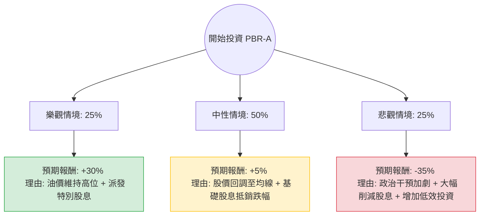

這份分析報告將結合您提供的基本面數據與最新的市場動態（包含巴西政局、油價走勢及 Petrobras 內部政策變動），利用**決策樹（Decision Tree）**與**期望值分析（Expected Value Analysis）**評估 PBR-A（巴西石油優先股）的投資價值。

---

### 一、 核心背景與市場動態搜尋摘要

在進行計算前，透過即時資訊彙整以下關鍵點：
1.  **管理層變動與政治風險**：巴西政府（Lula 政府）近期更換了 CEO（由 Magda Chambriard 接任），市場擔憂公司將從「高派息模式」轉向「擴大資本支出（CAPEX）」模式，投入煉油與綠能。
2.  **股利政策**：雖然 PBR-A 過去以超高股息著稱，但未來派發特別股利的頻率可能降低。
3.  **估值與技術面**：目前股價（$18.29）已高於分析師平均目標價（$15.73），且處於 52 週高點附近，短期獲利了結壓力大。
4.  **財務狀況**：ROE (29%) 與 P/E (6.01) 依然極具吸引力，顯示其獲利能力強勁，但債務比 (Debt/Eq 0.92) 需留意。

---

### 二、 決策樹分析 (Decision Tree)

我們將未來一年的投資情境分為三種：**樂觀（牛市）**、**中性（基準）**與**悲觀（熊市）**。

#### 節點詳細數據：

| 情境節點 | 發生機率 (P) | 預期報酬率 (R) | 期望值 (P * R) |
| :--- | :--- | :--- | :--- |
| **樂觀 (Bull)** | 25% (0.25) | +30% | +7.5% |
| **中性 (Base)** | 50% (0.50) | +5% | +2.5% |
| **悲觀 (Bear)** | 25% (0.25) | -35% | -8.75% |
| **總計期望值** | **100%** | | **+1.25%** |

---

### 三、 計算過程與核心假設

#### 1. 期望值計算 (Expected Value Calculation)
$$EV = (P_{Bull} \times R_{Bull}) + (P_{Base} \times R_{Base}) + (P_{Bear} \times R_{Bear})$$
$$EV = (0.25 \times 0.30) + (0.50 \times 0.05) + (0.25 \times -0.35)$$
$$EV = 0.075 + 0.025 - 0.0875 = 0.0125 = \mathbf{1.25\%}$$

#### 2. 核心假設說明
*   **樂觀情境 (+30%)**：假設布蘭特原油維持在 $85 以上，且新任 CEO 證明其資本支出計畫仍具備高 ROI，並維持 40% 以上的自由現金流派息率。股價突破 52 週高點。
*   **中性情境 (+5%)**：目前股價 $18.29 已大幅偏離目標價 $15.73（溢價約 16%）。假設股價回落至目標價附近，但靠著約 10-12% 的年度總股息（含基礎股息）補回價差損失，最終小幅獲利。
*   **悲觀情境 (-35%)**：巴西政府強烈干預油價定價以抑制通膨，或強制公司收購虧損的煉油廠/基礎建設，導致特別股息歸零，P/E 估值因風險溢價上升而遭到殺估值（De-rating）。

---

### 四、 綜合評估與最終結論

#### 數據面亮點：
*   **極低估值**：P/E 6.01 與 P/S 0.56 顯示該公司在財務上極其便宜。
*   **強大現金流**：P/FCF 僅 3.38，代表公司賺取現金的能力極強。

#### 風險面警訊：
*   **技術面過熱**：SMA200 乖離率高達 47%，且股價高於分析師目標價，短期修正壓力極大。
*   **政策轉向**：EPS next Y 預期衰退 (-2.84%)，反映市場對未來獲利與派息縮減的擔憂。

#### **最終結論：不適合投資（短期觀望 / 減持）**

**理由：**
1.  **期望值過低**：計算出的整體期望值僅為 **1.25%**，相對於其面臨的巴西政治風險與油價波動，風險報酬比（Risk-Reward Ratio）極不具吸引力。
2.  **價格已透支**：目前股價處於歷史高位區間，且已超過目標價 $15.73。在基本面（股息政策）面臨不確定性的情況下，追高風險極大。
3.  **下行空間大**：一旦政治干預成真，股價回測 $12-$13 區間（52W 中位數）的可能性高，潛在跌幅遠大於潛在漲幅。

**建議操作：**
若已持有者可考慮**逢高部分獲利了結**；若未持有者，建議等待股價回落至 **$15.50 - $16.00** 區間（接近目標價且技術指標降溫）後，再重新評估當時的股息政策。