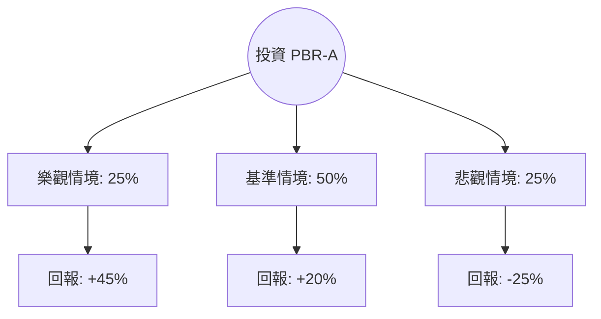

# PBR-A (Petrobras) 量化投資分析報告

作為量化投資分析師，針對 **PBR-A (Petroleo Brasileiro S.A. Petrobras ADR)** 的評估必須超越單純的財務比率，深入探討巴西政治溢價與全球能源週期的交集。以下是基於概率思考的深度分析。

---

### 1. 核心驅動因素與風險 (Drivers & Risks)

#### **關鍵催化劑 (Catalysts)**
1.  **特別股息發放的確定性**：Petrobras 的現金流極其強勁（P/FCF 僅 2.76）。若董事會與巴西政府達成共識，將超額現金以「特別股息」形式發放而非強迫進行低效資本支出（CAPEX），將引發估值修復。
2.  **鹽下油田 (Pre-salt) 產能擴張**：公司在鹽下油田的開採成本極低（盈虧平衡點約在每桶 35-40 美元）。隨著新平台（FPSOs）上線，產量增長將抵消油價波動風險。
3.  **地緣政治溢價**：中東局勢不穩可能推升布蘭特原油（Brent）價格。作為非 OPEC 的主要產油國，Petrobras 是全球原油供應缺口的直接受益者。

#### **主要風險點 (Risks)**
1.  **政治干預與資本配置轉向**：盧拉政府可能施壓公司增加在煉油、造船或再生能源等低回報領域的投資，以刺激國內就業，這將直接損害股東權益與 ROE。
2.  **燃油價格補貼政策**：為抑制國內通膨，政府可能強制 Petrobras 以低於國際市場的價格銷售國內燃油，導致下游利潤被侵蝕。
3.  **匯率波動風險**：巴西里爾 (BRL) 對美元的貶值會增加公司的美元債務負擔，並影響 ADR 的折算價值。

---

### 2. 情境設定與機率賦予 (Scenario Modeling)

基於未來 12 個月的預期，設定以下三種互斥且窮盡的情境：

#### **樂觀情境 (Bull Case)**
*   **發生條件**：布蘭特原油維持在 $85 以上；公司維持現行股息政策並發放特別股息；政府干預僅限於口頭，未實質改變 CAPEX 計劃。
*   **預估機率**：25%
*   **目標價格與預期回報**：目標價 $25.00（基於 P/E 回升至 6x）。預期總回報（含息）：**+45%**。

#### **基準情境 (Base Case)**
*   **發生條件**：油價在 $70-$80 震盪；公司執行既定投資計劃，股息發放符合市場預期（約 12-15% 殖利率）；政治雜音持續但未破壞公司基本面。
*   **預估機率**：50%
*   **目標價格與預期回報**：目標價 $21.00（接近分析師平均目標價 22.24）。預期總回報（含息）：**+20%**。

#### **悲觀情境 (Bear Case)**
*   **發生條件**：全球經濟衰退導致油價跌破 $65；巴西政府強制要求大規模投資低毛利項目；股息支付率被大幅削減以支應政府預算。
*   **預估機率**：25%
*   **目標價格與預期回報**：目標價 $13.00（回測 52 週低點並考慮估值下修）。預期總回報（含息）：**-25%**。

---

### 3. 期望值計算與決策樹 (EV Calculation & Decision Tree)

#### **決策樹結構**

```mermaid
graph TD
    Start((投資 PBR-A)) --> Bull[樂觀情境: 25%]
    Start --> Base[基準情境: 50%]
    Start --> Bear[悲觀情境: 25%]
    
    Bull --> R1[回報: +45%]
    Base --> R2[回報: +20%]
    Bear --> R3[回報: -25%]
```

#### **總期望值計算**
*   `EV = (0.25 * 0.45) + (0.50 * 0.20) + (0.25 * -0.25)`
*   `EV = 0.1125 + 0.10 - 0.0625 = 0.15`
*   **總期望報酬率 = 15%**

#### **風險回報比分析**
*   **上行潛力**：相較於基準價有約 35-45% 的空間。
*   **下行風險**：約 25-30% 的跌幅空間。
*   **不對稱性**：期望值為正（15%），且在基準情境下仍有雙位數回報。目前的低市盈率（P/E 4.68）提供了極強的安全邊際，抵消了部分政治風險。

---

### 4. 決策總結 (Decision Summary)

| 情境 | 發生機率 (%) | 預期報酬率 (%) | 關鍵驅動/觸發因素 |
| :--- | :--- | :--- | :--- |
| **樂觀 (Bull)** | 25% | +45% | 特別股息發放、油價 > $85、CAPEX 保持克制 |
| **基準 (Base)** | 50% | +20% | 產量穩定增長、維持常規高股息、政治雜音可控 |
| **悲觀 (Bear)** | 25% | -25% | 政府強制干預定價、油價暴跌、大規模低效投資 |
| **整體期望值** | **100%** | **15%** | **具備吸引力的風險補償** |

**最終結論：**
1. **投資建議**：**買入 (Buy)**
2. **核心逻辑**：PBR-A 目前處於「極低估值」與「高現金流」的失衡狀態。儘管政治風險揮之不去，但 15% 的正期望值顯示市場已過度定價（Over-priced）了悲觀預期。即便在基準情境下，依靠高額股息與產量增長，投資者仍能獲得優於大盤的回報。
3. **風控建議**：
    *   **出場訊號**：若巴西政府正式宣佈修改公司章程以取消股息下限，或 Brent 原油收盤連續一週低於 $65，應立即減碼。
    *   **對沖工具**：可考慮買入適量 BRL/USD 看跌期權，以對沖巴西國內宏觀經濟惡化的匯率風險。

【結束指令】