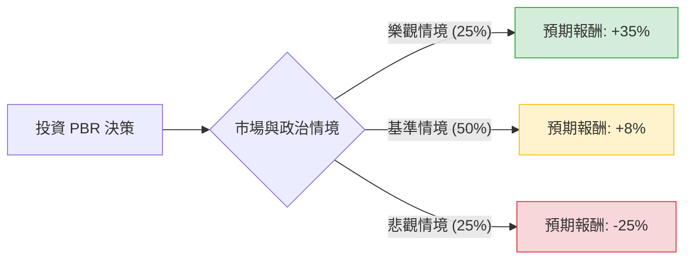

針對美股 **PBR (Petróleo Brasileiro S.A. - Petrobras)** 的投資評估，我結合了您提供的基本面數據，並檢索了最新的市場動態（包含 2024-2028 戰略計畫、巴西政治局勢及油價趨勢），進行決策樹與期望值分析。

---

### 一、 核心背景與市場動態分析

在進入計算前，需考量以下關鍵外部因素：
1.  **股利政策轉向**：Petrobras 已將股利發放比例從自由現金流的 60% 下調至 45%。雖然仍具吸引力，但過去那種「超額派息」的預期已降溫。
2.  **政治干預風險**：巴西政府（Lula 政府）傾向於讓 PBR 承擔更多社會責任，例如補貼國內油價或增加在低毛利煉油與綠能領域的資本支出（CAPEX），這可能壓低未來的 ROE。
3.  **產量增長**：PBR 在 Pre-salt（深海鹽下油田）的生產成本極低（約每桶 35-40 美元即可獲利），且產量持續增長，這是其核心競爭力。
4.  **估值現況**：目前股價接近 52 週高點（$19.82），且高於分析師平均目標價（$17.29），顯示短期內價格可能過熱。

---

### 二、 決策樹分析 (Decision Tree)

我們以 **未來一年的投資報酬率 (Total Return = 股價變動 + 股息)** 為評估目標。

#### 節點詳細說明：

1.  **樂觀情境 (Bull Case) - 25% 機率**
    *   **條件**：國際油價維持在 $90 以上；巴西政府干預低於預期；公司維持高額特別股利。
    *   **預期報酬**：股價突破新高 (+20%) + 股息收益 (15%) = **+35%**。
2.  **基準情境 (Base Case) - 50% 機率**
    *   **條件**：油價在 $75-$85 震盪；資本支出按計畫增加但未失控；股息發放符合 45% FCF 政策。
    *   **預期報酬**：股價因估值修復小幅回落 (-5%) + 股息收益 (13%) = **+8%**。
3.  **悲觀情境 (Bear Case) - 25% 機率**
    *   **條件**：全球經濟衰退導致油價跌破 $70；巴西政府強行要求補貼油價；大幅削減股息以支應政治性投資。
    *   **預期報酬**：股價大幅修正 (-30%) + 股息收益 (5%) = **-25%**。

---

### 三、 期望值分析 (Expected Value Analysis)

#### 1. 核心假設
*   **當前股價**：$19.82
*   **分析師目標價**：$17.29 (隱含約 -12.7% 的下行空間)
*   **股息率預估**：雖然數據顯示 2.5%，但根據 PBR 2024 財測，預期年度化殖利率應在 12%-15% 之間（基準情境）。
*   **P/E 估值**：目前 6.51 倍，處於歷史中值，但高於同業（如中海油或部分新興市場油企）。

#### 2. 計算過程
期望值 (EV) = $\sum (機率 \times 預期報酬)$

*   **樂觀情境**：$0.25 \times 35\% = 8.75\%$
*   **基準情境**：$0.50 \times 8\% = 4.0\%$
*   **悲觀情境**：$0.25 \times (-25\%) = -6.25\%$

**總體期望報酬率 (Expected Return) = $8.75\% + 4.0\% - 6.25\% = 6.5\%$**

---

### 四、 最終結論

#### **判斷：不適合現在立即「重倉」投資（建議：觀望或逢低分批佈局）**

#### **理由：**
1.  **期望值偏低**：計算出的預期報酬率僅為 **6.5%**。考慮到 PBR 作為新興市場 ADR，需承擔極高的政治風險與匯率風險，此報酬率不足以補償其風險溢價（通常要求 10% 以上）。
2.  **估值觸頂**：目前股價 ($19.82) 已極度接近 52 週高點 ($20.28)，且顯著高於分析師平均目標價 ($17.29)。技術面上，SMA200 乖離率高達 51.75%，短期回檔壓力大。
3.  **政策不確定性**：巴西政府對 Petrobras 的戰略指導方針正在改變，從「利潤最大化」轉向「國家建設優先」。這通常會導致資本配置效率下降，長期壓低 P/E 估值。
4.  **現金流壓力**：雖然 Q/Q EPS 增長強勁，但 Debt/Eq 達 0.92，且 Quick Ratio 僅 0.48，顯示短期流動性較緊，若油價波動，維持高股息的壓力會增大。

**操作建議：**
若您是追求高股息的長期投資者，建議等待股價回落至 **$16.5 - $17.5** 區間（接近目標價且安全邊際較高時）再行介入。目前價位追高風險較大。