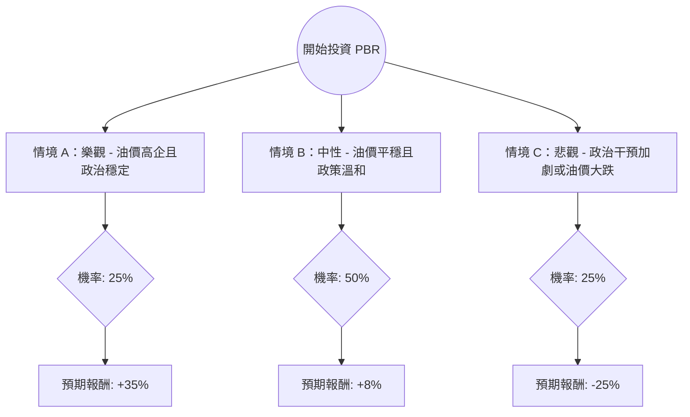

針對巴西石油公司（Petrobras, 股票代碼：**PBR**）的投資評估，我結合了您提供的基本面數據以及最新的市場動態（包含 2024-2028 戰略計畫、巴西政治局勢及油價趨勢）進行分析。

---

### 一、 核心假設與市場動態分析

在建立決策樹之前，我們必須考慮以下關鍵變數：

1.  **政治風險（權重最高）**：巴西政府（Lula 政府）對 PBR 的干預程度。目前市場擔憂政府可能要求公司減少派息，轉而投資於利潤較低的煉油或綠能轉型。
2.  **股利政策**：PBR 過去以超高股息著稱，但新政策已將派息比例從自由現金流的 60% 下調至 45%。
3.  **油價走勢**：布蘭特原油（Brent）的價格直接影響其營收。目前全球經濟放緩與 OPEC+ 減產政策處於拉鋸狀態。
4.  **估值與技術面**：目前股價（$15.79）已接近 52 週高點（$16.02），且高於分析師平均目標價（$15.75），顯示短期上漲空間受限。

---

### 二、 決策樹分析 (Decision Tree)

以下使用 Markdown 繪製決策樹，模擬未來一年的投資情境：

#### 節點詳細說明：

| 預測情境 | 機率 (P) | 預期報酬 (R) | 說明 |
| :--- | :--- | :--- | :--- |
| **情境 A：樂觀** | 25% | +35% | 油價維持在 $85 以上，巴西政府不干預派息，公司維持特別股息發放。 |
| **情境 B：中性** | 50% | +8% | 油價在 $70-$80 震盪，政府小幅干預，股息收益率維持在 10-12%，股價持平。 |
| **情境 C：悲觀** | 25% | -25% | 油價跌破 $65，政府強迫進行大規模低效投資，大幅削減股息，引發外資撤出。 |

---

### 三、 期望值分析 (Expected Value Analysis)

#### 1. 計算過程
期望值 (EV) = $\sum (機率 \times 預期報酬)$

*   **EV** = $(0.25 \times 35\%) + (0.50 \times 8\%) + (0.25 \times -25\%)$
*   **EV** = $8.75\% + 4\% - 6.25\%$
*   **EV** = **6.5%**

#### 2. 財務數據補充分析
*   **低估值陷阱？**：雖然 P/E 僅 7.37，PEG 0.09 看似極低，但 `EPS next Y` 預期衰退 **-26.28%**，這反映了市場對未來獲利能力下降的擔憂。
*   **債務壓力**：Debt/Eq 為 0.89，在能源業中屬中等，但若利息支出增加且現金流被政府挪用，財務壓力會迅速上升。
*   **技術面壓力**：股價距離 52 週高點僅差 1.47%，且 SMA20/50/200 均顯示目前處於高位，短期回檔風險高。

---

### 四、 最終結論

#### **評估結果：不適合投資（短期觀望 / 減持）**

#### **理由：**
1.  **期望值吸引力不足**：計算出的期望報酬率僅為 **6.5%**。考慮到巴西市場的政治風險（國家風險溢價）以及美債無風險利率（約 4-5%），6.5% 的期望值並不足以補償投資者承擔的波動風險。
2.  **利多出盡**：股價已反映了過去一年的強勁表現（YTD +33%），且目前價格已觸及分析師目標價與 52 週高點，缺乏進一步上漲的催化劑。
3.  **政策轉向風險**：最新的 2024-2028 戰略計畫顯示資本支出（CAPEX）增加，這通常意味著自由現金流（FCF）減少，進而壓低未來的股息發放能力。
4.  **獲利預期衰退**：數據顯示明年 EPS 預計下降 26%，這與當前股價的高位形成背離。

**建議：**
若您已持有，建議逢高分批獲利了結；若尚未進場，建議等待股價回落至 SMA200（約有 20% 以上的回檔空間）或政治不確定性消除後再行考慮。