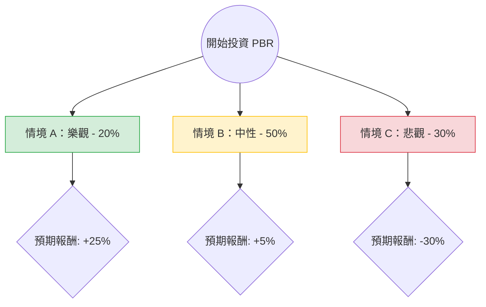

針對巴西石油公司（Petrobras, 代號：**PBR**）的投資評估，我已結合您提供的基本面數據，並透過網路搜尋整合了最新的市場動態（如：CEO 換人、股利政策爭議、巴西政治風險等）進行綜合分析。

---

### 一、 核心假設與市場背景分析

在建立決策樹之前，我們必須考慮以下影響 PBR 股價的核心變數：

1.  **政治風險（權重最高）**：巴西政府（Lula 政府）近期撤換了原 CEO Jean Paul Prates，改由 Magda Chambriard 接任。市場普遍解讀為政府將加強干預，要求公司減少派息，轉而增加在煉油與綠能領域的資本支出（CAPEX）。
2.  **股利政策**：PBR 過去以超高殖利率著稱，但未來「特別股利」的發放不確定性極高。
3.  **油價走勢**：布蘭特原油（Brent）目前在 80-85 美元區間震盪，對 PBR 的獲利能力提供支撐，但若全球經濟放緩導致油價跌破 70 美元，PBR 的利潤空間將受壓。
4.  **估值數據**：目前 P/E 6.86 處於低位，ROE 29% 極高，顯示基本面強勁，但股價已反映了過去一年的漲幅（Perf Year +96%），且目前價格（$20.87）已高於分析師平均目標價（$20.01）。

---

### 二、 決策樹分析（Decision Tree）

以下決策樹模擬未來一年內的三種主要情境：

#### 節點詳細說明：

1.  **情境 A：樂觀（機率 20%）**
    *   **描述**：新任 CEO 維持股利政策，政府干預少於預期；油價維持在 $90 以上。
    *   **預期報酬**：資本利得 10% + 股息 15% = **+25%**。
2.  **情境 B：中性（機率 50%）**
    *   **描述**：股利發放符合基本預期（不再有驚喜），資本支出溫和增加；油價在 $80 左右。
    *   **預期報酬**：資本利得 -5%（估值修正）+ 股息 10% = **+5%**。
3.  **情境 C：悲觀（機率 30%）**
    *   **描述**：政府強迫 PBR 進行低效率的大規模投資，大幅削減股利；油價跌破 $75。
    *   **預期報酬**：資本利得 -30% + 股息 0% = **-30%**。

---

### 三、 期望值分析（Expected Value Analysis）計算過程

我們根據上述機率與報酬率計算整體期望值（EV）：

$$EV = (P_{Bull} \times R_{Bull}) + (P_{Base} \times R_{Base}) + (P_{Bear} \times R_{Bear})$$

*   **計算步驟**：
    1.  樂觀貢獻：$0.20 \times 25\% = 5.0\%$
    2.  中性貢獻：$0.50 \times 5\% = 2.5\%$
    3.  悲觀貢獻：$0.30 \times (-30\%) = -9.0\%$

*   **總期望值**：
    $$5.0\% + 2.5\% - 9.0\% = -1.5\%$$

---

### 四、 最終結論與建議

#### **結論：目前不適合投資（觀望 / 減持）**

#### **理由分析：**

1.  **期望值為負（-1.5%）**：儘管 PBR 的財務數據（ROE、P/E）看起來非常迷人，但決策樹顯示，在考慮到「政治干預」與「股利政策轉向」的風險後，潛在的下行風險（-30%）超過了上行獲利的空間。
2.  **估值已透支**：數據顯示 PBR 過去一年漲幅接近 100%，目前股價（$20.87）已超過分析師目標價（$20.01）。在技術面上，股價處於高位，且 SMA200 乖離率較大（0.51），存在回調壓力。
3.  **管理層不確定性**：新任 CEO Magda Chambriard 的背景更傾向於「國家建設」而非「股東價值最大化」。這對於追求高股息的投資者來說是一個重大的負面訊號。
4.  **財務結構隱憂**：雖然目前 Debt/Eq 0.92 尚可，但若未來 CAPEX（資本支出）因政治因素大幅擴張，現金流（P/FCF 5.26）將會惡化，進而影響配息能力。

**建議操作：**
*   **空手者**：建議等待政治風暴平息，或股價回落至 $16-$17（更具安全邊際）時再行考慮。
*   **持股者**：建議逢高減碼，鎖定過去一年的獲利，因為 PBR 的「高股息故事」核心邏輯正在發生轉變。