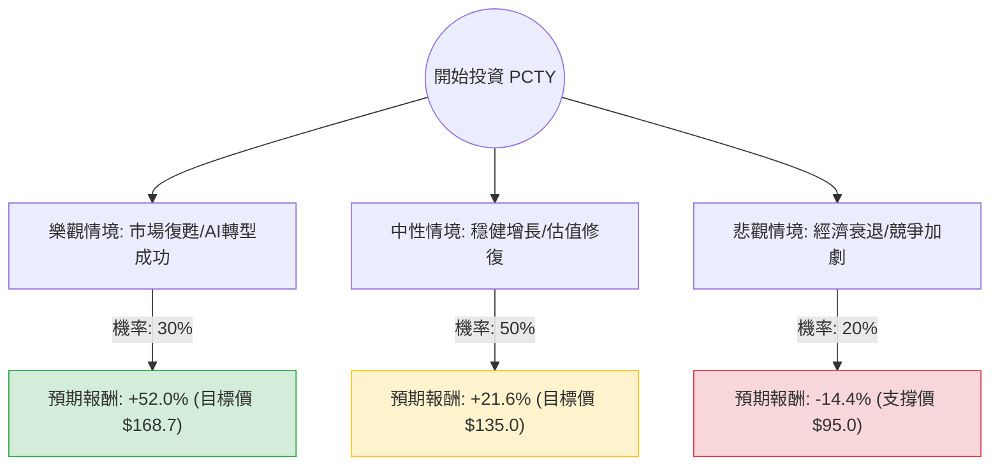

這份分析報告將結合您提供的基本面數據與最新的市場動態（截至 2024 年 5 月），利用**決策樹（Decision Tree）**與**期望值分析（Expected Value Analysis）**來評估 Paylocity Holding Corporation (PCTY) 的投資價值。

---

### 1. 市場現況與最新動態分析 (Web Search Summary)

在進入計算前，整合最新資訊如下：
*   **最新財報表現**：Paylocity 在最近一季的財報中顯示營收增長約 18%，雖然優於預期，但市場對其未來指引（Guidance）持謹慎態度，主要擔心宏觀經濟放緩導致企業招聘需求下降。
*   **產業趨勢**：HCM（人力資本管理）軟體市場正向 AI 驅動轉型。PCTY 積極整合 AI 自動化功能，這有助於維持其 68% 的高毛利率。
*   **估值水平**：目前股價接近 52 週低點，Forward P/E 僅 13.3 倍，遠低於其歷史平均水平（過去常在 30-50 倍），顯示市場已消化大量負面預期。
*   **技術面**：股價處於 SMA20, 50, 200 之下，短期趨勢偏弱，但具備超跌反彈的潛力。

---

### 2. 決策樹分析圖 (Decision Tree)

我們將未來一年的投資情境分為三種：**樂觀（Bull）**、**中性（Base）**、**悲觀（Bear）**。

---

### 3. 核心假設與計算過程

#### A. 核心假設
1.  **樂觀情境 (30%)**：聯準會降息帶動中小企業擴張，PCTY 的 AI 產品大幅提升客單價，股價回歸分析師平均目標價 **$168.74**。
2.  **中性情境 (50%)**：公司維持現有 10-15% 的增長，市場情緒回穩，Forward P/E 從 13 倍修復至較合理的 16-18 倍，對應股價約 **$135**。
3.  **悲觀情境 (20%)**：美國經濟陷入硬著陸，失業率上升導致訂閱數下滑，股價跌破 52 週低點，下探至 **$95**（約為 P/S 3 倍的極端支撐）。

#### B. 各情境報酬率計算 (現價 $111.03)
*   **樂觀報酬 ($R_{bull}$)**: $(168.74 - 111.03) / 111.03 = +51.98\% \approx 52.0\%$
*   **中性報酬 ($R_{base}$)**: $(135.00 - 111.03) / 111.03 = +21.59\% \approx 21.6\%$
*   **悲觀報酬 ($R_{bear}$)**: $(95.00 - 111.03) / 111.03 = -14.44\% \approx -14.4\%$

#### C. 期望值 (Expected Value, EV) 計算
$$EV = (P_{bull} \times R_{bull}) + (P_{base} \times R_{base}) + (P_{bear} \times R_{bear})$$
$$EV = (0.30 \times 0.52) + (0.50 \times 0.216) + (0.20 \times -0.144)$$
$$EV = 0.156 + 0.108 - 0.0288$$
$$EV = 0.2352 = 23.52\%$$

---

### 4. 最終結論

**投資判斷：適合投資 (Buy / Overweight)**

#### 理由：
1.  **期望值極具吸引力**：計算出的年度預期報酬率為 **23.52%**，遠高於標普 500 指數的歷史平均報酬。
2.  **估值安全邊際高**：Forward P/E 13.3 倍對於一家 ROE 達 21% 且毛利近 70% 的 SaaS 公司來說顯著低估。PEG 1.39 顯示其增長成本合理。
3.  **財務體質穩健**：Debt/Eq 僅 0.12，幾乎沒有債務壓力，在利率高企的環境下具備極強的抗風險能力。
4.  **技術面超跌**：股價過去一年下跌 42.8%，已充分反應市場對中小企業增長放緩的恐懼。目前處於 52 週低點附近，下行空間（-14.4%）相對於上行空間（+52%）具有極佳的風險回報比（Risk/Reward Ratio）。

**建議操作策略：**
由於目前技術面（SMA20/50/200）仍呈空頭排列，建議採取**分批買入（Dollar-cost Averaging）**策略，以規避短期內可能因市場情緒波動導致的進一步下探，首批進場點可設於 $110 附近，若跌至 $100-$105 區間則可加大配置。