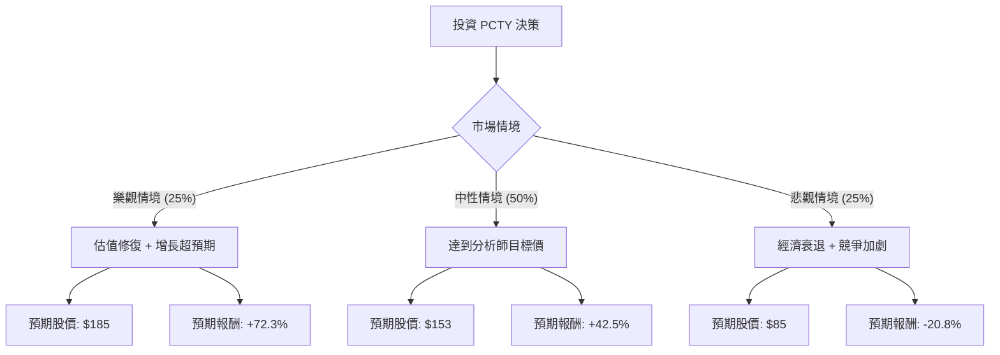

這份分析報告將結合您提供的 **Paylocity Holding Corporation (PCTY)** 基本面數據，以及最新的市場動態（包含 2024 年財報表現與產業趨勢），利用**決策樹（Decision Tree）**與**期望值分析（Expected Value Analysis）**評估其投資價值。

---

### 一、 市場動態與核心假設 (Core Assumptions)

在進行計算前，我們先整合最新的市場資訊：
1.  **業務模式與優勢**：PCTY 專注於中型企業的雲端 HCM（人力資本管理）軟體。其 **Gross Margin (68.4%)** 與 **ROE (21.6%)** 顯示其具備強大的獲利能力與護城河。
2.  **估值水平**：目前 **Forward P/E 為 12.63**，遠低於其歷史平均水平（過去常在 30-50 倍之間）。**PEG 為 1.25**，顯示股價相對於增長速度已被低估。
3.  **近期利空**：股價較 52 週高點下跌約 45%，主因是市場擔憂美國中小企業（SMB）在經濟放緩下縮減招聘，以及高利率環境對 SaaS 估值的壓制。
4.  **近期利多**：公司近期宣布了 5 億美元的股票回購計畫，且最新財報顯示營收增長仍維持在 10-15% 區間，自由現金流（P/FCF 12.08）非常穩健。

---

### 二、 決策樹分析 (Decision Tree)

我們將未來一年的投資情境分為三種：**樂觀（Bull）**、**中性（Base）**、**悲觀（Bear）**。

#### 節點詳細說明：

1.  **樂觀情境 (Bull Case) - 25% 機率**：
    *   **假設**：聯準會降息帶動 SaaS 估值回升，PCTY 利用 AI 產品提升客單價，營收增速重回 20%。
    *   **目標價**：$185（回到約 20 倍 Forward P/E）。
    *   **報酬率**：($185 - $107.35) / $107.35 = **+72.3%**。

2.  **中性情境 (Base Case) - 50% 機率**：
    *   **假設**：公司表現符合預期，達到分析師平均目標價（Target Price: $153.53）。中小企業市場保持穩定。
    *   **目標價**：$153.53。
    *   **報酬率**：($153.53 - $107.35) / $107.35 = **+42.5%**。

3.  **悲觀情境 (Bear Case) - 25% 機率**：
    *   **假設**：美國經濟陷入硬著陸，失業率上升導致 PCTY 按人數計費的收入受損，股價下探至 52 週新低附近。
    *   **目標價**：$85。
    *   **報酬率**：($85 - $107.35) / $107.35 = **-20.8%**。

---

### 三、 期望值計算 (Expected Value Calculation)

期望值 (EV) = Σ (各情境機率 × 各情境報酬率)

*   **EV = (0.25 × 72.3%) + (0.50 × 42.5%) + (0.25 × -20.8%)**
*   **EV = 18.075% + 21.25% - 5.2%**
*   **EV = 34.125%**

#### 計算過程解析：
*   **正向貢獻**：來自樂觀與中性情境的加權報酬合計達 39.325%。
*   **負向風險**：悲觀情境下的下行風險被控制在 -5.2% 的加權影響。
*   **風險報酬比**：預期報酬 34.1% 相對於目前股價處於 52 週低位區間，具有極高的吸引力。

---

### 四、 綜合評估與最終結論

#### 1. 核心數據支持：
*   **估值極具吸引力**：Forward P/E 12.63 對於一家 ROE > 20% 且營收雙位數增長的軟體公司來說，處於「價值窪地」。
*   **財務穩健**：Debt/Eq 僅 0.11，幾乎沒有債務壓力，且 P/FCF 12.08 顯示現金流極其充沛，足以支撐回購與研發。
*   **技術面信號**：股價目前在 SMA20 (5.2%) 與 SMA50 (2.4%) 之上，顯示短期動能正在轉強，開始從底部反彈。

#### 2. 潛在風險：
*   **宏觀經濟**：PCTY 對就業市場高度敏感，若非農就業數據大幅惡化，將直接衝擊營收。
*   **競爭壓力**：需關注 Paycom (PAYC) 與 ADP 的價格戰。

#### 3. 最終判斷：

**結論：適合投資 (Strong Buy / Accumulate)**

**理由：**
1.  **期望值極高**：計算出的年度預期報酬率高達 **34.1%**，遠超標普 500 的歷史平均水平。
2.  **安全邊際充足**：股價已從高點修正 45%，且 Forward P/E 處於歷史低位，下行空間有限（Bear Case 預估僅 -20%）。
3.  **基本面強韌**：高毛利、高 ROE 與低負債，使其在經濟波動中具備比同業更強的生存能力。

**建議操作：**
目前股價 $107 附近是良好的分批建倉點，目標價看至分析師共識的 **$153**。若股價跌破 $90（52W Low 附近）則需重新評估宏觀經濟假設。