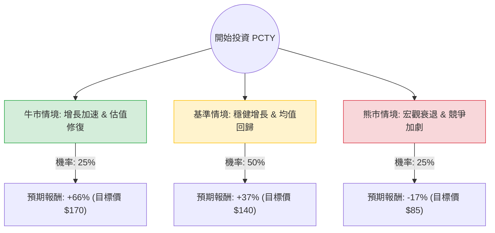

這份分析報告結合了您提供的基本面數據，以及針對 **Paylocity Holding Corporation (PCTY)** 的最新市場動態、財報表現與產業趨勢進行的綜合評估。

---

### 一、 核心背景與最新動態分析

在進入決策樹之前，我們先整合最新的市場資訊：

1.  **收購 Airbase 的戰略轉型**：PCTY 最近完成了對支出管理平台 **Airbase** 的收購。這標誌著公司從單純的人力資源/薪酬系統（HCM）擴展到「全面支出管理」領域，增加了產品競爭力與交叉銷售的機會。
2.  **最新財報表現**：2025 財年第一季（截至 2024/09/30）營收增長約 14%，優於預期。公司上調了全年營收與 EBITDA 指引。
3.  **估值與技術面矛盾**：
    *   **基本面強勁**：ROE 高達 21%，債務極低 (Debt/Eq 0.12)，且 Forward P/E 僅 12.64，遠低於歷史平均。
    *   **技術面疲軟**：股價處於 52 週低點附近，SMA200 為 -35%，顯示市場情緒極度悲觀，可能受中小企業（SMB）支出放緩及高利率環境影響。
4.  **產業趨勢**：HCM 市場競爭激烈（對手包括 ADP, Paycom, Workday），但 PCTY 專注於中型市場，且透過 AI 自動化提升毛利（Gross Margin 68%）。

---

### 二、 決策樹分析 (Decision Tree)

我們以 **12 個月投資週期** 為基準，設定三種主要情境：

#### 決策樹節點詳細說明：

1.  **牛市情境 (Bull Case) - 25% 機率**：
    *   **條件**：Airbase 整合極其成功，帶動營收增速重回 20% 以上；聯準會降息刺激中小企業擴張。
    *   **預期報酬**：股價回升至分析師平均目標價 **$170**。
    *   **計算**：($170 - $102) / $102 = **+66.7%**

2.  **基準情境 (Base Case) - 50% 機率**：
    *   **條件**：公司維持目前 14-15% 的穩健增長，獲利能力持續改善。市場意識到 Forward P/E 12x 過低，估值修復至 SMA200 水準。
    *   **預期報酬**：股價回升至約 **$140**。
    *   **計算**：($140 - $102) / $102 = **+37.3%**

3.  **熊市情境 (Bear Case) - 25% 機率**：
    *   **條件**：美國經濟陷入衰退，中小企業倒閉潮導致客戶流失；收購整合成本過高拖累利潤。
    *   **預期報酬**：股價跌破支撐，下探 **$85**。
    *   **計算**：($85 - $102) / $102 = **-16.7%**

---

### 三、 期望值分析 (Expected Value Analysis)

#### 1. 計算過程
期望值 (EV) = Σ (各情境機率 × 各情境報酬率)

*   **EV** = (0.25 × 66.7%) + (0.50 × 37.3%) + (0.25 × -16.7%)
*   **EV** = 16.675% + 18.65% - 4.175%
*   **EV = 31.15%**

#### 2. 核心假設
*   **市場假設**：假設未來一年內不會發生系統性金融崩潰，且利率環境趨於穩定或下降。
*   **財務假設**：Forward P/E 12.64 顯示市場對未來盈餘有信心，假設 EPS next Y 增長 7.5% 為保守估計，實際可能因 AI 效率提升而更高。
*   **產業假設**：HCM 軟體具有高黏著度（切換成本高），即便經濟放緩，現有客戶流失率仍可控。

---

### 四、 最終結論

**判斷：適合投資 (Strong Buy on Dip)**

#### 理由：
1.  **極具吸引力的風險回報比**：計算出的期望報酬率高達 **31.15%**，而下行風險相對受限（因其強大的現金流與低負債）。
2.  **估值嚴重低估**：目前的 P/E (24.8) 與 Forward P/E (12.6) 處於歷史低位，相對於其 21% 的 ROE 與 68% 的毛利率，股價顯然被超賣（SMA200 為 -35%）。
3.  **戰略轉型紅利**：收購 Airbase 讓 PCTY 從單一工具轉型為平台，這通常會帶來估值倍數（Multiple Expansion）的提升。
4.  **財務穩健**：Debt/Eq 0.12 確保了公司在動盪環境中的生存能力，且 P/FCF 僅 12.35，顯示其產出現金的能力極強。

**建議操作**：
由於目前技術面仍處於下降趨勢（SMA20/50/200 皆為負），建議採取**分批進場**策略，以規避短期內可能因市場情緒導致的進一步探底，長期持有以等待估值回歸。