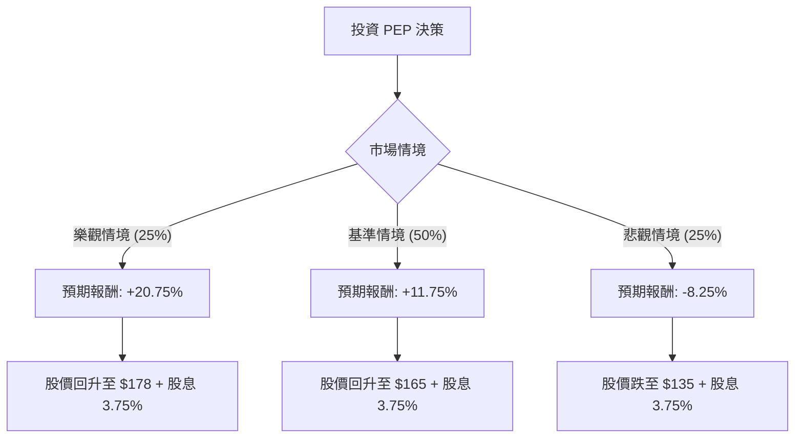

這份分析報告將結合您提供的基本面數據，以及最新的市場動態（包含 2024 年第三季財報表現與產業趨勢），利用**決策樹（Decision Tree）**與**期望值分析（Expected Value Analysis）**來評估百事可樂（PepsiCo, PEP）的投資價值。

---

### 一、 最新市場動態與背景資訊 (Web Search Summary)

在進行模型建構前，整合最新資訊如下：
1.  **財報表現（2024 Q3）**：百事近期下修了全年營收指引，主因是北美市場（尤其是 Frito-Lay 零食部門）需求疲軟，消費者因通膨壓力減少購買。然而，其核心 EPS 仍保持增長，顯示成本控制能力強。
2.  **GLP-1 藥物衝擊**：市場持續擔憂減肥藥普及會減少高熱量零食與含糖飲料的消費，這對 PEP 的長期估值造成壓力。
3.  **國際市場**：新興市場（如拉丁美洲、亞太地區）表現優於北美，成為增長引擎。
4.  **財務健康**：負債比（Debt/Eq: 2.6）偏高，但在降息循環下，利息壓力有望減輕。股息殖利率（3.75%）處於歷史較高水準，具備防禦性。

---

### 二、 決策樹分析 (Decision Tree)

我們將未來一年的投資表現分為三種情境：**樂觀（Bull）**、**基準（Base）**、**悲觀（Bear）**。

#### 節點詳細說明：

| 情境 | 機率 (P) | 預期股價變動 | 股息收益 | 總報酬 (R) | 期望值 (P * R) |
| :--- | :--- | :--- | :--- | :--- | :--- |
| **樂觀 (Bull)** | 25% | +17% (需求復甦+降息) | 3.75% | **+20.75%** | 5.1875% |
| **基準 (Base)** | 50% | +8% (符合分析師目標) | 3.75% | **+11.75%** | 5.875% |
| **悲觀 (Bear)** | 25% | -12% (消費持續萎縮) | 3.75% | **-8.25%** | -2.0625% |
| **總計** | **100%** | - | - | - | **8.999%** |

---

### 三、 核心假設與計算過程

#### 1. 核心假設
*   **基準情境 (Base Case, 50%)**：
    *   假設 PEP 股價回升至分析師平均目標價約 $165 - $171 區間（目前 Target Price 為 $171.56，我們取保守值 $165）。
    *   北美零食需求維持平穩，國際市場抵銷部分疲軟。
    *   Forward P/E 16.49 顯示市場預期明年獲利改善。
*   **樂觀情境 (Bull Case, 25%)**：
    *   通膨顯著降溫，消費者購買力回升。
    *   Frito-Lay 成功推出健康系列產品，緩解 GLP-1 擔憂。
    *   股價挑戰 52 週高點（約 $178-$180）。
*   **悲觀情境 (Bear Case, 25%)**：
    *   經濟陷入衰退，消費者轉向廉價自有品牌（Private Labels）。
    *   高負債（Debt/Eq 2.6）在利率維持高位時限制擴張。
    *   股價回測 52 週低點支撐（約 $135）。

#### 2. 期望值 (Expected Value, EV) 計算
$$EV = (P_{Bull} \times R_{Bull}) + (P_{Base} \times R_{Base}) + (P_{Bear} \times R_{Bear})$$
$$EV = (0.25 \times 20.75\%) + (0.50 \times 11.75\%) + (0.25 \times -8.25\%)$$
$$EV = 5.1875\% + 5.875\% - 2.0625\% = 9.0\%$$

---

### 四、 綜合基本面評估

*   **優勢 (Pros)**：
    *   **ROE (42.86%)** 極高，顯示資本利用效率極佳。
    *   **股息 (3.75%)** 具吸引力，且 EPS Q/Q 增長 67.5%，顯示獲利結構依然穩健。
    *   **估值**：Forward P/E (16.49) 遠低於當前 P/E (25.28)，暗示股價目前可能被低估，或明年獲利將大幅跳升。
*   **劣勢 (Cons)**：
    *   **短期趨勢**：SMA20 (-4.53%) 與 SMA50 (-4.1%) 均呈負值，顯示短期技術面偏弱。
    *   **流動性**：Current Ratio (0.85) 低於 1，短期償債壓力需關注。
    *   **增長瓶頸**：PEG (2.51) 偏高，顯示相對於其增長速度，股價並不便宜。

---

### 五、 最終結論

**判斷：適合投資 (建議分批買入)**

#### 理由：
1.  **正向期望值**：經過決策樹計算，未來一年的預期總報酬率約為 **9.0%**。雖然不是爆發性成長，但在當前動盪市場中，這是一個穩健的防禦性回報。
2.  **股息安全墊**：3.75% 的股息率提供了強大的下行保護。即使股價橫盤整理，投資者仍能獲得優於現金的收益。
3.  **估值修復機會**：目前股價 ($153) 距離分析師目標價 ($171.56) 有約 12% 的上漲空間。近期股價因財報指引下修而回落（月跌幅 10.5%），反而創造了較好的切入點。
4.  **風險提示**：需密切觀察北美 Frito-Lay 的銷量是否持續下滑。若下季財報顯示銷量衰退擴大，則需重新評估「悲觀情境」的機率。

**建議策略**：由於短期技術指標（SMA20/50）偏弱，建議不要一次性投入，而是採取**定期定額**或**分批佈局**，在 $145 - $153 區間分段建倉。